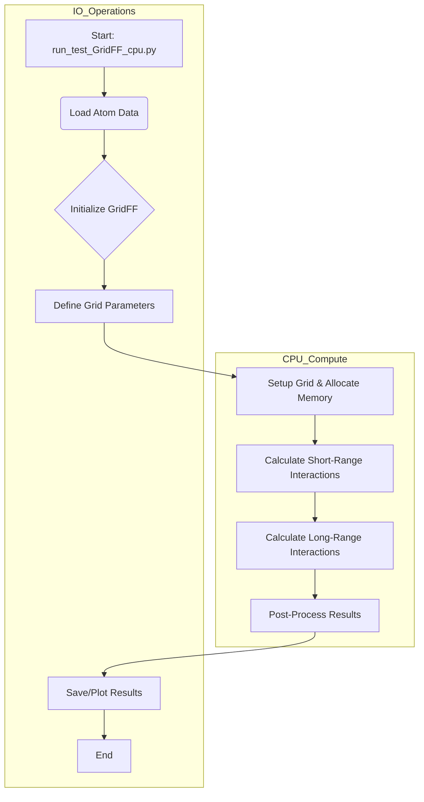
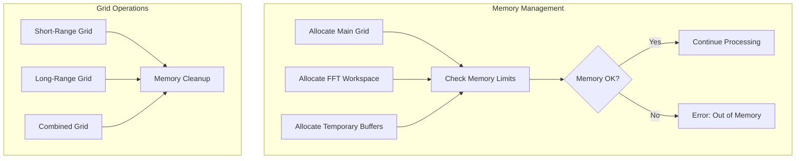
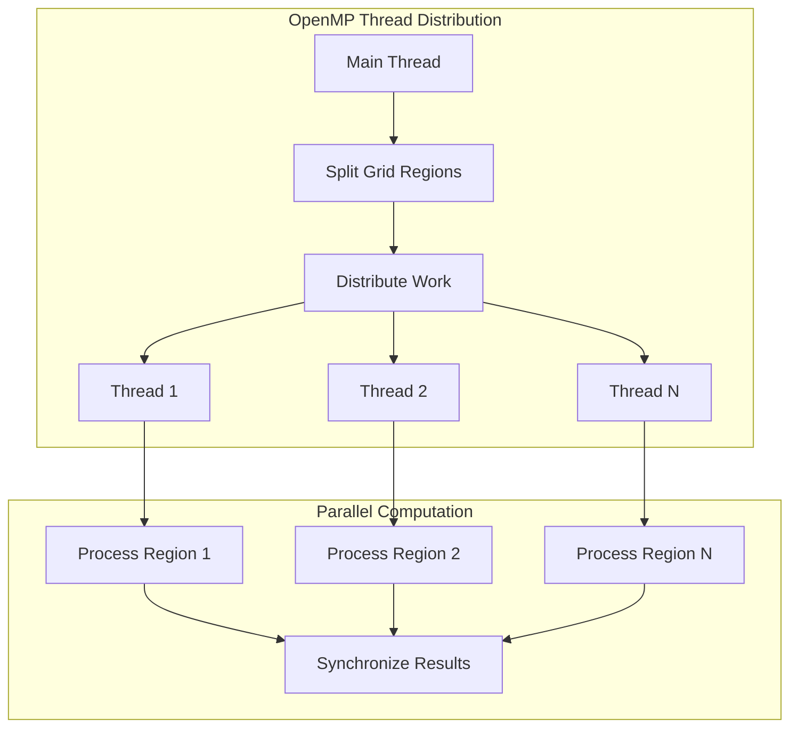

# GridFF CPU System Documentation

## 1. Introduction & Overview

**Purpose:**
The CPU implementation of GridFF is a high-performance molecular mechanics system that calculates potential energy fields on 3D grids without GPU acceleration. It provides accurate calculations of both short-range (Morse/Lennard-Jones) and long-range (Coulomb/Electrostatic) interactions using direct space summation and Ewald methods.

**Core Advantages of CPU Implementation:**
- Higher numerical precision (double vs float)
- Easier debugging and validation
- No hardware dependencies
- Simpler implementation of complex algorithms
- Direct memory access without transfer overhead

**Key Components:**

1. **GridFF Class (C++):**
   - Core computation engine
   - Memory management
   - Grid operations
   - Force field calculations
   - B-spline operations

2. **Ewald Summation Module:**
   - 3D periodic systems
   - 2D slab geometry corrections
   - Real-space and reciprocal-space contributions
   - Optimized convergence parameters

3. **Python Interface:**
   - High-level control
   - Data preprocessing
   - Results analysis
   - Visualization tools

## 2. Core Concepts & Implementation Details

### 2.1 Grid System

**Grid Definition:**
```cpp
struct Grid3D {
    Vec3d  pos0;     // Origin position
    Vec3d  dg;       // Grid spacing
    Vec3i  n;        // Number of points
    double* data;    // Grid data array
    // ... additional properties
};
```

**Key Parameters:**
- Origin (`pos0`): Corner point of the grid
- Spacing (`dg`): Distance between grid points
- Dimensions (`n`): Number of points in each direction
- Volume: `dg.x * dg.y * dg.z`
- Total points: `n.x * n.y * n.z`

### 2.2 Force Field Components

#### A. Short-Range Interactions

**Morse Potential Implementation:**
```cpp
double MorsePotential(double r, double R0, double E0, double alpha) {
    double x = exp(-alpha * (r - R0));
    return E0 * (x*x - 2*x);
}
```

**Split into Components:**
1. Pauli Repulsion:
   - Represents electron cloud overlap
   - Dominates at short range
   - Highly sensitive to distance

2. London Dispersion:
   - Attractive van der Waals force
   - Medium-range interaction
   - Smoother distance dependence

#### B. Long-Range Interactions (Ewald Summation)

**Components:**
1. Direct Space Sum:
   - Short-range screening
   - Gaussian charge distribution
   - Error function complement

2. Reciprocal Space Sum:
   - Long-range contributions
   - Fourier transforms
   - Periodic boundary conditions

3. Self-Energy Correction:
   - Removes self-interaction
   - Constant term correction
   - System-size independent

### 2.3 B-Spline Operations

**Projection:**
```cpp
void projectAtomBspline(const Vec3d& pos, double charge, Grid3D& grid) {
    // Calculate support region
    int order = 6;  // Quintic B-spline
    Vec3i min_idx, max_idx;
    calculateSupportRegion(pos, order, grid, min_idx, max_idx);
    
    // Evaluate B-spline coefficients
    for(int iz = min_idx.z; iz <= max_idx.z; iz++) {
        for(int iy = min_idx.y; iy <= max_idx.y; iy++) {
            for(int ix = min_idx.x; ix <= max_idx.x; ix++) {
                double bx = evaluateBspline(order, (pos.x - grid.pos0.x)/grid.dg.x - ix);
                double by = evaluateBspline(order, (pos.y - grid.pos0.y)/grid.dg.y - iy);
                double bz = evaluateBspline(order, (pos.z - grid.pos0.z)/grid.dg.z - iz);
                grid.add(ix,iy,iz, charge * bx * by * bz);
            }
        }
    }
}
```

## 3. Workflow & Block Diagrams

### 3.1. High-Level Workflow

This diagram shows the general flow of control in the CPU implementation.



### 3.2. Detailed Processing Flow


### 3.3. Memory Management Flow



### 3.4. Parallel Processing Structure



## 4. Error Analysis & Validation

### 4.1 Sources of Error

1. **Discretization:**
   - Grid spacing effects
   - B-spline order
   - Boundary effects

2. **Summation:**
   - Ewald convergence
   - Real-space cutoff
   - K-space truncation

3. **Numerical:**
   - Floating-point precision
   - Accumulation errors
   - FFT artifacts

### 4.2 Validation Methods

1. **Reference Systems:**
   - Known analytical solutions
   - Point charge pairs
   - Periodic crystals

2. **Conservation Laws:**
   - Total energy
   - Charge neutrality
   - Force balance

3. **Convergence Tests:**
   - Grid resolution
   - Ewald parameters
   - System size scaling

## 5. Performance Considerations

### 5.1 Computational Complexity

1. **Short-Range Terms:**
   - O(N²) naive implementation
   - O(N) with cutoff
   - O(N log N) with cell lists

2. **Long-Range Terms:**
   - O(N log N) FFT-based
   - O(N²) direct summation
   - O(N) multipole methods

### 5.2 Memory Requirements

1. **Grid Storage:**
   - Primary grids: 3 × nx × ny × nz × 8 bytes
   - Temporary grids: 2-3× primary size
   - FFT workspace: ~2× grid size

2. **Atomic Data:**
   - Positions: N × 3 × 8 bytes
   - Parameters: N × 4 × 8 bytes
   - Forces: N × 3 × 8 bytes

## 6. Usage Guidelines

### 6.1 Parameter Selection

1. **Grid Parameters:**
   ```python
   recommended_spacing = min_atomic_distance / 4.0
   grid_dimensions = cell_size / recommended_spacing
   ```

2. **Ewald Parameters:**
   ```python
   alpha = 3.5 / cutoff_radius
   kmax = 2 * alpha * box_length
   ```

### 6.2 Best Practices

1. **System Preparation:**
   - Center system in box
   - Apply charge neutrality
   - Check periodic images

2. **Calculation Setup:**
   - Use appropriate cutoffs
   - Set convergence criteria
   - Monitor energy conservation

3. **Output Analysis:**
   - Check energy ranges
   - Validate forces
   - Verify periodicity
