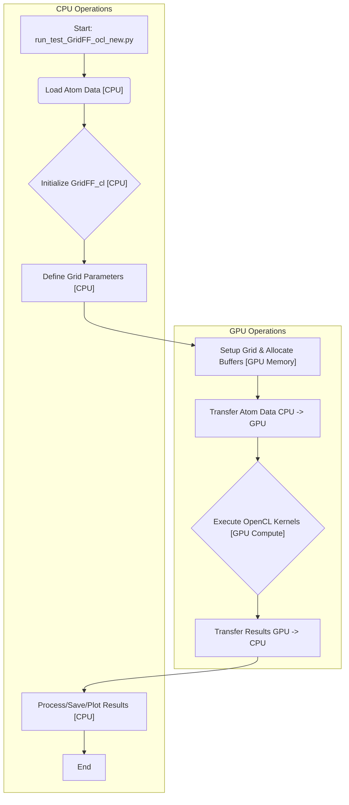
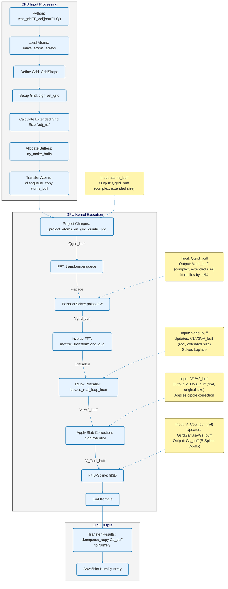
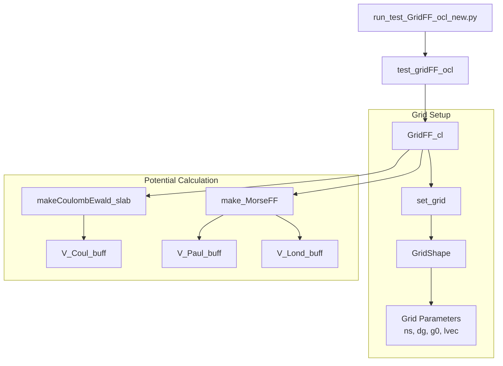
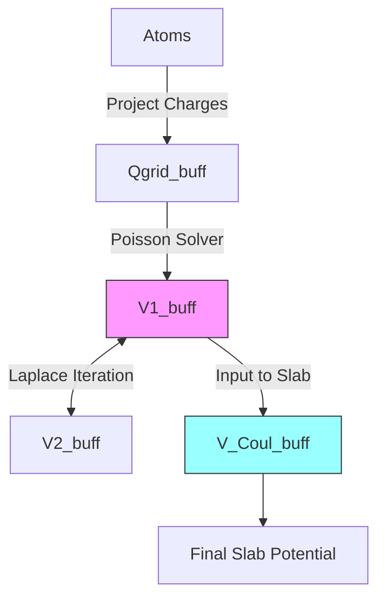
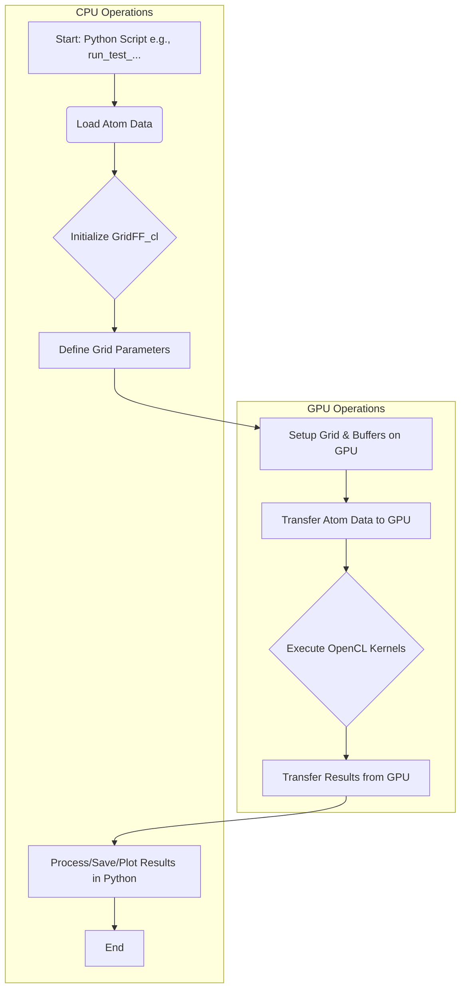
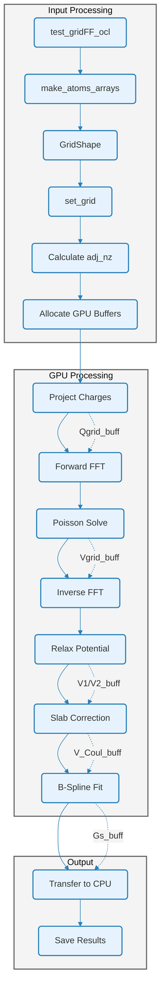
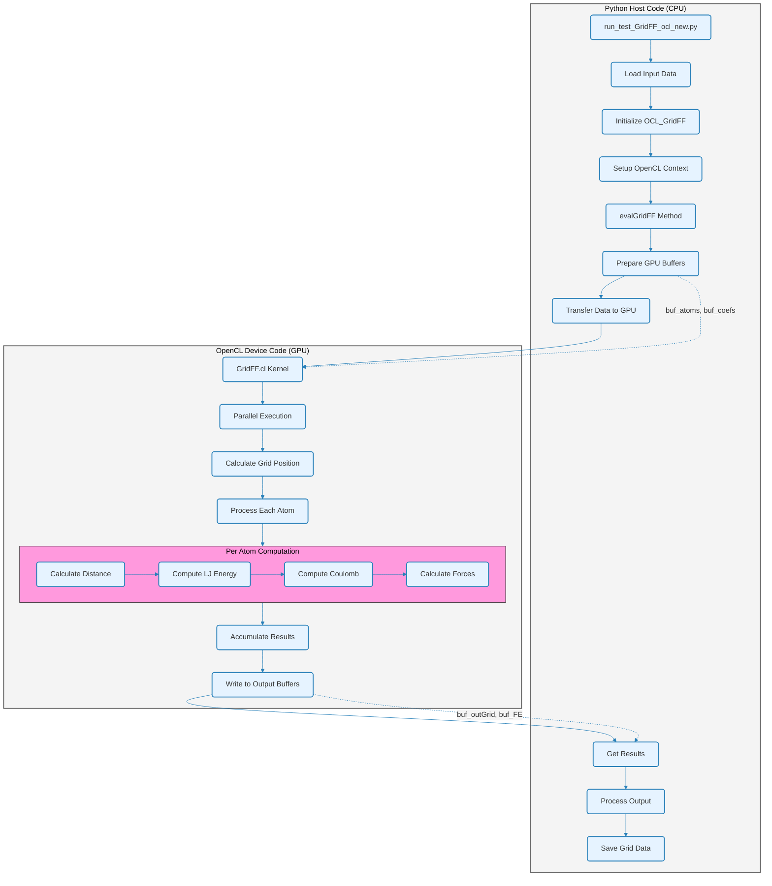

# GridFF System Documentation

''' Detailed description of the GridFF system, including its architecture, key components, and usage instructions. '''

# GridFF OpenCL System Documentation

## 1. Introduction & Overview

**Purpose:**
The `GridFF_cl` system is a Python library leveraging OpenCL for high-performance computation of molecular mechanics potential energy fields on a 3D grid. It specializes in calculating short-range (Morse, approximating Lennard-Jones) and long-range (Coulomb/Electrostatic via Ewald summation with FFTs) interactions. It also includes functionality for fitting B-spline representations to these fields and sampling the fields at arbitrary points or on different grids.

**Core Idea:**
Instead of calculating atom-probe interactions individually for every point (computationally expensive), GridFF calculates the total potential generated by all atoms onto a discrete 3D grid. Evaluating the potential at any point within the grid then becomes a fast interpolation. OpenCL enables massive parallelization of the grid calculation, FFTs, and fitting steps on Graphics Processing Units (GPUs), significantly accelerating the process.

**Key Components:**

1.  **`GridFF.cl`:** The heart of the GPU computation. Contains OpenCL C code defining *kernels* – functions executed in parallel on the GPU for tasks like potential calculation, charge projection, Poisson solving, relaxation, B-spline fitting, and sampling.
2.  **`GridFF.py`:** Defines the main Python class `GridFF_cl`. This class acts as the primary user interface, managing:
    *   OpenCL environment setup (context, command queue, program compilation).
    *   GPU memory allocation (*buffers*).
    *   Data transfer between CPU (NumPy arrays) and GPU (OpenCL buffers).
    *   Orchestration of kernel execution on the GPU.
3.  **`ocl_GridFF_new.py`:** Contains utility functions and the main testing function `test_gridFF_ocl`. This script demonstrates practical usage of the `GridFF_cl` class for calculating and processing potential fields.
4.  **`run_test_GridFF_ocl_new.py`:** The top-level Python script that users execute. It sets up parameters (like input file names) and calls the `test_gridFF_ocl` function to perform the grid generation and analysis.

## 2. Core Concepts

*   **Grid:** A regular 3D lattice defined by:
    *   `g0`: `(x, y, z)` coordinate of the grid origin (corner with indices 0,0,0).
    *   `dg`: `(dx, dy, dz)` spacing between grid points (voxel size) along each axis.
    *   `ns`: `(nx, ny, nz)` number of grid points along each axis.
    *   `lvec`: 3x3 matrix where rows are lattice vectors `a`, `b`, `c` defining the simulation cell, used for Periodic Boundary Conditions (PBC).
*   **Atoms:** Represented by:
    *   `apos`: `(N, 3)` array of 3D coordinates.
    *   `qs`: `(N,)` array of partial charges.
    *   `REQs`: `(N, 4)` array often storing Van der Waals parameters (Radius `R`, Energy `Epsilon`) and charge `Q`. `Epsilon` might be stored as `sqrt(Epsilon)`.
*   **Potentials:**
    *   **Morse/Lennard-Jones (LJ):** Short-range interactions modeling Pauli repulsion and Van der Waals attraction. `GridFF.cl` uses the Morse potential, often split into repulsive (`V_Paul`) and attractive (`V_Lond`) components.
    *   **Coulomb/Electrostatic:** Long-range interactions between charges. Calculated efficiently using Ewald summation, implemented here via Fast Fourier Transforms (FFTs) to solve the Poisson equation. Special corrections (`slabPotential`) are applied for systems with 2D periodicity (slabs).
*   **OpenCL:** A framework for parallel programming on heterogeneous platforms (CPUs, GPUs). Allows computationally intensive kernels in `GridFF.cl` to run on the many cores of a GPU.
*   **Buffers:** Designated memory regions on the GPU device used to hold grid data (`V_Paul_buff`, `Qgrid_buff`, etc.), atom data (`atoms_buff`, `REQs_buff`), and intermediate results during calculations. Data must be explicitly copied between the CPU's RAM and these GPU buffers.
*   **Kernels:** Functions written in OpenCL C (in `GridFF.cl`) that are executed by the GPU's processing units. Examples: `make_MorseFF`, `poissonW`, `fit3D`.
*   **B-Splines:** Smooth, piecewise polynomial functions used for:
    *   *Projection:* Smoothly distributing atomic properties (like charge) onto the grid (`project_atoms_on_grid_quintic_pbc`).
    *   *Fitting:* Creating a compact and smooth mathematical representation of the calculated grid potential (`fit3D`).
    *   *Interpolation:* Evaluating the potential or force at points between grid nodes (`sample3D`, `sample3D_grid`).

## 3. Workflow & Block Diagrams

### 3.1. High-Level Workflow

This diagram shows the general flow of control and data between the CPU and GPU.



### 3.2. Detailed Workflow: Coulomb Slab Potential (makeCoulombEwald_slab) + Fitting (fit3D)
This illustrates a common, complex workflow involving calculating electrostatics for a slab geometry and then fitting the result. Note the use of an extended grid for intermediate steps.


## 4. Key Python Interface (`GridFF.py` - `GridFF_cl` class)

This class provides the main programming interface.

*   **`__init__(self, nloc=32)`:**
    *   Initializes PyOpenCL context (`ctx`) and command queue (`queue`), attempting to find an NVIDIA GPU.
    *   Compiles the OpenCL code from `GridFF.cl` into a program (`prg`).
    *   Sets the default local workgroup size (`nloc`).
    *   Initializes buffer attributes (e.g., `self.atoms_buff`) to `None`.

*   **`set_grid(self, gsh: GridShape)`:**
    *   Takes a `GridShape` object containing `ns`, `dg`, `lvec`, `g0`.
    *   Stores it as `self.gsh`.
    *   Creates a `GridCL` object (`self.gcl`) which holds OpenCL-friendly versions of grid parameters (e.g., `int4` for `ns`, `float4` for vectors).

*   **Buffer Management:**
    *   **`try_make_buff(self, buff_name, sz)`:** Checks if a buffer named `buff_name` exists and has the correct size (`sz` in bytes). If not, it creates (or recreates) the `cl.Buffer` object on the GPU. This allows reusing buffers or resizing them automatically when the grid changes.
    *   **`try_make_buffs(self, names, na, nps, bytePerFloat=4)`:** The primary function for ensuring all necessary GPU buffers are allocated for a calculation.
        *   `names`: A `set` of strings specifying required buffers (e.g., `{'atoms', 'REQs', 'V_Paul', 'V_Lond'}`).
        *   `na`: Number of atoms (for atom-related buffers).
        *   `nps`: Number of grid points (`nxyz`) or sample points.
        *   Calculates required sizes and calls `try_make_buff` for each needed buffer.

*   **Core Calculation Functions:**
    *   **`make_MorseFF(self, atoms, REQs, ...)`:** Calculates Pauli and London potentials on the grid.
        1.  Calls `try_make_buffs` to ensure `atoms_buff`, `REQs_buff`, `V_Paul_buff`, `V_Lond_buff` exist.
        2.  Copies `atoms` (xyzq) and `REQs` data from NumPy arrays to GPU buffers using `cl.enqueue_copy`.
        3.  Launches the `make_MorseFF` kernel (`self.prg.make_MorseFF(...)`).
        4.  Optionally copies results (`V_Paul_buff`, `V_Lond_buff`) back to NumPy arrays if `bReturn=True`.
    *   **`make_Coulomb_points(self, atoms, ps, ...)`:** Calculates Coulomb potential/force directly at specified points `ps` (not necessarily on the grid) using PBC. Slower than grid methods but exact for the given points. Uses `make_Coulomb_points` kernel.
    *   **`project_atoms_on_grid_quintic_pbc(self, atoms, ...)`:** Projects atom charges (`atoms[:,3]`) onto the grid using 5th-order B-spline weighting to create a smooth charge density. Handles PBC. Uses `project_atoms_on_grid_quintic_pbc` kernel. Stores result in `Qgrid_buff` (as complex `float2` for FFT compatibility).
    *   **`poisson(self, ...)` / `poisson_old(self, ...)`:** Solves the Poisson equation ∇²V = -ρ/ε₀ in Fourier space using FFTs.
        1.  Requires `Qgrid_buff` (charge density ρ, complex `float2`).
        2.  Calls `prepare_poisson` to set up FFT plans (`clUtils.FFT`).
        3.  Performs FFT(`Qgrid_buff`).
        4.  Launches `poissonW` kernel (multiplies by -1/k² in k-space). `poisson` uses accurate k-vectors, `poisson_old` uses a simpler approximation.
        5.  Performs Inverse FFT, storing the potential `V` in `Vgrid_buff` (complex `float2`).
    *   **`laplace_real_loop_inert(self, niter, ...)`:** Refines the potential from `poisson` by iteratively solving the Laplace equation (∇²V = 0) in real space using a finite difference relaxation method (Jacobi/SOR-like with inertia). This helps smooth FFT artifacts and enforce boundary conditions.
        1.  Uses `V1_buff`, `V2_buff` (for potential) and `vV_buff` (for inertia/velocity).
        2.  Copies the real part of `Vgrid_buff` to `V1_buff`.
        3.  Iteratively calls `laplace_real_pbc` kernel, ping-ponging between `V1_buff` and `V2_buff`.
        4.  Returns the final potential buffer (either `V1_buff` or `V2_buff`).
    *   **`slabPotential(self, Vin_buff, nz_slab, dipol, ..., bTranspose=False)`:** Applies a potential correction for slab geometries (2D PBC). Adds a linear potential ramp based on the net dipole moment perpendicular to the slab.
        1.  Reads potential from `Vin_buff` (typically the result from `laplace_real_loop_inert` on the *extended* grid).
        2.  Calculates correction parameters (`dVcor`, `Vcor0`).
        3.  Launches `slabPotential` or `slabPotential_zyx` kernel based on `bTranspose`.
        4.  Writes the corrected potential to `V_Coul_buff` (on the *original* grid size).
        5.  **`bTranspose` / `slabPotential_zyx`:** This flag is critical. It selects the `slabPotential_zyx` kernel, which reads the input `Vin_buff` assuming a different memory layout (likely ZYX) than the default `slabPotential` kernel (likely XYZ) expects. This is often necessary to correct for data ordering mismatches between different steps. **See Debugging Section.**
    *   **`makeCoulombEwald_slab(self, atoms, Lz_slab, ..., bTranspose=False, ...)`:** The main orchestrator for slab electrostatic calculations.
        1.  Determines the *extended* grid size (`adj_nz`) needed to include vacuum padding (`Lz_slab`).
        2.  Allocates buffers for the *extended* size.
        3.  Calls `_project_atoms_on_grid_quintic_pbc` on the extended grid.
        4.  Calls `poisson` on the extended grid.
        5.  Calls `laplace_real_loop_inert` on the extended grid.
        6.  Calls `slabPotential` with the correct `Vin_buff` (from Laplace), `nz_slab`, `dipol`, and crucially, the `bTranspose` flag. This step applies the correction and copies/transposes the data from the extended grid buffer to the final `V_Coul_buff` (original grid size).
        7.  Returns the potential as a NumPy array if `bDownload=True`.
    *   **`fit3D(self, Ref_buff, ...)`:** Fits a B-spline representation to a reference potential field (`Ref_buff`).
        1.  Uses buffers `Gs_buff` (coefficients - the result), `dGs_buff` (error), `fGs_buff` (force), `vGs_buff` (velocity).
        2.  Initializes `Gs_buff` from `Ref_buff`.
        3.  Iteratively calls kernels:
            *   `BsplineConv3D`: Calculates error `dGs = Bspline(Gs) - Ref`.
            *   `BsplineConv3D`: Calculates force `fGs = -Bspline(dGs)`.
            *   `move`: Updates `Gs` and `vGs` using `fGs` (like molecular dynamics).
        4.  Returns the fitted coefficients (`Gs_buff`) as a NumPy array.
    *   **`fit3D_with_buffer(...)`:** A wrapper for `fit3D` that handles potential size mismatches between the input `buffer` and the expected grid size, copying data to a temporary buffer if needed.

*   **Sampling Functions:**
    *   **`sample3D(self, ps, buff)`:** Interpolates potential and force at arbitrary points `ps` from a grid stored in `buff` using the `sample3D` kernel (3rd-order B-spline).
    *   **`sample3D_grid(self, V_buff, samp_grid, ...)`:** Samples potential from `V_buff` onto a different grid `samp_grid` using the `sample3D_grid` kernel.

## 5. OpenCL Kernels (`GridFF.cl`)

These are the functions executed on the GPU.

*   **`make_MorseFF` / `make_MorseFF_f4`:** Calculates Morse potential (or potential+force) for each grid point by summing contributions from atoms and their periodic images. Uses `__local` memory for caching atom data.
*   **`make_Coulomb_points`:** Calculates Coulomb potential/force at discrete points `ps` using direct summation with PBC. Uses `__local` memory.
*   **`project_atoms_on_grid_quintic_pbc`:** Distributes atom charges onto the grid using 5th-order B-spline weights. Handles PBC. Writes complex `float2` to `Qgrid`.
*   **`poissonW` / `poissonW_old`:** Multiplies the k-space charge density `rho_k` by `-1/k²` to get the k-space potential `V_k`. Handles `k=0`. `poissonW` uses correct k-vector calculation.
*   **`laplace_real_pbc`:** Performs one iteration of real-space potential relaxation using a 7-point finite difference stencil. Includes optional SOR and inertia terms. Handles PBC.
*   **`slabPotential` / `slabPotential_zyx`:** Reads potential from `Vin` (extended grid), adds the linear dipole correction `Vcor_z`, and writes to `Vout` (original grid). **`slabPotential_zyx` reads `Vin` assuming a ZYX memory layout, while `slabPotential` likely assumes XYZ.**
*   **`BsplineConv3D`:** Performs 3D convolution with the B-spline kernel. Used in `fit3D`. Handles PBC.
*   **`move`:** Performs a velocity Verlet step to update coefficients (`Gs`) and velocities (`vGs`) during fitting.
*   **`sample3D` / `sample3D_grid` / `sample3D_comb`:** Interpolates grid values using 3rd-order B-splines. Calculates derivatives (forces). Handles PBC.
*   **Helper Functions:** `basis`, `dbasis`, `basis5`, `dbasis5` (B-spline evaluation), `modulo`, `make_inds_pbc`, `choose_inds_pbc` (PBC index handling).

## 6. Running the Example (`run_test_GridFF_ocl_new.py`)

This script demonstrates how to use the system.

1.  **Import:** `import pyBall.tests.ocl_GridFF_new as gff`
2.  **Select Input:** Sets the `name` variable (e.g., `"NaCl_8x8_L3_ClHole"`) which determines the input `.xyz` file path (`data/xyz/{name}.xyz`).
3.  **Execute Test:** Calls `gff.test_gridFF_ocl(...)` with parameters:
    *   `fname`: Full path to the input geometry file.
    *   `Element_Types_name`: Path to the file defining atom VdW parameters (e.g., `./data/ElementTypes.dat`).
    *   `save_name="double3"`: Controls saving behavior. `"double3"` saves the fitted Pauli, London, and Coulomb potentials together as a NumPy array (`.npy`) in the `./data/{name}/` directory. The array shape is `(nx, ny, nz, 3)` after transposition (XYZ order). If `None`, results are usually not saved.
    *   `job="PLQ"`: Specifies the task:
        *   `"PLQ"`: Calculate Pauli, London, and Coulomb (Ewald slab), fit all three using `fit3D`, and potentially save/plot. (Most common).
        *   `"Morse"`: Calculate and fit only Pauli and London.
        *   `"Ewald"`: Calculate and fit only Coulomb (Ewald slab).
        *   `"PLQ_lin"`: Calculate potentials but save the raw potential+force fields *before* B-spline fitting.
        *   `"brute"`: Calculate Coulomb potential at specific points using direct summation (`make_Coulomb_points`) for debugging/reference (slow).
    *   `bSymetrize=False`: If `True`, uses symmetry operations to reduce the number of unique atoms considered (can speed up calculations for symmetric systems).
    *   `bFit=True`: If `True` (default for `PLQ`, `Morse`, `Ewald`), performs B-spline fitting (`fit3D`) after calculating the raw potential grids.
    *   `z0=np.nan`: Specifies the z-coordinate for the grid origin `g0`. `np.nan` usually means it's determined automatically (e.g., based on the highest atom's z-coordinate).
    *   `shift0=(0.0,0.0,0.0)`: An optional shift applied to all atom coordinates before calculations.

**To Run:** Simply execute `python run_test_GridFF_ocl_new.py` from the appropriate directory (likely `tests/tMMFF/`). Ensure the specified input files (`.xyz`, `ElementTypes.dat`) exist in the correct relative paths (`./data/xyz/`, `./data/`).

## 7. Debugging Guide

### 7.1. Dimensions & Data Order (XYZ vs ZYX) - **CRITICAL**

This is a frequent source of errors and confusion.

*   **NumPy/Python:** Typically uses C-ordering (row-major). A 3D array `arr` indexed as `arr[z, y, x]` has the x-index varying fastest in memory. The `.shape` attribute is `(nz, ny, nx)`. This is often referred to as **ZYX order**.
*   **OpenCL Kernels:** Kernels often process linear memory using `get_global_id(0)`. The common index calculation `ix = iG % nx`, `iy = (iG / nx) % ny`, `iz = iG / (nx * ny)` implies that the kernel *expects* the underlying buffer data to be laid out contiguously in **XYZ order** (x varies fastest).
*   **`GridFF.py` Interaction:**
    *   `self.gsh.ns` stores dimensions as `(nx, ny, nz)`.
    *   Buffers are created with total size `nx*ny*nz` elements.
    *   When copying *from* GPU *to* NumPy using `cl.enqueue_copy(queue, np_array, gpu_buffer)`, if `np_array` was created like `np.zeros(self.gsh.ns[::-1])` (i.e., shape `(nz, ny, nx)`), PyOpenCL handles the copy correctly, respecting NumPy's ZYX indexing. The data appears correctly in the NumPy array.
    *   **Transposition:** The `transpose((2, 1, 0))` calls in `ocl_GridFF_new.py` before saving fitted potentials (`V_Paul`, `V_Lond`, `V_Coul`) indicate that the arrays returned by `fit3D` (and likely the raw potential functions) are in **ZYX** order `(nz, ny, nx)`. The transposition converts them to **XYZ** order `(nx, ny, nz)` for saving, likely for compatibility with other tools (e.g., PPSTM).
*   **`slabPotential` & `bTranspose`:**
    *   **The Problem:** `makeCoulombEwald_slab` uses an *extended* grid for Poisson/Laplace (`V1_buff`/`V2_buff`) but the final `slabPotential` step writes to `V_Coul_buff` on the *original* grid. The `laplace_real_loop_inert` kernel might implicitly produce `V1_buff`/`V2_buff` in ZYX order in memory (matching NumPy). However, the default `slabPotential` kernel might expect its input `Vin` buffer to be in XYZ order. This mismatch leads to scrambled output in `V_Coul_buff`.
    *   **The Solution:** The `bTranspose=True` flag in `makeCoulombEwald_slab` selects the `slabPotential_zyx` kernel. This kernel is specifically designed to read the `Vin` buffer assuming it's in **ZYX** order (by calculating the linear index `j` differently) while still writing the `Vout` buffer in the standard linear order expected by subsequent steps or NumPy copy operations.
*   **Debugging Tips:**
    *   **Visualize:** Always plot 2D slices (XY, XZ, YZ) of your potential grids (`V_Paul`, `V_Lond`, `Vcoul`) at various stages. Use `matplotlib.pyplot.imshow`. Do they look physically reasonable? If `Vcoul` looks scrambled after `slabPotential`, the `bTranspose` flag is the first thing to check.
    *   **Check Shapes & Strides:** In `GridFF.py`, print the `.shape` and `.strides` of NumPy arrays immediately before copying *to* the GPU and immediately after copying *from* the GPU. Compare with `self.gsh.ns`.
    *   **Kernel Indices:** Carefully examine index calculations within kernels, especially `slabPotential` vs `slabPotential_zyx`, comparing how the linear index `j` (for reading `Vin`) and `i` (for writing `Vout`) are computed based on `ix, iy, iz`.

### 7.2. Buffer Usage Table

| Buffer Name     | Purpose                                       | Typical Size (`N=nxyz`) | Data Type | Kernels Used By                                                                 | Notes                                      |
| :-------------- | :-------------------------------------------- | :---------------------- | :-------- | :------------------------------------------------------------------------------ | :----------------------------------------- |
| `atoms_buff`    | Atom positions (xyz) and charges (q)          | `na * 4 * float`        | `float4`  | `make_MorseFF`, `make_Coulomb_points`, `project_atoms_on_grid...`             | Input data from CPU                        |
| `REQs_buff`     | Atom VdW params (R, E) and charge (Q)         | `na * 4 * float`        | `float4`  | `make_MorseFF`                                                                  | Input data from CPU (E might be sqrt(E))   |
| `V_Paul_buff`   | Raw Pauli potential grid                      | `N * float`             | `float`   | `make_MorseFF` (write), `fit3D` (read ref)                                      | Intermediate result                        |
| `V_Lond_buff`   | Raw London potential grid                     | `N * float`             | `float`   | `make_MorseFF` (write), `fit3D` (read ref)                                      | Intermediate result                        |
| `FE_Paul_buff`  | Raw Pauli potential+force grid                | `N * 4 * float`         | `float4`  | `make_MorseFF_f4` (write)                                                       | Alternative Morse output                   |
| `FE_Lond_buff`  | Raw London potential+force grid               | `N * 4 * float`         | `float4`  | `make_MorseFF_f4` (write)                                                       | Alternative Morse output                   |
| `Qgrid_buff`    | Charge density grid (real+imag)               | `N_ext * 2 * float`     | `float2`  | `project_atoms_on_grid...` (write), `poissonW` (read), FFT                      | Often on *extended* grid (`N_ext`) for slab |
| `Vgrid_buff`    | Potential grid from FFT (real+imag)           | `N_ext * 2 * float`     | `float2`  | `poissonW` (write), `laplace_real_loop_inert` (read init), IFFT                 | Often on *extended* grid (`N_ext`)         |
| `V1_buff`       | Real-space potential grid (Laplace iter 1)    | `N_ext * float`         | `float`   | `laplace_real_loop_inert` (read/write), `slabPotential` (read `Vin`)            | Often on *extended* grid (`N_ext`)         |
| `V2_buff`       | Real-space potential grid (Laplace iter 2)    | `N_ext * float`         | `float`   | `laplace_real_loop_inert` (read/write), `slabPotential` (read `Vin`)            | Often on *extended* grid (`N_ext`)         |
| `vV_buff`       | Potential "velocity" for Laplace inertia      | `N_ext * float`         | `float`   | `laplace_real_loop_inert` (read/write)                                          | Often on *extended* grid (`N_ext`)         |
| `V_Coul_buff`   | Final Coulomb potential grid (after slab)     | `N * float`             | `float`   | `slabPotential`/`_zyx` (write `Vout`), `fit3D` (read ref)                       | On *original* grid size (`N`)              |
| `Gs_buff`       | B-spline coefficients (fitted potential)      | `N * float`             | `float`   | `fit3D` (read/write via `move`), `BsplineConv3D` (read)                         | **Result** of `fit3D`                      |
| `dGs_buff`      | Fitting error `Bspline(Gs) - Ref`             | `N * float`             | `float`   | `fit3D` (write via `BsplineConv3D`), `BsplineConv3D` (read)                     | `fit3D` intermediate                       |
| `fGs_buff`      | Fitting "force" `-Bspline(dGs)`               | `N * float`             | `float`   | `fit3D` (write via `BsplineConv3D`), `move` (read)                              | `fit3D` intermediate                       |
| `vGs_buff`      | Fitting "velocity" for `Gs` update            | `N * float`             | `float`   | `fit3D` (read/write via `move`)                                                 | `fit3D` intermediate                       |
| `FEps_buff`     | Potential/Force at specific points            | `n_ps * 4 * float`      | `float4`  | `make_Coulomb_points` (write)                                                   | Result for point sampling                  |
| `ps_buff`       | Coordinates of specific points for sampling   | `n_ps * 4 * float`      | `float4`  | `make_Coulomb_points` (read), `sample3D` (read)                                 | Input for point sampling                   |
| `fes_buff`      | Potential/Force results from sampling         | `n_ps * 4 * float`      | `float4`  | `sample3D` (write), `sample3D_grid` (write), `sample3D_comb` (write)            | Result of sampling                         |

*Note: `N` = `nx*ny*nz` (original grid size), `N_ext` = `nx*ny*nz_extended` (extended grid size for slab calculations).*

### 7.3. Common Issues & Checks

*   **Incorrect Potential Values:**
    *   Check atom parameters (`ElementTypes.dat`), charges (`atoms.qs`), `COULOMB_CONST`.
    *   Verify units are consistent (eV, Angstrom, e).
    *   Check PBC range (`nPBC` in `make_MorseFF`, `make_Coulomb_points`). Is it large enough?
    *   Is the Ewald sum converged? Try increasing grid density (`dg`) or FFT grid size.
    *   Is the slab dipole correction (`dipol` parameter, `slabPotential`) calculated and applied correctly?
*   **Grid Artifacts (Ringing, Sharp Features):**
    *   Often related to FFTs. Ensure grid resolution (`dg`) is sufficient.
    *   `laplace_real_loop_inert` helps smooth these. Try increasing `niter`.
    *   Check charge projection (`project_atoms_on_grid...`). Is the order high enough (quintic is used)?
*   **Transposition/Ordering Errors:**
    *   **Symptom:** Potential fields look scrambled or mirrored when plotted.
    *   **Action:** Plot slices (XY, XZ, YZ). Check the `bTranspose` flag in `makeCoulombEwald_slab`. Compare `slabPotential` and `slabPotential_zyx` kernel logic. Ensure NumPy arrays have the expected `(nz, ny, nx)` shape after copying from GPU.
*   **Fit (`fit3D`) Doesn't Converge or is Slow:**
    *   Check fitting parameters: `dt` (timestep), `damp` (damping factor).
    *   Examine the convergence trajectory (`trj`). Is the force (`|F|`) or error (`|E|`) decreasing?
    *   Try increasing `nmaxiter` or adjusting `damp` (values around 0.05-0.2 often work). Too much damping slows convergence; too little can lead to instability.
*   **OpenCL Errors (Compilation or Runtime):**
    *   **Compilation:** Check `GridFF.cl` for syntax errors. Use `export PYOPENCL_COMPILER_OUTPUT=1` before running Python for detailed compiler messages.
    *   **Runtime:**
        *   `INVALID_BUFFER_SIZE`: Check buffer allocation in `try_make_buffs`. Ensure `set_grid` was called correctly. Does `nps` match the grid size?
        *   `MEM_OBJECT_ALLOCATION_FAILURE`: GPU might be out of memory. Reduce grid size (`ns`) or check for memory leaks.
        *   `INVALID_KERNEL_ARGS`: Check that the number and types of arguments passed to `self.prg.kernel_name(...)` in `GridFF.py` match the kernel signature in `GridFF.cl`.
        *   Ensure PyOpenCL is installed correctly and a compatible OpenCL driver/runtime is available for your GPU.

## 8. Dependencies

*   **Python:**
    *   `numpy`: For numerical arrays and operations.
    *   `pyopencl`: The Python wrapper for OpenCL.
    *   `matplotlib`: For plotting and visualization (used in tests).
*   **OpenCL:**
    *   A working OpenCL 1.2+ compatible runtime/driver for your target device (GPU). Provided by vendor drivers (NVIDIA, AMD) or SDKs (Intel).
*   **FFT Library:**
    *   The `clUtils.FFT` class likely wraps an external OpenCL FFT library. The code mentions `clu.try_load_clFFT()`, suggesting it might use `gpyfft` or `pyfft`. Ensure one of these is installed and compatible with your PyOpenCL setup.
*   **Internal Modules (within FireCore/pyBall):**
    *   `pyBall.atomicUtils`: For loading atom data and parameters.
    *   `pyBall.OCL.clUtils`: Helper functions for OpenCL, including `GridShape`, `GridCL`, and potentially the `FFT` wrapper.
    *   `pyBall.tests.utils`: Helper functions for testing (e.g., reference potential calculation).


## 9. Dependencies

### 9.1 Python Libraries
- numpy
- pyopencl
- matplotlib

### 9.2 Custom Modules
- atomicUtils
- OCL.GridFF
- MMFF

## 10. Example Usage

```python
def run_grid_generation():
    # Initialize system
    xyzq, REQs, atoms = make_atoms_arrays(fname="structure.xyz")
    
    # Setup grid
    grid = GridShape(dg=(0.1,0.1,0.1), lvec=atoms.lvec)
    clgff.set_grid(grid)
    
    # Calculate potentials
    Vcoul = clgff.makeCoulombEwald_slab(xyzq, niter=2)
    clgff.make_MorseFF(xyzq, REQs)
    
    # Fit potentials
    VcoulB, trj_coul = clgff.fit3D(clgff.V_Coul_buff)
```


##  System Architecture













