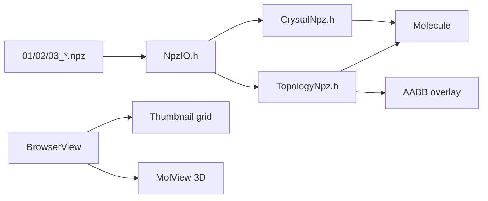

# C++ MolecularBrowser — NPZ crystal viewer

## Summary

SDL/OpenGL **file browser** for nanocrystal pipeline artifacts: loads `01_crystal.npz`, `02_relaxed.npz`, `03_topology.npz`, and loose `.npy` triplets into interactive 3D VIEW mode. NPZ parsing is native C++ (zlib raw deflate, parity with `web/common_js/npzIO.js`). Topology NPZs draw **surface-group AABB wireframes**; optional **MMFF bond-length color map** uses per bond-type equilibrium lengths from `BondTypes.dat`.

**Not in scope:** `04_hessian.npz`, `05_spectrum.npz` (hidden from browser grid; unicode metadata arrays skipped if opened via `--verify-npz`). **Python Vispy browser** has a vibration spectrum plugin for these stages — see [`Python_Vispy_MolBrowser_Plugins.md`](Python_Vispy_MolBrowser_Plugins.md). Topology **neighbor matrix / stiffness overlays** are not drawn yet in C++ (Python has `neigh_idx` bonds + `bond_k` coloring).



---

## Tutorial

### Build & headless verify

```bash
# From repo root
./tests/tSiNCs/test_cpp_npz_load.sh

# Optional: open GUI after verify
./tests/tSiNCs/test_cpp_npz_load.sh --gui

# Single file (no GUI)
cpp/Build/apps/MolecularEditor/MolecularBrowser --verify-npz path/to/03_topology.npz
```

### Interactive browser

```bash
# Default: tests/tSiNCs/fixtures/ (npz_viewer + si_1nm_passivation trees)
./tests/tSiNCs/run_cpp_mol_browser.sh

# Explicit pipeline output folder
./tests/tSiNCs/run_cpp_mol_browser.sh tests/tSiNCs/fixtures/si_1nm_passivation/09_sphere_13A_H_fuse
```

**CLI resources** (override defaults):

| Flag | Default | Role |
|------|---------|------|
| `-res` | `common_resources` | `ElementTypes.dat`, fonts, `BondTypes.dat` |
| `-dir` | `.` | Initial browse directory |
| `-ini` | — | `res_dir=`, `work_dir=` key/value file |

### BROWSE mode

| Input | Action |
|-------|--------|
| Arrow keys | Move selection in folder grid (auto-scroll keeps selection visible) |
| Enter | Open molecule VIEW, or enter subfolder |
| Click tile | Open molecule VIEW |
| Esc / Backspace | Parent directory (`..`) |
| Ctrl+Q / Ctrl+D | Quit |
| Mouse wheel | Zoom (global camera) |

Hidden from grid: `*hessian*.npz`, `*spectrum*.npz`, `Z.npy`/`bonds_ij.npy` when `pos.npy` exists, dot-directories (e.g. `.vispy_mol_browser_cache`).

### VIEW mode

| Key / GUI | Effect |
|-----------|--------|
| Enter / Esc | Back to BROWSE (preserves grid scroll + selection) |
| Ctrl+Q / Ctrl+D | Quit |
| RMB drag | Rotate |
| Wheel | Zoom |
| `l` | Atom index labels |
| `t` | Atom type labels |
| `b` | Bond index labels |
| `i` | Bond length numbers (3D text) |
| `c` | **Bond length color map** (MMFF l₀ per type, ±5% blue/black/red) |
| `g` | Topology AABB wireframes |
| Numpad 2/4/6/8/7/9/5 | View presets / reset |

**Bond colors:** each bond type (e.g. Si–Si vs Si–H) uses its own `l₀` from `MMFFparams::getBondParams`. Requires `params.makeIdDicts()` after `loadBondTypes()` (wired in `MolecularBrowser.cpp`). Legend shows per-type vmin / l₀ / vmax.

**Bond source by file kind:**

| File | Bonds drawn from |
|------|------------------|
| `01_crystal.npz`, `02_relaxed.npz` | `bonds_ij` (required) |
| `03_topology.npz` | Distance fallback only (`findBonds_brute`); `neigh_idx`+`stick_class` **not** used yet |
| Missing bonds | `findBonds_brute(0.5 × covalent radii)` — may miss Si–Si on topology-only files |

---

## API reference (C++ modules)

| Module | Entry points | Notes |
|--------|--------------|-------|
| `NpyIO.h` | `npy_load_file`, `npy_try_parse_buffer`, `npy_as_f8` / `_i4` / `_i8` / `_b1` | Fail-loud on strict parse; try-parse for optional keys |
| `NpzIO.h` | `npz_read_file` | Skips undecodable arrays with warning |
| `CrystalNpz.h` | `crystal_from_npz`, `molecule_loadNpy` | Z → atom type via element table |
| `TopologyNpz.h` | `loadTopologyNpzOnce`, `topology_bboxes_from_npz` | AABB + optional geometry |
| `BrowserView.h` | `loadMoleculeFile`, `refreshDir` | Orchestrates load + filters |
| `MolView.h` | `draw3D`, `rebuildBondLengthCache` | VIEW overlays |
| `Draw3D_Molecular.h` | `bondLengthColorMapMMFF` | Blue ← l₀ → red |

---

## NPZ dtype support (C++ reader)

| dtype | Status | Typical keys |
|-------|--------|--------------|
| `<f8` | read | `pos`, `fmax`, `timing_ms`, Hessian `K` |
| `<f4` | read | `bond_k`, `bond_l0` |
| `<i4` | read | `Z`, `bonds_ij`, `neigh_idx` |
| `<i8` | read | `n_steps` (relaxed NPZ) |
| `\|u1` | read | `gen_params`, `defects_json` |
| `\|b1` | read | `converged` |
| `<U*`, `\|S*` | **skipped** | `source`, `units`, `grid_meta` |

Schema details: [`NPZ_Crystal_Schema.md`](NPZ_Crystal_Schema.md).

---

## Parity & tests

| Check | Command / artifact |
|-------|-------------------|
| Headless parse | `tests/tSiNCs/test_cpp_npz_load.sh` |
| Python counterpart | [`Python_Vispy_MolBrowser_Plugins.md`](Python_Vispy_MolBrowser_Plugins.md) |
| JS reference codec | `web/common_js/npzIO.js` |

---

## Pitfalls

1. **`makeIdDicts()` required** — loading `BondTypes.dat` alone does not build `bonds_` lookup; bond color map falls back to default l₀=2.0 Å for all types without it.
2. **Topology bonds** — `03_topology.npz` has bonds in `neigh_idx`/`stick_class`, not `bonds_ij`; C++ viewer auto-distance bond find is tight for Si–Si. Prefer `01_crystal`/`02_relaxed` for bond sticks, or use Python Vispy (`bonds_from_neigh_idx`).
3. **Pipeline folders** — directories with `04_hessian.npz` / `05_spectrum.npz` are safe to browse; those files are excluded from the thumbnail grid.
4. **ASan builds** — `test_cpp_npz_load.sh` sets `LD_PRELOAD=libasan` when present; GUI launch may need `env -u LD_PRELOAD` if ASan warns about load order.
5. **Small crystals** — `natoms < 3` skips `FindRotation` orient (avoids NaN bbox from degenerate PCA).

---

## Related

- Schema: [`NPZ_Crystal_Schema.md`](NPZ_Crystal_Schema.md)
- Pipeline: [`Nanocrystal_NPZ_Pipeline.guide.md`](Nanocrystal_NPZ_Pipeline.guide.md)
- Python viewer: [`Python_Vispy_MolBrowser_Plugins.md`](Python_Vispy_MolBrowser_Plugins.md)
- Hub: [`tests/tSiNCs/README.md`](../../../tests/tSiNCs/README.md)
