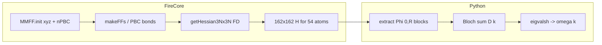

# USER

Plese look here:

I was testing calculation of phonons using MMFF/UFF and I encountered two importaint problems
1) it was crashing with Build-asan while it is not crashing with Build-opt, this indicate there may be some undefined behavitoru touching invalid memory or something. We should test it throughfoully

(these are two problems and we have to focus on each separately and solve them one by one not mix it up)

2) probably unrelated physics problem. Weh nwe compute dynamical matrix from hessian computed at gamma point (With proper PBC - i.e. atoms having bonds to neighboring unitcells) and then apply k-transform on this hessian o get dynamical matrix I get resaonably lokin phonon dispersion but two bands are negative, they look fine if I flip the sing, but I wonder why they are negative.

LLM recomanded to modify how I compute hessian explicitly considering the K-dependnece. But the result was more wrong than before, all the bands were very flat after the change, like 10x smaller frequencies.   

there are more detailed notes from the other LLM in the other repo (CompChemUtils):
/home/prokop/git/CompChemUtils/examples/phonons/MMFF_phonon_PBC_report.md

there is also detailed dicussion about the physics of the problem
@doc/Topics/FTIR_Nanocrystals/Debug_negative_phonon_freqs.md 
 probably we should impleent the 3x3x3 supercell and move only the atoms in the central cell (6x6 hessian from 54 atom in cell)

plese review the code and suggest prossible problesm and plan how to debug it

notece that we have specific system of compitlation we always build in 
/home/prokop/git/FireCore/cpp/Build/
which is a link
we can switch this link to point to either 
/home/prokop/git/FireCore/cpp/Build-opt/
or 
/home/prokop/git/FireCore/cpp/Build-asan/

also preferebly use  @tests/tMMFF/run.sh for debugging as it recompile fresh code and setup ASan library paths

relevant files in this repo
@pyBall/MMFF.py 
@cpp/libs/Molecular/MMFF_lib.cpp @cpp/common/molecular/MolWorld_sp3.h @cpp/common/molecular/UFF.h 
@tests/tMMFF/test_diamond_phonon_bands.py @tests/tMMFF/run.sh 

review the code, make notes and plan, do not code yet

---

# Cursor Composer 2.5

# Phonon debugging review and plan

Two issues should stay separate: **(1) memory/ASan reliability** and **(2) physics of negative phonon branches**. The notes in `Debug_negative_phonon_freqs.md` and `MMFF_phonon_PBC_report.md` match what the code is doing; below is a tighter map of causes and a staged debug plan.

## Current architecture (what the code actually does)



| Layer | File | Role |
|-------|------|------|
| FD Hessian | `cpp/libs/Molecular/MMFF_lib.cpp` | Global `W`, central FD, symmetrize |
| Forces/PBC | `cpp/common/molecular/MolWorld_sp3.h` | `eval_no_omp()`, `makeMMFFs()`, PBC shifts |
| Python API | `pyBall/MMFF.py` | Loads `cpp/Build/libs/Molecular/libMMFF_lib.so` |
| Test harness | `tests/tMMFF/test_diamond_phonon_bands.py` | 3×3×3 supercell, **nPBC=(0,0,0)**, extract Φ, Bloch sum |
| Reference orchestration | CompChemUtils `phonon_backends.py` | Same pattern; `hessian_pbc` toggles nPBC |

**Important:** `test_diamond_phonon_bands.py` uses **`bMMFF=True`**, not UFF. UFF PBC is in `UFF.h::evalAtomBonds` with the same shift logic, but the active phonon path is MMFF sp3.

---

## Problem 1 — ASan crash / heap corruption (trust blocker)

### Symptoms (from report)

| Symptom | When | Build |
|---------|------|-------|
| heap-use-after-free | `MMFF.init()` on 54-atom supercell | Build-asan |
| `double free or corruption (!prev)` | After successful Hessian, on teardown | Build-opt |
| ASAN symbol missing | Load `.so` | Mixed asan/opt object files |

### Likely root causes in FireCore

**1. `init()` is not re-entrant (strongest hypothesis)**

```356:420:cpp/common/molecular/MolWorld_sp3.h
virtual int init(){
    ...
    if(bMMFF || bUFF){
        makeFFs();   // allocates ff, ffl, nbmol, ...
        if(bCheckStuck)apos_bak = new Vec3d[ffl.natoms];  // no delete if called again
    }
```

`MMFF_lib::init()` calls `W.init()` with **no prior `W.clear()`**:

```121:157:cpp/libs/Molecular/MMFF_lib.cpp
void* init(...){
    ...
    int ret = W.init();
```

`clearFFs()` exists and is used by `clear()`, but **`init()` never calls it**. A second `MMFF.init()` in one process (CompChemUtils does this) can:

- Leak old `ffl` / `nbmol` buffers  
- Leave stale Python `ctypes` views (`getBuffs()` → `fapos`, `apos`) pointing at freed memory  
- Produce double-free at process exit  

**2. Mixed ASan/opt link (already seen)**

If `Build → Build-opt` but some `.o` files came from `Build-asan`, you get undefined symbols or silent corruption. Always verify:

```bash
nm -D cpp/Build/libs/Molecular/libMMFF_lib.so | grep -i asan   # must be empty for opt
```

**3. `run.sh` workflow is inconsistent**

```7:36:tests/tMMFF/run.sh
cd ../../cpp/Build-opt/libs/Molecular/   # hardcoded Build-opt, ignores Build symlink
...
LD_PRELOAD=$(g++ -print-file-name=libasan.so)   # ASAN always on
export LD_PRELOAD
```

So the script **builds opt** but **runs with ASAN preloaded** — that can create false crashes, hide real ones, or conflict with matplotlib/ft2font. For Problem 1, asan and opt runs must be cleanly separated.

**4. ASAN + matplotlib in one process**

Known environmental issue (not necessarily MMFF bug). Hessian-only scripts should not import matplotlib when debugging with ASAN.

### Debug plan — Problem 1 only

**Phase 1A — Reproduce with clean builds**

1. `ln -sfn Build-asan cpp/Build` → rebuild full chain: `DynamicOpt`, `MMFF_lib`
2. Minimal repro (no matplotlib):

```bash
unset ASAN_OPTIONS LSAN_OPTIONS
export LD_PRELOAD=$(g++ -print-file-name=libasan.so)
export ASAN_OPTIONS=detect_leaks=0:halt_on_error=1:symbolize=1
cd tests/tMMFF && python3 -c "
import sys; sys.path.insert(0,'../..')
from pyBall import MMFF
# small then large: 2-atom primitive, then 54-atom supercell from test
"
```

3. Repeat with `Build-opt`, **`unset LD_PRELOAD`**, same script — confirm opt completes.

**Phase 1B — Bisect crash location**

| Step | What to run | If it crashes here, inspect |
|------|-------------|------------------------------|
| 1 | `MMFF.init()` only (2-atom primitive) | `loadGeom`, `assignTypes`, `toMMFFsp3_loc` |
| 2 | `init` + single `eval()` | force evaluation |
| 3 | `init` + `getHessian3Nx3N` 6×6 | FD loop |
| 4 | 54-atom supercell `init` | `initNBmol`, PBC neighbor arrays, `assignSpecialTypes` |
| 5 | Full 162×162 Hessian | long FD loop / buffer sizes |
| 6 | **Two** `init()` calls in one process | re-init without `clear()` |

Use ASAN stack trace; line numbers point into `MolWorld_sp3.h`, `MMFFBuilder.h`, `initNBmol`.

**Phase 1C — Confirm re-init hypothesis**

- Run Hessian twice in one process with two `MMFF.init()` calls  
- Run same in **fresh subprocess** (`multiprocessing` / `python -c` per structure)  
- If subprocess-only works → fix is `W.clear()` at start of `MMFF_lib::init()` (future code change)

**Phase 1D — Valgrind / guard as cross-check**

If ASAN is inconclusive on opt-only double-free at exit, run once under valgrind on a minimal 2-atom Hessian after double-init.

**Acceptance for Problem 1:** 54-atom Hessian completes under Build-asan (no matplotlib), and repeated init/Hessian in one process does not crash on exit.

---

## Test harness & results (2026-06-10)

**Scripts:** `tests/tMMFF/test_asan_minimal.py`, `tests/tMMFF/run_asan_minimal.sh` (numpy only, no matplotlib).

```bash
cd tests/tMMFF
bash run_asan_minimal.sh asan
bash run_asan_minimal.sh opt
```

| Step | Build-opt compute | Build-opt teardown | Build-asan |
|------|-------------------|--------------------|------------|
| 1–6 (init … 162×162 H) | **PASS** (‖H‖≈3.07×10⁵) | `double free` on normal exit | **FAIL** `heap-buffer-overflow` in `eval_check` → `eval_atom` |
| 7 double `init` | **FAIL** duplicate `ElementType E` | segfault | FAIL |

Harness uses `os._exit(0)` after PASS (default) so subprocess tests measure compute, not ctypes unload.

**ASAN stack:** `MMFFsp3_loc::eval_atom` ← `eval_check()` ← `makeFFs()`; alloc via `MMFFsp3::realloc` / `toMMFFsp3`. Diamond primitive: `neighCell={-1,-1,-1,-1}`, `npbc=1`, 2 atoms.

**Workaround for phonon pipelines:** one `MMFF.init()` per **subprocess**; do not call `init()` twice in one process.

---

## `run.sh` recommendations

| Goal | Build symlink | Compile | Run env |
|------|---------------|---------|---------|
| Production phonons | `Build → Build-opt` | `cmake --build cpp/Build --target MMFF_lib` | `unset LD_PRELOAD ASAN_OPTIONS` |
| Memory debug | `Build → Build-asan` | full rebuild of deps + `MMFF_lib` | `LD_PRELOAD=libasan`, no matplotlib |
| Current `run.sh` | Hardcoded `Build-opt` + ASAN preload | **Fix before trusting** | Split into `run.sh` (opt) and `run_asan.sh` |

Suggested test entry:

```bash
cd tests/tMMFF
# opt:
unset LD_PRELOAD ASAN_OPTIONS
python3 test_diamond_phonon_bands.py --unit THz

# asan (after ln -sfn Build-asan cpp/Build && rebuild):
export LD_PRELOAD=$(g++ -print-file-name=libasan.so)
export ASAN_OPTIONS=detect_leaks=0:halt_on_error=1
python3 test_diamond_phonon_bands.py --unit THz   # fails before plot if crash is in Hessian
```

## Prioritized summary

| Priority | Issue | Most likely cause | First action |
|----------|-------|-------------------|--------------|
| **P0** | ASAN `eval_atom` OOB | `neighCell`/buffer sizes in `toMMFFsp3` for PBC diamond | Fix sizing; re-run `run_asan_minimal.sh asan` |
| **P0** | Teardown double-free | global `W` / `params` destructor | Valgrind; fix dealloc pairing |
| **P0** | Double `init` | no `W.clear()`; `initParams` re-load | `W.clear()` at start of `MMFF_lib::init()` |
| **P1** | `run.sh` mixed mode | builds opt, preloads ASAN | use `run_asan_minimal.sh` |

## Suggested order of work

1. Fix `MMFFsp3_loc::eval_atom` buffer overflow (ASAN blocker).  
2. `W.clear()` before `W.init()` + teardown audit.  
3. Phonon work via **subprocess per structure** until (1–2) fixed.  
4. Physics / negative bands → `Debug_negative_phonon_freqs.md`.

---

# Cursor Composer 2.5

## What was added

| File | Purpose |
|------|---------|
| `tests/tMMFF/test_asan_minimal.py` | Bisect steps 1–7, numpy only |
| `tests/tMMFF/run_asan_minimal.sh` | Rebuild + run (`asan` or `opt`) |
| `doc/Topics/FTIR_Nanocrystals/Debug_ASan.md` | Updated with results |

```bash
cd tests/tMMFF
bash run_asan_minimal.sh asan    # Build → Build-asan + LD_PRELOAD
bash run_asan_minimal.sh opt       # Build → Build-opt, no ASAN
```

---

## Results

### Build-opt (production) — compute OK

All compute steps **pass** in a fresh subprocess:

| Step | Result |
|------|--------|
| 1 prim `init` | PASS |
| 2 `eval()` | PASS |
| 3 Hessian 6×6 | PASS |
| 4 supercell init (54 atoms) | PASS |
| 5 central-cell Hessian | PASS |
| 6 full 162×162 Hessian | PASS, ‖H‖ ≈ **3.07×10⁵** |
| 7 double `init` in one process | **FAIL** |

**Teardown:** normal Python exit after a single `init()` → `double free detected in tcache 2` / segfault. The harness uses `os._exit(0)` after `PASS` so this does not hide compute success.

**Double init:** second `MMFF.init()` reloads params → `ElementType[22](E) is duplicated => Exit()`.

### Build-asan — init blocked

All steps **fail at `init`** during `ffl.eval_check()`:

```
heap-buffer-overflow in MMFFsp3_loc::eval_atom(int)
  ← eval_check() ← makeFFs()
```

Same diamond primitive (`neighCell` all `-1`, `npbc=1`, 2 atoms). Opt runs past `eval_check`; ASAN catches an OOB read opt does not.

---

## Practical takeaway

- Phonon Hessian on **Build-opt** is usable if each job runs in its **own subprocess** (as CompChemUtils already suggests).
- **Build-asan** points to a real bug in `eval_atom` / buffer setup for PBC diamond — that should be the first C++ fix.
- **Do not** call `MMFF.init()` twice in one process until `W.clear()` is added.

`cpp/Build` is currently linked to **Build-asan**. Switch back with:

```bash
cd cpp && ln -sfn Build-opt Build
```

when you want production phonon runs. I can next trace the `eval_atom` OOB in `MMFFsp3_loc.h` if you want to move on to the fix.