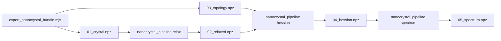

# Nanocrystal NPZ Pipeline — Stages, Contracts, Consumers

**Summary:** End-to-end workflow from JS nanocrystal generation through MMFF relax and topology-linear Hessian to vibrational spectrum NPZ. **Topology and force-field parameters are fixed at export** (`03_topology.npz`); relaxation changes **coordinates only**. Consumers (C++/Python viewers, spectrum tools) must respect per-stage contracts in [`NPZ_Crystal_Schema.md`](NPZ_Crystal_Schema.md).



---

## Design contract (read this first)

| Concept | Rule |
|---------|------|
| **Topology** | `neigh_idx`, `bond_k`, `bond_l0`, `stick_class`, surface AABBs — assigned once at generation. **Not** recomputed after relax. |
| **Coordinates** | `01_crystal.npz` → init; `02_relaxed.npz` → minimized geometry. Hessian evaluates exported springs at **relaxed** `pos`. |
| **Atomic numbers `Z`** | Authoritative in `01_crystal.npz` / `03_topology.npz`. Relax preserves `Z` from init NPZ (do not re-infer from MMFF type names on defect structures). |
| **Viewers** | List `01_*`, `02_*`, `03_*` only. Hide `04_hessian`, `05_spectrum` (analysis stages; may contain unicode metadata). |
| **Relax vs Hessian FF** | Relax today uses **C++ MMFF**; Hessian/spectrum use **exported MMFFL linear sticks** from `03_topology.npz`. Full FF parity at relax is future work (LFF on topology). |

Full key tables: [`NPZ_Crystal_Schema.md`](NPZ_Crystal_Schema.md).

---

## Stage files (per crystal directory)

| Stage | File | Writer | Primary reader |
|-------|------|--------|----------------|
| 1 Generate | `01_crystal.npz` | JS `exportNanocrystalBundle` | Viewers, relax |
| 1 Generate | `03_topology.npz` | JS `buildTopologyNpzFull` | Viewers, Hessian |
| 1 Generate | `meta.json` | JS export | Humans, provenance |
| 2 Relax | `02_relaxed.npz` | `pyBall.nanocrystal_pipeline relax` | Viewers, Hessian |
| 2 Relax | `relaxed.xyz` | same (optional) | Legacy tools |
| 3 Hessian | `04_hessian.npz` | `nanocrystal_pipeline hessian` | Spectrum stage |
| 4 Spectrum | `05_spectrum.npz` | `nanocrystal_pipeline spectrum` | Ensemble accumulate, plots |
| — | `*.status.json` | Python stages | Timing, diagnostics |

Companion status files mirror stage NPZ basename: `02_relaxed.status.json`, etc.

---

## Tutorial — single crystal

```bash
cd /path/to/FireCore
export LSAN_OPTIONS=detect_leaks=0
ASAN="$(g++ -print-file-name=libasan.so)" && [ -f "$ASAN" ] && export LD_PRELOAD="$ASAN"

DIR=tests/tSiNCs/fixtures/si_1nm_passivation/02_sphere_13A_H_standard

python3 -m pyBall.nanocrystal_pipeline relax \
  --init-npz "$DIR/01_crystal.npz" \
  --out-npz "$DIR/02_relaxed.npz" \
  --out-xyz "$DIR/relaxed.xyz"

python3 -m pyBall.nanocrystal_pipeline hessian \
  --relaxed-npz "$DIR/02_relaxed.npz" \
  --topology-npz "$DIR/03_topology.npz" \
  --out-npz "$DIR/04_hessian.npz"

python3 -m pyBall.nanocrystal_pipeline spectrum \
  --hessian-npz "$DIR/04_hessian.npz" \
  --out-npz "$DIR/05_spectrum.npz" \
  --out-plot "$DIR/spectrum.png"
```

**Do not** rebuild `03_topology.npz` after relax unless connectivity changed (defect edit, add/delete bond).

---

## Tutorial — Si ~1 nm passivation gallery (batch)

Nine committed examples under [`tests/tSiNCs/fixtures/si_1nm_passivation/`](../../../tests/tSiNCs/fixtures/si_1nm_passivation/):

```bash
cd /path/to/FireCore
export LSAN_OPTIONS=detect_leaks=0
ASAN="$(g++ -print-file-name=libasan.so)" && [ -f "$ASAN" ] && export LD_PRELOAD="$ASAN"

for d in tests/tSiNCs/fixtures/si_1nm_passivation/*/; do
  python3 -m pyBall.nanocrystal_pipeline relax --init-npz "$d/01_crystal.npz" \
    --out-npz "$d/02_relaxed.npz" --out-xyz "$d/relaxed.xyz" --allow-unconverged
  python3 -m pyBall.nanocrystal_pipeline hessian --relaxed-npz "$d/02_relaxed.npz" \
    --topology-npz "$d/03_topology.npz" --out-npz "$d/04_hessian.npz"
  python3 -m pyBall.nanocrystal_pipeline spectrum --hessian-npz "$d/04_hessian.npz" \
    --out-npz "$d/05_spectrum.npz" --out-plot "$d/spectrum.png"
done
```

Regenerate init bundles only: `node tests/tSiNCs/generate_si_passivation_examples.mjs`.

---

## Consumer guide — what to load

### Molecular browsers (C++ / Python Vispy)

| Goal | Load | Notes |
|------|------|-------|
| Init geometry + bonds | `01_crystal.npz` | `pos`, `Z`, `bonds_ij` |
| Relaxed geometry | `02_relaxed.npz` | Same keys + `fmax`, `converged` |
| Bond sticks + AABB overlay | `03_topology.npz` beside crystal | `neigh_idx`/`stick_class` for sticks; `group_bbox_*` for wireframes |
| Fast path | `pos.npy` + `Z.npy` | Optional; see schema |
| **Vibration spectrum plot** | `05_spectrum.npz` | Via Python **Vibration** plugin (hidden from grid) |
| **Eigenmode visualization** | `04_hessian.npz` | Plugin re-diagonalizes for displacements; arrows + animation on 3D view |

Loaders: `cpp/common/io/CrystalNpz.h`, `TopologyNpz.h`; `pyBall/io/crystal_npz.py`; `web/common_js/npzIO.js`.

**Python plugin guide:** [`Python_Vispy_MolBrowser_Plugins.md`](Python_Vispy_MolBrowser_Plugins.md).

### Spectrum / analysis

| Goal | Load |
|------|------|
| Diagonalize / replot | `04_hessian.npz` — `K_projected`, `M`, `pos` |
| Histogram / modes metadata | `05_spectrum.npz` — `omegas_modes`, `omega_centers`, `hist` |
| IR probe weights (v2) | `05_spectrum.npz` — `probe_weight_x/y/z` |

### Hessian source

Default `--source topology`: analytical assembly from `03_topology.npz` springs at `02_relaxed.pos` via `FTIR.build_hessian_from_linear_topology`. Optional `--source mmff` runs C++ FD for diagnostics only (`--compare-mmff` records `parity_max_rel_diff`).

---

## Python API

| Module | Role |
|--------|------|
| [`pyBall/nanocrystal_pipeline.py`](../../../pyBall/nanocrystal_pipeline.py) | CLI: `relax`, `hessian`, `spectrum`, `accumulate` |
| [`pyBall/io/crystal_npz.py`](../../../pyBall/io/crystal_npz.py) | `load_crystal_npz`, `load_topology_npz`, `validate_topology_crystal_parity` |
| [`pyBall/FTIR.py`](../../../pyBall/FTIR.py) | `build_hessian_from_linear_topology`, `project_rigid_modes`, `mass_matrix_from_Z` |

---

## Pitfalls

1. **Stale advice:** rebuilding topology on relaxed coords changes exported `bond_k`/`l0` assignments — wrong unless connectivity changed.
2. **Z mismatch:** defect crystals — never take `Z` from MMFF type names after relax; use `01_crystal.npz`.
3. **Viewer listing:** do not thumbnail `04_*` / `05_*` — C++ `BrowserView::filterNonViewerNpzFiles()`.
4. **Unicode arrays:** `source`, `topology_path`, `grid_meta` in pipeline NPZs may be `<U*`; C++ skips with warning.
5. **ASan:** set `LSAN_OPTIONS=detect_leaks=0` when running Python MMFF stages.

---

## Cross-links

- [`NPZ_Crystal_Schema.md`](NPZ_Crystal_Schema.md) — authoritative key/dtype tables  
- [`CPP_MolecularBrowser_NPZ.md`](CPP_MolecularBrowser_NPZ.md) — C++ viewer  
- [`Python_Vispy_MolBrowser_Plugins.md`](Python_Vispy_MolBrowser_Plugins.md) — Python viewer  
- [`tests/tSiNCs/fixtures/si_1nm_passivation/README.md`](../../../tests/tSiNCs/fixtures/si_1nm_passivation/README.md) — gallery index  
- [`tests/tSiNCs/ToDo_Nanocrystal.md`](../../../tests/tSiNCs/ToDo_Nanocrystal.md) — open items  
- [`doc/topical_audit/Nanocrystal_Vibrations.md`](../../topical_audit/Nanocrystal_Vibrations.md) — code inventory  
