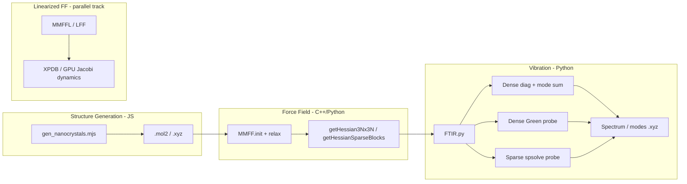
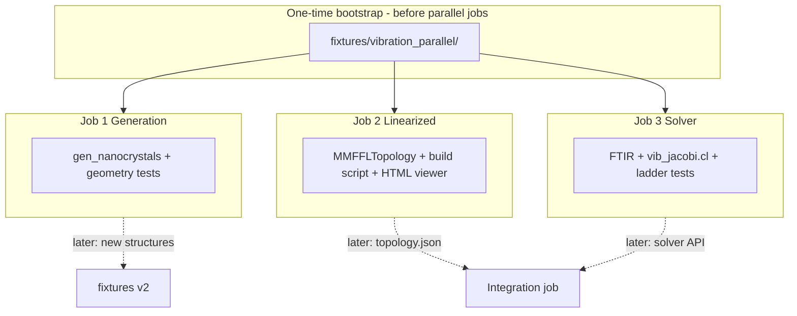

# USER

OK, we should now do something about this vibration spectra of silicon nanocrystals

@.backup_md/doc/topical_audit/Nanocrystal_Vibrations.md @.backup_md/doc/Topics/FTIR_Nanocrystals/gen_nanocrystals.md @scripts/gen_nanocrystals.mjs 


there are several sub-problems we should resolved.

1) efficient linear solver for vibration stats with large sparse hessinan. I thik we were trying to run some sparse solver but it gave wrong results. We should try to make crystal of reasonable size, get hessian, diagonalize it by standard numpy (the size should be approriate so that it is still possible) and then try solution using fast random proble technique. 

We also should implement it on GPU if it is not implemented already. 

pyOpenCL should allo to implement efficient mometum accelerated linear jacobi solver, I think we already have something like that implemented from projective dynamics.

2) Then I think in javascript we have implemented this linearized forciefild where instead of angles and dihedrals we implement linears spring between 2nd and 3rd neighbors. 
see


@web/molgui_web/js/ProjectiveDynamics.js @web/molgui_webgpu/MMFFLTopology.js @web/common_resources/cl/LFF.cl @pyBall/OCL/LFFSolver.py @pyBall/OCL/MMFFL.py 

I do not remember what is the status of these things

can you review it?

possible we should fist to try it on adamantane, and only then move furter, we can then try some larger but regular SiNCs

also I realized that in our generated nanocrystals the geometry in .xyz after generation and before relaxation was somewhat strange (hydrogens were sticking in som dirrections not having nice tetrahedral geometry with 

why is it so?

These are soeveral sub-topics, we should later split it to several tesks which we will solve independnetly obe by one, but lets make overall overview now.

also you can review @doc/topical_audit/intramolecular_forcefields.md for better navigation

---

# Cursor Composer 2.5

# Silicon Nanocrystal Vibration Spectra — Overview & Task Map

This is a synthesis of the existing pipeline, what works, what is broken, and how to split the work into independent tasks.

## End-to-end pipeline (current state)



| Stage | Status | Notes |
|-------|--------|-------|
| SiNC generation (`gen_nanocrystals.mjs`) | **Active** | Miller cuts, prune, H-cap, optional bridge ops |
| MMFF Hessian (dense FD, C++) | **Active, validated** | Adamantane parity with Green's probing |
| Sparse Hessian blocks (C++) | **Active** | `getHessianSparseBlocks` + neighbor shells |
| Dense vibration spectrum | **Active** | `test_vibration_spectra.py`, `vibration_spectrum_from_modes` |
| Sparse vibration spectrum | **Implemented, suspect** | Missing rigid-mode projection; shell truncation needs validation |
| GPU vibration linear solve | **Not implemented** | GPU Jacobi exists for MD/PD, not for \(A(\omega)u=f\) |
| Linearized FF (LFF/MMFFL) | **Active for MD/XPDB** | Not wired into vibration/Hessian pipeline |

## Sub-problem 1: Efficient linear solver for vibrations

### What exists

**Reference (small systems, ground truth)**

- `tests/tMMFF/test_vibration_spectra.py` — adamantane end-to-end: dense Hessian → `project_rigid_modes` → `mechanical_greens_probing` → compare peaks with `np.linalg.eigh` on mass-weighted \(H\). **This is the validation template.**
- `tests/tMMFF/test_nanocrystal_sparse_hessian.py` — diamond nanoparticle: relax → sparse blocks → spectrum via `dense` / `sparse` / `both`.

**Three spectrum methods in `pyBall/FTIR.py`:**

| Method | Function | Cost | Status |
|--------|----------|------|--------|
| Dense eigenmode | `vibration_spectrum_from_modes` | \(O(N^3)\) once + \(O(n_\omega N)\) | **Preferred for \(N \lesssim 1000\)** |
| Dense per-ω solve | `mechanical_greens_probing` | \(O(n_\omega N^3)\) | Slow; reference only |
| Sparse per-ω solve | `mechanical_greens_probing_sparse` | \(O(n_\omega \cdot \text{nnz})\) | **Likely wrong today** |

**Sparse Hessian infrastructure** (documented in `doc/Topics/FTIR_Nanocrystals/Sparse_Hessian_Vibration_Spectra.guide.md`):

- `MMFF.buildNeighShells()` — BFS from 1st neighbors
- `MMFF.getHessianSparseBlocks()` — C++ FD, reads forces only on shell neighbors
- `FTIR.build_sparse_hessian_from_blocks()` — scipy BSR assembly

**Iterative / GPU solvers (not connected to vibrations):**

- `pyBall/pyTruss/IterativeLinearSolvers.py` — Jacobi, Chebyshev, momentum (CPU, toy tests)
- `web/common_resources/cl/LFF.cl` + `pyBall/OCL/LFFSolver.py` — GPU momentum Jacobi for **bonded spring dynamics**
- `pyBall/XPDB_AVBD/XPDB_new.py` — tiled Jacobi for projective dynamics
- OrderN_QM docs mention stochastic probing / contour integration — **not in `FTIR.py`**

### Why the sparse solver likely gave wrong results

Three concrete issues, not one mystery bug:

1. **Rigid modes not projected in sparse path**  
   In `test_nanocrystal_sparse_hessian.py`, the dense branch calls `FTIR.project_rigid_modes(...)` before spectrum computation. The sparse branch feeds raw `H_sparse` into `mechanical_greens_probing_sparse` with **no projection**. That alone produces huge spurious low-frequency response for clusters.

2. **Approximate Hessian via shell truncation**  
   `getHessianSparseBlocks` only records force derivatives for atoms in the precomputed shell list. With `n_shells=2` this is usually enough for bonded MMFF, but it must be validated against the full dense Hessian (block reconstruction vs `getHessian3Nx3N`).

3. **`scipy.sparse.linalg.spsolve` on complex \(A(\omega)\)**  
   Near resonances \(\det(K - \omega^2 M) \approx 0\) the direct sparse solve is ill-conditioned. The `stabilize` shift helps but is not a substitute for proper rigid-mode handling or iterative solvers with preconditioning.

### Recommended validation ladder (your proposed plan)

```
Adamantane (C10H16, ~126 DOF)
  → dense H, eigh, Green probe, sparse probe (all with project_rigid_modes)
  → assert peak positions match

Small regular SiNC (~50–200 atoms, after relax)
  → same comparison
  → check shell count (2 vs 3) vs full dense H

Medium SiNC (~500–1500 atoms)
  → dense diag if feasible (reference)
  → sparse + GPU Jacobi iterative probe (new)
```

**GPU path:** Port the `lff_jacobi` pattern (local gather, diagonal solve, momentum `bMix`) to solve \(A(\omega) u = f\) at each \(\omega\), or factor once per \(\omega\) on CPU for medium systems. There is **no** GPU vibration solver today; LFF is time-domain MD, not frequency-response.

**Random / stochastic probing** (for very large \(N\)): mentioned in `gen_nanocrystals.md` (OrderN_QM) but not implemented in `FTIR.py`. Worth a separate task after dense/sparse parity is fixed.

## Sub-problem 2: Linearized force field (LFF / MMFFL)

### Concept

Replace explicit angle/dihedral terms with **harmonic springs between 2nd neighbors** (law of cosines for equilibrium distance \(l_0\)):

\[
l_0 = \sqrt{r_{AB}^2 + r_{BC}^2 - 2 r_{AB} r_{BC} \cos\theta_0}
\]

Same physics as angle bending, but only 2-body springs → compatible with Jacobi/PD solvers.

### Implementation status

| Layer | File | Status |
|-------|------|--------|
| **Python topology** | `pyBall/OCL/MMFFL.py` | **Mature** — `build_linearized()`, `_build_angle_bonds()`, `build_topology()` for XPDB |
| **Python GPU dynamics** | `pyBall/OCL/LFFSolver.py`, `LFF.cl`, `run_lff_linearized.py` | **Working for relaxation/MD**, not vibrations |
| **JS topology** | `web/molgui_webgpu/MMFFLTopology.js` | **Mature** — `buildAngleBonds()`, `buildMMFFLTopology()`, `buildXPDBInputsFromMol()` |
| **JS PD** | `web/molgui_web/js/ProjectiveDynamics.js` | **Parallel implementation** — `convertAngleToDistance()` virtual bonds (lines ~504–580) |
| **Tests** | `test_TiledJacobi_molecules.py`, `test_XPDB_new_dump_headless.py` | MMFFL topology + XPDB parity; **no adamantane vibration test** |
| **Vibration / Hessian** | — | **Not connected** — vibrations still use full MMFF angles via C++ FD |

**Gaps:**

- No analytical linearized Hessian (only springs → sparse matrix assembly is trivial and cheap).
- No parity test: MMFFL linearized modes vs MMFF full-angle modes on adamantane.
- `MMFFL` depends on correct `mol.enames` type names; `gen_nanocrystals.mjs` never assigns `atype` (falls back to element-based `Si` type — usually OK, but fragile).

**Suggested first test:** adamantane — compare \(\omega_i\) from:
1. Full MMFF Hessian (`test_vibration_spectra.py`)
2. Linearized spring network built from `MMFFL.build_topology()` (analytical \(3\times3\) blocks or FD on LFF energy)

Then SiNC after H-passivation is fixed.

## Sub-problem 3: Strange hydrogen geometry in generated nanocrystals

### What the generator does

```434:438:scripts/gen_nanocrystals.mjs
        let nCaps = 0;
        if (args.caps && args.caps !== '0' && args.caps !== 'none') {
            const r = mol.addCappingAtoms(mm, args.caps, { onlySelection: false, bBond: true });
            nCaps = r.nAdded | 0;
            if (nCaps > 0) mol.recalculateBonds(mm, { defaultRcut: args.defaultRcut, bondFactor: args.bondFactor });
```

`addCappingAtoms` uses `missingDirsVSEPR()` — mathematically correct **local tetrahedral completion** given existing Si–Si bond directions:

- 3 neighbors → 1 H opposite \(\sum \hat{r}_i\)
- 2 neighbors → 2 H via cross-product construction
- 1 neighbor → 3 H at \(\sim 109.5°\) from the single bond

Si type resolves correctly (`AtomTypes.dat`: `Si`, valence 4, Ass = 109.5°).

### Why it still looks wrong (before relaxation)

1. **No relaxation step** — `gen_nanocrystals.mjs` exports raw capped geometry. The Python test pipeline always relaxes (`MMFF.run(...)`) before Hessian; generated `.xyz` does not.

2. **Surface geometry is not bulk-diamond** — faceted cuts leave Si–Si–Si angles deviating from 109.5°. VSEPR completes tetrahedra **locally** relative to distorted surface bonds, so H can appear to “stick out” relative to the global surface normal.

3. **Bridge insert/collapse** (`insertBridge` with `hDist: 1.3`, carbon-default geometry, then promoted to Si) can add visibly bad SiH\(_2\) groups after capping.

4. **No surface-normal bias** — chemists often want H pointing outward from the facet; VSEPR is symmetric and ignorant of surface orientation.

5. **Documented as known bug** in `Sparse_Hessian_Vibration_Spectra.guide.md` (H placement section) — root cause is partly “no relax + bridge ops + no outward bias”, not a broken VSEPR formula per se.

6. **Contrast with Python test builder** — `test_nanocrystal_sparse_hessian.py` uses a simpler `-Σ r̂` H placement for diamond, then **MMFF relaxes 2000 steps** before any vibration work.

**Fix direction (later task):** assign `Si`/`H` atom types explicitly → cap → optional outward-normal bias → **MMFF/UFF relax** (bonds+angles only) → export relaxed `.xyz` for vibration pipeline.

## Proposed independent tasks

### Task A — Reference validation (adamantane)
**Goal:** Lock down the gold standard before SiNC.  
**Work:** Run `test_vibration_spectra.py`; add automated peak-position comparison (Green probe vs `eigh`); document tolerances.  
**Exit criterion:** Peaks match within \(\eta\)-broadening; modes visualizable in Jmol.

### Task B — Fix sparse vibration solver
**Goal:** Make `mechanical_greens_probing_sparse` trustworthy.  
**Work:**
- Apply `project_rigid_modes` to sparse matrix (or project in solve RHS)
- Validate reconstructed sparse \(H\) vs dense `getHessian3Nx3N` on adamantane + small SiNC
- Tune `n_shells`, `max_neigh`; run `--spectrum-method both` and assert `rel_diff < 1e-3`
- Consider `eigsh` for partial spectrum at larger \(N\)

### Task C — GPU / iterative frequency-domain solver
**Goal:** Scale beyond dense diagonalization.  
**Work:** Adapt `LFF.cl` Jacobi + momentum (or `IterativeLinearSolvers.solve_jacobi_momentum`) to complex \(A(\omega) u = f\); benchmark vs scipy on medium SiNC.  
**Depends on:** Task B (correct CPU reference).

### Task D — H passivation & pre-relax in generator
**Goal:** Sensible `.xyz` straight from `gen_nanocrystals.mjs`.  
**Work:** Explicit type assignment; optional surface-outward bias; post-cap MMFF relax hook (Python or JS); fix `insertBridge` SiH\(_2\) geometry.  
**Exit criterion:** Visual tetrahedral SiH\(_n\) on {111}/{100} facets; no clashes before MMFF.

### Task E — Linearized FF vibration parity (adamantane → SiNC)
**Goal:** Use LFF/MMFFL as cheaper vibration model.  
**Work:** Build spring network from `MMFFL.build_topology()`; analytical or FD Hessian; compare modes to full MMFF on adamantane, then relaxed SiNC.  
**Leverages:** `MMFFL.py`, `MMFFLTopology.js`, `LFF.cl` (if GPU Hessian-vector products needed).

### Task F — SiNC production pipeline
**Goal:** End-to-end spectrum for real generated crystals.  
**Work:** `gen_nanocrystals.mjs` → relax → Hessian (sparse) → spectrum → compare with experiment / literature.  
**Depends on:** Tasks B, D (minimum).

## Suggested execution order

```
A (adamantane reference)
  ↓
B (fix sparse solver)  ←→  D (H geometry + relax)  [can parallelize]
  ↓
E (LFF parity on adamantane)
  ↓
C (GPU iterative solver, if B shows sparse CPU is correct)
  ↓
F (regular SiNC spectra)
```

## Navigation pointers

- **Vibration topic map:** `.backup_md/doc/topical_audit/Nanocrystal_Vibrations.md`
- **Sparse Hessian guide:** `doc/Topics/FTIR_Nanocrystals/Sparse_Hessian_Vibration_Spectra.guide.md`
- **Force field landscape:** `doc/topical_audit/intramolecular_forcefields.md` (UFF, MMFFsp3, PD, XPBD — LFF/MMFFL is the linearized variant used by XPDB, not yet listed as its own section)
- **Generation docs:** `.backup_md/doc/Topics/FTIR_Nanocrystals/gen_nanocrystals.md`

## Immediate takeaway

The pipeline is **not empty** — adamantane vibration spectroscopy works, sparse Hessian **blocks** are computed, and LFF/MMFFL linearization is **production-ready for XPDB/MD** but **not for vibrations**. The two highest-impact fixes before touching SiNC spectra are:

1. **Rigid-mode projection in the sparse spectrum path** (likely explains “wrong sparse results”).
2. **MMFF relaxation after H-capping** in the generation pipeline (likely explains “strange H geometry” in raw `.xyz`).

I can start with **Task A** (adamantane automated parity) or **Task B** (sparse solver fix) whenever you want to pick one.

---

# USER

OK, now in folder 

/home/prokop/git/FireCore/.backup_md/doc/Topics/FTIR_Nanocrystals
you sould create separate desing documents/progress reports *.progress.md each related to each of the sub-problems

1) generation of the nanocrustals. We should check why the hydrogen are not nice on some simple geometry, produce .xyz does not have to be large crystal of diamond. we should also test different possible deffects (what are the options to modify shape and introduce deffects? I remember some colapsing of bridges, adding bridges in the middle of bond, cutting different faces ... something elese?). But we should generate geometry as close to minimum as possible, with tetrahedral neighborhood of all C or Si atoms

2) preparation of Linearized topology. We should do it using javascript (headless batch script with node.js) because it is faster than python. we should have 1-2 (bonds), 1-3 (angles) and (1-4) like torison all represented by linear stick (spring), how many neighbors we need for that maximum? consider that our diamond lattie is made of hexagons so 1-4 is basically connecting oposite sites of hexagon (1-2,1-3,1-4 is like ortho,metha, para benzene substiution sites) which is exactly what we wnat, so we can have stifnfnes constant K12,K13,K14.
To debug if it assing it properly we can generate .mol file (for small crystal), or we can generate small HTML using p5.js or other online genric 3d vide package which will plot us this sticks (L12,K13,K14 but 3 different colors red, green, blue) for debugging, (rotable by mouse). I hope we can do such interacitve molecular visualizer without much programing

3) the most tricky part is debuging the fast linear solver. It definitely does not make sense to scan spectrum for m frequencies with slow O(n^3) linear solver. In that case it is much cheaper to really solve eigenmodes once for all frequencies. But for large system the scannig method with probles can be faster but only if we use sparse inear solvers. We can see if numpy or scifpy provide some espablished (just for test) but ultimately we want to implement our own using pyOpenCL which reads the sparse hamiltonian with defined pair-indexes (up to some maxumum limit) and we should use efficintly workgroups ans wrgroups shared local memory that is essential for speed, review all our implementations of this which is most developed and which we should use. We should test this in several stateges. First on small system we diagonalize it by normal dense eighensolver, and we try to use sparse numpy/scipy eignesolver if it produce peaks at position of eighevalues, then we try to use our pyOpenCL jacobi heavy-ball acclerated solver to do that if it reporduce the numpy/scipy sparse solver and produce peks at proper place. Wen this works, we can move to large systems where we really see performance advantage and try to solve it there.


do not program now, analyse the problem deeper, and write the 3 .progress.md files which well defined plan, desing goals, and testing milestones which we should meet. 

---

# Cursor Composer 2.5

Created three design/progress documents in `.backup_md/doc/Topics/FTIR_Nanocrystals/`:

| File | Topic |
|------|--------|
| [`Nanocrystal_generation.progress.md`](file:///home/prokop/git/FireCore/.backup_md/doc/Topics/FTIR_Nanocrystals/Nanocrystal_generation.progress.md) | H passivation, minimal test crystals, defect catalog |
| [`Linearized_topology.progress.md`](file:///home/prokop/git/FireCore/.backup_md/doc/Topics/FTIR_Nanocrystals/Linearized_topology.progress.md) | JS headless MMFFL, K₁₂/K₁₃/K₁₄, neighbor budget, HTML stick viewer |
| [`Sparse_vibration_solver.progress.md`](file:///home/prokop/git/FireCore/.backup_md/doc/Topics/FTIR_Nanocrystals/Sparse_vibration_solver.progress.md) | Validation ladder, scipy vs GPU Jacobi, LFF.cl as base |

### 1) Generation

- **Minimal geometry ladder G0–G5:** SiH₄ reference → `diamond_primitive` → single `{111}` cut → adamantane → no bridge ops until baseline works.
- **Defect catalog** documents every CLI knob: Miller planes, prune, caps, `insertProb` / `collapseProb`, bond cutoffs, jitter.
- **Root cause:** VSEPR is fine; problems are no relax, bridge insertion geometry, and distorted surface Si–Si angles.
- **Milestones M-G0…M-G5:** automated `geometry_report.json` (angles, Si–H lengths, clashes) before any vibration work.

### 2) Linearized topology

- **JS-first** batch script plan (`build_linearized_topology.mjs`); Python MMFFL only for parity.
- **K₁₂ (red)** = bonds — done; **K₁₃ (green)** = angle springs — done; **K₁₄ (blue)** = dihedral→distance springs — **to implement** (hexagon ortho/meta/para = graph dist 1/2/4).
- **Neighbor budget:** interior diamond needs ~28 incident sticks → raise `MAX_NEIGHBORS` from 8 (LFF.cl) to **32** or split into three lists.
- **Debug viewer:** standalone Three.js/p5 HTML (~100 lines), no molgui — color-coded sticks, mouse orbit.
- **Milestones M-L0…M-L6** through adamantane parity and GPU packing format.

### 3) Sparse vibration solver

- **Algorithm choice:** dense `eigh` for small N; frequency scan only when solves are O(nnz), never O(N³) per ω.
- **Known bugs:** sparse path skips `project_rigid_modes`; shell truncation must be validated.
- **Staged ladder:** M-S0 dense eigh → M-S1 scipy `spsolve`/`eigsh` → M-S2 CPU complex Jacobi+momentum → M-S3 **pyOpenCL** (port **`LFF.cl`** local-memory Jacobi-fly, not XPDB) → M-S4 large NC timing.
- **Two Hessian paths:** MMFF FD blocks (Path A) vs analytical springs from linearized topology (Path B).

The existing `Nanocrystal_vibration_sparse.progress.md` remains a chat transcript from the earlier overview; the three new files are the actionable design specs with milestones.

Suggested start order when you begin implementation: **M-G2** (caps-only minimal cut) in parallel with **M-S0** (adamantane dense reference), then **M-L0** on adamantane topology.

---

# USER

can these tasks be solved independnetly? I mean do they need to edit same files? I would like to run tham as 3 indepndneted agentic jobs in parralel, which do not need to talk to each other. Is that possible? should we give them some guards? For example linars solver can work with hessian we computed by MMFF (C++) for original crystal (therefore it does not depend on changes in Linearized forcefield, or crustal generation), linearized forcefield can also work with nanocrystal geometry (adametane, or other nanocrystal we pregenerated), mayb we should pre-generate all these artificas and instruc the LLM to use them in ach document, to avoid thse conflicts before we start these jobs 

---

# Cursor Composer 2.5

Yes — **parallel runs are feasible** if you treat the three tracks as **separate code ownership** plus a **frozen input fixture bundle**. Without that, two jobs will collide on the same files.

## Can they be independent?

**Logically:** mostly yes. Each track has a natural reference that does not need the others’ *code* changes:

| Track | Reference physics | Needs other tracks’ *code*? |
|-------|-------------------|----------------------------|
| **Generation** | Geometry + H placement | No |
| **Linearized topology** | Spring list from fixed `.mol2`/`.xyz` | No (adamantane + pre-cut NC) |
| **Sparse solver** | MMFF C++ Hessian on fixed relaxed geometry | No (not linearized K, not new generator) |

**Git / file edits:** not fully disjoint today. Without guards, agents will step on each other.

### High-risk shared files (must split ownership)

| File | Generation | Linearized | Solver |
|------|:----------:|:----------:|:------:|
| `scripts/gen_nanocrystals.mjs` | **owns** | — | — |
| `web/molgui_webgpu/EditableMolecule.js` | **owns** | — | — |
| `web/molgui_webgpu/MMFFLTopology.js` | — | **owns** | — |
| `pyBall/FTIR.py` | — | — | **owns** |
| `web/common_resources/cl/LFF.cl` | — | ⚠️ wants `MAX_NEIGHBORS` | ⚠️ wants Jacobi port |
| `pyBall/OCL/LFFSolver.py` | — | — | ⚠️ |
| `tests/tMMFF/test_nanocrystal_sparse_hessian.py` | — | — | **owns** |
| `pyBall/OCL/MMFFL.py` | — | read-only parity | — |

**Main collision:** `LFF.cl` / `LFFSolver.py` — both progress docs mention them. **Solver must not edit `LFF.cl` in place**; copy to a new vibration-specific kernel (e.g. `vib_jacobi.cl` + `VibSolver.py`).

**Secondary:** `tests/tSiNCs/` or `OUT_*` output dirs if everyone writes there.

## Recommended: fixture bundle + agent contracts

Pre-generate **once** (you or a short setup script), commit to git, and point all three agents at the same read-only tree. That removes runtime coupling.

Suggested layout:

```
tests/tSiNCs/fixtures/vibration_parallel/
  MANIFEST.md                 # paths, hashes, how each job uses them
  structures/
    adamantane.mol2             # from cpp/common_resources/mol/
    diamond_primitive.xyz       # from cpp/common_resources/crystals/
    si_G1_primitive_capped.xyz  # minimal Si, caps only, insert/collapse=0
    si_G2_facet111_capped.xyz   # single-facet cut
    diamond_nc_R8_relaxed.xyz   # from test_nanocrystal_sparse_hessian pipeline
  hessian_mmff/                 # for SOLVER job only (frozen MMFF reference)
    adamantane_H_dense.npy        # or .npz with H, M, pos, elements
    adamantane_omegas_ref.npz     # optional: dense eigh peaks for M-S0
    diamond_nc_R8_blocks.npz      # neigh_idx, neigh_count, blocks
  expected/                     # optional golden outputs
    adamantane_peak_omega.txt   # first N mode frequencies
```

**One-time setup commands** (human or “fixture bootstrap” agent, not the three parallel jobs):

1. Copy/link adamantane + diamond primitive.
2. Run `gen_nanocrystals.mjs` with fixed seed, caps only, no bridges → G1/G2 `.xyz`.
3. Run `test_nanocrystal_sparse_hessian.py` once → relaxed NC + sparse `.npz`.
4. Run `test_vibration_spectra.py` on adamantane → save dense `H`, `M`, reference peak list.

After that, parallel agents **only read** `fixtures/vibration_parallel/`.

## Per-job guards (paste into each agent prompt)

### Job 1 — Generation (`Nanocrystal_generation.progress.md`)

**May edit:**
- `scripts/gen_nanocrystals.mjs`
- `scripts/test_nanocrystal_geometry.mjs` (new)
- `web/molgui_webgpu/EditableMolecule.js` / `MoleculeUtils.js` (only if cap/bridge logic)

**May write outputs:**
- `tests/tSiNCs/geometry/` (new outputs only)

**Must not edit:**
- `pyBall/FTIR.py`, `pyBall/OCL/*`, `MMFFLTopology.js`, `LFF.cl`, `tests/tMMFF/test_vibration*`

**Inputs:** compare against `fixtures/vibration_parallel/structures/diamond_primitive.xyz`; do not require new solver or LFF code.

**Done when:** M-G2 geometry report passes on caps-only G2; artifacts written under `tests/tSiNCs/geometry/`.

### Job 2 — Linearized topology (`Linearized_topology.progress.md`)

**May edit:**
- `web/molgui_webgpu/MMFFLTopology.js`
- `web/molgui_webgpu/MMParams.js` (only if loading dihedrals)
- `scripts/build_linearized_topology.mjs` (new)
- `tests/tSiNCs/linearized/` (outputs: `topology.json`, `debug_viewer.html`)

**Must not edit:**
- `gen_nanocrystals.mjs`, `EditableMolecule.js`, `FTIR.py`, `LFF.cl`, `LFFSolver.py`, C++ MMFF

**Inputs (read-only):**
- `fixtures/vibration_parallel/structures/adamantane.mol2`
- `fixtures/vibration_parallel/structures/si_G*.xyz`
- Optional parity read: `pyBall/OCL/MMFFL.py` (no modifications)

**Must not** change `MAX_NEIGHBORS` in `LFF.cl`; document required neighbor count in `topology.json` metadata only.

**Done when:** M-L0–L3 on adamantane; HTML viewer works; no changes outside JS + new script + `tests/tSiNCs/linearized/`.

### Job 3 — Sparse solver (`Sparse_vibration_solver.progress.md`)

**May edit:**
- `pyBall/FTIR.py`
- `tests/tMMFF/test_vibration_solver_ladder.py` (new)
- `tests/tMMFF/test_vibration_jacobi_ocl.py` (new)
- **New** `cpp/common_resources/cl/vib_jacobi.cl` (copy from `LFF.cl`, do not modify `LFF.cl`)
- **New** `pyBall/OCL/VibSolver.py` (copy pattern from `LFFSolver.py`)

**Must not edit:**
- `MMFFLTopology.js`, `gen_nanocrystals.mjs`, `EditableMolecule.js`, `MMFFL.py`

**Inputs (read-only):**
- `fixtures/vibration_parallel/structures/adamantane.mol2`
- `fixtures/vibration_parallel/hessian_mmff/*` OR compute via existing `MMFF.getHessian3Nx3N` / `getHessianSparseBlocks` on fixture structures only
- Hessian source: **MMFF C++ only** (Path A); ignore linearized topology until integration phase

**Done when:** M-S0–S3 on adamantane using MMFF Hessian; rigid-mode fix in sparse path; GPU solver in **new** files only.

## Dependency graph (for parallel work)



Solid arrows = read fixtures. Dotted = **after** parallel phase, not during.

## What still blocks true independence?

| Issue | Mitigation |
|-------|------------|
| Solver wants new NC geometries | Use **pre-generated** `si_G2_*.xyz` + `diamond_nc_R8_relaxed.xyz` in fixtures |
| Linearized wants “good” Si caps | Use adamantane + **relaxed** diamond NC from fixtures; generation job improves caps in parallel without blocking |
| Both want `MAX_NEIGHBORS` change | Solver: new `vib_jacobi.cl` with `MAX_NEIGHBORS=32`; LFF: metadata only in Job 2 |
| MMFF C++ rebuild | Solver job may need `make.sh` in `tests/tMMFF`; Generation/LFF jobs do not touch C++ |
| Shared `tests/tMMFF/` | Solver owns new `test_vibration_solver_ladder.py`; avoid editing same existing test file in parallel — solver fixes `test_nanocrystal_sparse_hessian.py` **or** copies logic into ladder test only |

## Verdict

**Yes, run three agents in parallel** if you:

1. **Bootstrap fixtures first** (`MANIFEST.md` + structures + optional frozen Hessian `.npz`).
2. **Assign exclusive write sets** (table above).
3. **Fork GPU code** (`vib_jacobi.cl`, not `LFF.cl`).
4. **Defer integration** (LFF Hessian + new NC geometries + production spectrum) to a fourth job after all three hit M-G2 / M-L3 / M-S1.

I can add a `tests/tSiNCs/fixtures/vibration_parallel/MANIFEST.md` and a short **“Agent contract”** section to each of the three `.progress.md` files so prompts are copy-paste ready — say if you want that committed before launching the jobs.

---

# USER

OK, I do not want these debugging artifacts to be commited to git. I will commit only after all the jobs are finished. 

but otherwise I agree, use current pipleine which is described in @.backup_md/doc/topical_audit/Nanocrystal_Vibrations.md @.backup_md/doc/Topics/FTIR_Nanocrystals/Sparse_Hessian_Vibration_Spectra.md to prepare all the artifiacs (crystals geometries, precaclualted hessian), mention them in the docs inclusing the contracts, and then we can run the 3 agentic tasks in parallel.

Do it

---

# Cursor Composer 2.5

Done. Here is what is in place:

## Fixtures generated (local, gitignored)

```bash
python3 tests/tSiNCs/bootstrap_vibration_parallel_fixtures.py          # full
python3 tests/tSiNCs/bootstrap_vibration_parallel_fixtures.py --hessian-only  # MMFF only
```

**`tests/tSiNCs/fixtures/vibration_parallel/`** (11 files + `MANIFEST.json` with SHA256):

| Path | Content |
|------|---------|
| `structures/adamantane.mol2` | 26 atoms |
| `structures/si_G1_caps_only.{mol2,xyz}` | 214 atoms, caps-only, seed=42 |
| `structures/si_G2_facet111_caps_only.{mol2,xyz}` | 609 atoms |
| `structures/diamond_primitive.xyz` | reference cell |
| `structures/diamond_nc_R6_{init,relaxed}.xyz` | C NC from `test_nanocrystal_sparse_hessian` |
| `hessian_mmff/adamantane_mmff_dense.npz` | H, H_projected, M, pos, omegas_modes |
| `hessian_mmff/diamond_nc_R6_sparse_blocks.npz` | neigh_idx, blocks |
| `expected/adamantane_omegas_modes.txt` | dense eigh reference |

## Committed / committable docs & tooling

| File | Role |
|------|------|
| `.backup_md/doc/Topics/FTIR_Nanocrystals/Parallel_agent_fixtures.guide.md` | **Master contract** + fixture layout + agent prompt snippet |
| Three `*.progress.md` files | Each has **Parallel agent contract (Job N)** section |
| `tests/tSiNCs/bootstrap_vibration_parallel_fixtures.py` | Regenerate fixtures |
| `scripts/mol2_to_xyz.mjs` | mol2→xyz helper |
| `.gitignore` | Ignores `fixtures/`, `geometry/`, `linearized/` |

Updated cross-links in `Nanocrystal_Vibrations.md` and `Sparse_Hessian_Vibration_Spectra.md`.

## Launching 3 parallel agents

Paste into each agent (adjust job number):

```
Read: .backup_md/doc/Topics/FTIR_Nanocrystals/Parallel_agent_fixtures.guide.md
Read: .backup_md/doc/Topics/FTIR_Nanocrystals/<JOB>.progress.md
Fixtures: tests/tSiNCs/fixtures/vibration_parallel/ (regenerate if missing)
Follow Job N contract only. Do not commit fixture artifacts.
```

| Job | Progress doc |
|-----|----------------|
| 1 Generation | `Nanocrystal_generation.progress.md` |
| 2 Linearized topology | `Linearized_topology.progress.md` |
| 3 Sparse solver | `Sparse_vibration_solver.progress.md` |

**Solver job** uses frozen MMFF `.npz` only — no dependency on generation or LFF code changes until integration.

**Note:** `si_G1` is 214 atoms (centered 1×1×1 still yields a sizable cut). Job 1 can add smaller geometries under `tests/tSiNCs/geometry/` without touching the frozen fixture basenames.