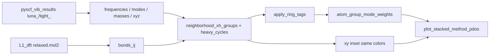

# PySCF L1 neighborhood PDOS

**Lead figures (the plot template):** [`tests/tSiNCs/OUT_pyscf_jobs/stacked_C.png`](../../../tests/tSiNCs/OUT_pyscf_jobs/stacked_C.png) · [`stacked_Si.png`](../../../tests/tSiNCs/OUT_pyscf_jobs/stacked_Si.png) · HTML [`OUT_pyscf_jobs/index.html`](../../../tests/tSiNCs/OUT_pyscf_jobs/index.html).

**PySCF vs DFTB+ L1 (same 12 crystals, same groups):** [`tests/tSiNCs/OUT_dftb_vs_pyscf_l1/index.html`](../../../tests/tSiNCs/OUT_dftb_vs_pyscf_l1/index.html) · per-crystal `compare_<name>.png` (stacked PDOS) + `<name>/spectra_overlay.png` (untyped DOS). DFTB jobs: `/home/prokop/SIMULATIONS/SiNCs/DFTB/L1`. All 24 DFTB Hessians are minima (`n_imag=0`).

**Hard rule:** a harmonic spectrum is the Hessian **at that method’s own minimum**. Imaginaries with \(|\nu|>10\,\mathrm{cm}^{-1}\) mean leftover forces — not FTIR peak positions. SSOT: [`Hessian_at_own_minimum.md`](Hessian_at_own_minimum.md).

**User preference (2026-09-02):** this stacked neighborhood PDOS (chemistry colors, black total DOS, eigenstate rug, xy geometry inset in the empty \(\omega\)-gap, 5/7-ring as its own PDOS slice) is the **reference / template** for further silicon-nanocrystal vibration plots. Do not invent a second stacked plotter. Reuse `plot_stacked_method_pdos`.

---

## Summary

L1 chem-atlas cube / octahedron nanocrystals (parent, 5-ring collapse, 7-ring insert) × {C, Si} were relaxed and Hessian’d with **PySCF PBE / ccECP-cc-pVDZ** on MetaCentrum. FireCore does **not** re-run DFT here: it reads `frequencies_cm1.npy`, `modes.npy` \((n_\mathrm{vib},N,3)\), `masses.npy`, `relaxed.xyz` and tags atoms with the **same neighborhood machinery** already used for L1/L2 MMFF and DFTB+ (`neighborhood_xh_groups`, `heavy_cycles`, `atom_group_mode_weights`).

Each mode’s mass-weighted \(|u|^2\) is a **partition** of the atoms: \(\sum_g w_g(\omega)=1\). Stacked PDOS therefore **is** the total DOS (black line). Colors mean chemistry (bulk, hydride@{hkl}, 5-ring, 7-ring), **not** one color per crystal. A rug of sticks under each panel is one eigenstate per line.

That plot answers “where in the particle does this frequency live?” It does **not** yet answer “which experimental FTIR band is this?” Reasons below: **`cube_C` and `octahedron_7ring_Si` are still saddles**; even the valid jobs are **DOS not IR**, **one L1 particle** not an ensemble, and Kusová samples are much larger / mixed. Five Si + five C L1 Hessians in `pyscf_vib_results` **are** now stationary.

---

## Why this was built

Matching experiment ([`Matching_Exp_Atlas.md`](Matching_Exp_Atlas.md), [`SiNCs.md`](../../topical_audit/SiNCs.md) §7) needs **typed sub-peaks**: SiH vs SiH₂, {100} vs {111}, 5-ring vs 7-ring, then mix weights. Default MMFF stretches sit ~700 cm⁻¹ too soft; DFTB+ 3ob on L2 C already splits CH₂@{100} above CH@{111} ([`HydrideMotif_spectra.md`](HydrideMotif_spectra.md)). PySCF L1 is the first **DFT** bake of the **same 12 L1 motifs** (including the ring defects).

Ad-hoc envelopes (one color per crystal, imaginary sticks at \(\omega<0\)) hide the chemistry. The template reuses the motif PDOS stack so DFT, DFTB+, and MMFF figures can be read with the **same legend**.



---

## What we implemented (and why)

| Piece | Where | Why |
|-------|--------|-----|
| Orchestration `--pyscf DIR` / `--dftb-l1 DIR` | `tests/tSiNCs/plot_hydride_motif_spectra.py` | Thin script: load npy or `vibrations.tag` + atlas mol2. No second PDOS implementation. |
| DFTB+ tagged modes | `pyBall.FFfit_utils.load_dftb_vibrations_tag` | L1 bake has no npy. `eigenmodes_scaled` = Cartesian unit columns (L2 `modes.npy` convention). Tag frequencies are Hartree. |
| Stacked group PDOS + total DOS + rug | `pyBall/FFfit_plots.plot_stacked_method_pdos` | \(\Sigma\) PDOS = DOS is a fail-loud invariant. Rug = discrete eigenstates, not a fake continuum. |
| Face/edge tags | `neighborhood_xh_groups` (`facet_mode='wulff'` on L1 PySCF) | L1 is too small for `ridge_110`: a 0.5 Å ⟨110⟩ slab paints **every** hydride as edge. Wulff COM support recovers cube CH₂@{100} (red) vs octa CH@{111} (blue) vs {110} (purple). |
| 5-/7-ring as PDOS groups | `heavy_cycles` already in `neighborhood_xh_groups`; **`apply_ring_tags`** steals those heavies **and** their X–H hydrogens from hydride tags | Rings were drawn on maps but skipped in `_owner_from_nbhd`, so they never entered the partition. Overlay-only rings would double-count. Exclusive retag keeps \(\sum w=1\). Green = 5-ring, orange = 7-ring (must differ from CH@{110} purple). |
| xy inset in the empty \(\omega\)-gap | `plot_stacked_method_pdos` + `plot_nc_views` | C has no modes ~1600–2800 cm⁻¹; Si ~900–2100. That hole is physical. One xy view, small balls, **bonds behind** atoms, same colors as the stack = shape + legend in one glance. |
| Cropped xmax, tight rows, figure legend | same plotter | Empty high-\(\omega\) was wasted space. Legend is the **union** of groups across rows (parents have no ring slice). |
| Imaginary notes in red | per-row `note` | Fail loud on the figure. Never `sqrt(max(λ,0))`, never drop imaginaries, never plot them as a disconnected barcode at \(\omega<0\). PySCF npy is already 3N−6 (rigid projected). |

Z order of PySCF `relaxed.xyz` matches atlas `relaxed.mol2` (checked when loading). Bonds come from mol2, **not** distance guesses — required for 5/7-ring topology. Tight-Si coordinates **moved** vs Batch-1 / atlas MMFF; Wulff face/edge counts follow the **new** PBE shape (e.g. `cube_5ring_Si` vs `cube_5ring_C` hydride@{hkl} counts differ).

**Not implemented here:** IR intensities (bond dipole / APT), Hungarian mode match, Kusová overlay, L0 cages, L2 PySCF. DFTB vs PySCF stacked PDOS on these 12 L1 jobs **is** implemented (`--dftb-l1`).

---

## Tutorial

Jobs live outside the repo (MetaCentrum bake):

```bash
python3 tests/tSiNCs/plot_hydride_motif_spectra.py \
  --pyscf /home/prokop/SIMULATIONS/SiNCs/pyscf_vib_results \
  --pyscf-out tests/tSiNCs/OUT_pyscf_jobs
```

`--facet` is overridden to **`wulff`** for this L1 PySCF path (printed reason: `ridge_110` tags every hydride as edge). L2 DFTB+/MMFF stacked plots still default to `ridge_110`.

Review artifacts: `OUT_pyscf_jobs/stacked_{C,Si}.png`, `pdos_<case>.png`, `index.html`.

Same 12 crystals vs DFTB+ SK sets (C: 3ob-3-1 / mio-1-1; Si: pbc-0-3 / matsci-0-3). L1 DFTB bakes have `vibrations.tag` + `status.json`, not npy — parsed by `load_dftb_vibrations_tag` (`eigenmodes_scaled` = Euclidean-unit Cartesian, same convention as L2 `modes.npy`).

```bash
python3 tests/tSiNCs/plot_hydride_motif_spectra.py \
  --pyscf /home/prokop/SIMULATIONS/SiNCs/pyscf_vib_results \
  --dftb-l1 /home/prokop/SIMULATIONS/SiNCs/DFTB/L1
```

Output: `tests/tSiNCs/OUT_dftb_vs_pyscf_l1/` (one stacked PDOS + DOS overlay per crystal). `--facet` still overridden to `wulff` on this L1 path.

Libraries (do not duplicate in the script):

- `pyBall.FFfit_utils`: `neighborhood_xh_groups`, `heavy_cycles`, `apply_ring_tags`, `atom_tags_from_owner`, `atom_group_mode_weights`, `load_dftb_vibrations_tag`, `nbhd_legend_label`, `NBHD_PLOT_STYLE`
- `pyBall.FFfit_plots.plot_stacked_method_pdos` / `plot_ownmin_method_dos`
- `pyBall.plotUtils.plot_nc_views`

---

## Stationary-point table (PySCF PBE L1, 2026-09-03 `pyscf_vib_results`)

Canonical root: `/home/prokop/SIMULATIONS/SiNCs/pyscf_vib_results`. Loaders resolve `luna_*` / `tight_*` / `modefollow_*` to crystal names (`resolve_pyscf_vib_case_dir`). Frequencies are 3N−6 (rigid dropped); imaginaries are stored as complex \(i|\nu|\). Hessian is \((N,N,3,3)\) raw. Legacy `pySCF/jobs/results` Si (5–11 imag) are superseded.

| Case | Job dir | \(n_\mathrm{imag}\) (\(\lvert\nu\rvert>10\)) | Cite as FTIR? |
|------|---------|---------------------------------------------:|:--------------|
| `cube_5ring_C`, `cube_7ring_C`, `octahedron_C`, `octahedron_5ring_C`, `octahedron_7ring_C` | `luna_*` | 0 | PDOS **positions** only (DOS, one tiny particle) |
| `cube_C` | `tight_cube_C` | 1 (−82.5 cm⁻¹) | **No** — Td symmetry saddle; mode-follow queued |
| `cube_Si` | `tight_cube_Si` | 0 | PDOS positions (was 10 imag) |
| `cube_5ring_Si` | `tight_cube_5ring_Si` | 0 | PDOS positions (was 5) |
| `cube_7ring_Si` | `tight_cube_7ring_Si` | 0 | PDOS positions (was 11) |
| `octahedron_Si` | `tight_octahedron_Si` | 0 | PDOS positions (was 6) |
| `octahedron_5ring_Si` | `tight_octahedron_5ring_Si` | 0 | PDOS positions (was 5) |
| `octahedron_7ring_Si` | `tight_octahedron_7ring_Si` | 1 (−25.8 cm⁻¹) | **No** — tip-local saddle; mode-follow queued |

Tight FMAX 0.01→0.001 fixed five Si. Remaining two need a displacement along the imaginary mode (L-BFGS-B cannot leave a saddle). Red notes stay on those two rows only. Do **not** quote Si–H from `octahedron_7ring_Si` or C–H from `cube_C`. Re-plot `OUT_pyscf_jobs/` from this bank (old stacked_Si.png still shows Batch-1 imaginaries).

---

## What we can (and cannot) attribute to experiment

Kusová windows: SiH 2040–2100, SiH₂ 2100–2140, CH 2815–2900, CH₂ 2900–2975 ([`SiNCs.md`](../../topical_audit/SiNCs.md) §1).

**Can say (0-imag L1):** five diamond C jobs as before, **plus five Si** (`cube_Si`, `cube_5ring_Si`, `cube_7ring_Si`, `octahedron_Si`, `octahedron_5ring_Si`). Hydride stretch sits in the **C–H** (~2800–3200) / **Si–H** (~2050–2140) regions, not in default-MMFF packets. Cube vs octa **colors** follow Wulff. 5/7-ring take weight out of local hydride bins — a **defect fingerprint on these 65–74 atom clusters**, not a claimed ND powder band.

**Cannot say yet:**

- **`cube_C` / `octahedron_7ring_Si`:** still saddles (mode-follow pending).
- **IR intensity:** plots are mass-weighted DOS. Experiment is absorption.
- **Sample size / ensemble:** L1 is one Wulff seed; Kusová traces mix shapes, sizes, and (for Si) oxidation. No \(w_c\) fit.
- **Exact cm⁻¹ match** of a colored slice to a named experimental shoulder. L1 is too small for a bulk-like {111} terrace; PBE stretch is not calibrated to the experimental hydride window.
- **5/7-ring in the lab:** we can see the motif in DFT PDOS; we have not shown that any residual in the experimental atlas **requires** that motif ([`Matching_Exp_Atlas.md`](Matching_Exp_Atlas.md) adaptive-expansion rule).

---

## Plot template (copy these rules)

Further Si NC vibration figures should:

1. Call **`plot_stacked_method_pdos`** (or the same invariants if the API grows). No one-color-per-crystal envelopes.
2. Partition modes by **atom groups** that sum to 1. Chemistry colors from `NBHD_PLOT_STYLE` / `NBHD_TAG_RGB`.
3. Draw **total DOS** as a black line on top of the stack.
4. Draw an **eigenstate rug** (physical \(\omega>10\,\mathrm{cm}^{-1}\)).
5. Put a **small xy geometry** in the empty mid-frequency gap (or equivalent dead space), **bonds behind** balls, **same colors** as the PDOS.
6. Label **\(n_\mathrm{imag}\)** in red when the Hessian is not a minimum. Do not hide imaginaries.
7. Treat **5-ring / 7-ring** as exclusive PDOS groups via `apply_ring_tags` + `heavy_cycles`, not as a second color overlay that ignores the partition.

L2 DFTB+ vs MMFF stacked plots (`l2_compare_*.png`, [`HydrideMotif_spectra.md`](HydrideMotif_spectra.md)) are the same stacker; they use a 3-view map on **top** because they compare methods on one crystal. Multi-crystal galleries should follow the PySCF **per-row inset** layout. L1 PySCF vs DFTB uses the **per-row inset** (each method’s own geometry).

---

## PySCF vs DFTB+ on the same L1 crystals

**Question:** can DFTB+ replace PBE as a proxy so we can push the same neighborhood PDOS to L2/L3?

**Protocol:** each method’s Hessian at **its own** minimum. Same `plot_stacked_method_pdos`. Bonds from atlas mol2; Z order checked against atlas `relaxed.xyz`. Face/edge tags use that method’s relaxed shape (`wulff`), so a few CH₂@{100} vs CH₂@{110} counts can move on ring-defected cubes — ring heavy counts do not.

**Stationary points:** all 24 DFTB+ L1 jobs `n_imag=0`. PySCF (2026-09-03 bank): 10/12 0-imag. Still saddles: `cube_C`, `octahedron_7ring_Si`. Si PBE vs DFTB stretch table below was computed on **Batch-1 off-min Si** — re-run `OUT_dftb_vs_pyscf_l1/` from `pyscf_vib_results` before quoting Si Δ.

### Diamond (valid PBE vs DFTB)

Weighted-mean hydride stretch (2700–3300 cm⁻¹), Δ = DFTB − PBE:

| Crystal | Group | PBE | 3ob Δ | mio Δ |
|---------|-------|----:|------:|------:|
| `octahedron_C` | CH@{111} | 2833 | **+90** | **−5** |
| `octahedron_C` | CH@{110} | 2831 | +90 | −11 |
| `octahedron_C` | CH₂@{110} | 2919 | +28 | **−1** |
| `cube_5ring_C` | CH@{110} | 2934 | **−8** | −104 |
| `cube_5ring_C` | CH₂@{100} | 3040 | −76 | −63 |
| octa CH₂−CH split | | 86 | 23 | **90** |
| cube CH₂−CH split (PBE 1 imag) | | 139 | 41 | 152 |

**Read this as ordering, not FTIR peak lists.** On octahedra, **mio-1-1** tracks PBE CH stretches to ~10 cm⁻¹ and keeps the CH₂-above-CH gap. **3ob-3-1** blueshifts {111} CH by ~90 cm⁻¹ and **compresses** that gap (23 vs 86 cm⁻¹) — the morphology split we care about for experiment. On cubes, 3ob matches the CH@{110} packet but both SK sets undershoot CH₂@{100} by 45–80 cm⁻¹; mio keeps the large CH₂−CH gap, 3ob does not.

Fingerprint (0–1600 cm⁻¹): same neighborhood colors in the same bands; peak positions are SK-shifted. 5-ring (green) / 7-ring (orange) remain exclusive PDOS slices in all three methods.

### Silicon (re-plot vs tight PBE)

DFTB Si is at a minimum. Five PySCF Si jobs are now minima too; `octahedron_7ring_Si` is not. The SK table below is still **DFTB-only** until `OUT_dftb_vs_pyscf_l1/` is rebuilt from `pyscf_vib_results`.

| SK | cube SiH@{110} | cube SiH₂@{100} | octa SiH@{111} | order vs Kusová |
|----|---------------:|----------------:|---------------:|-----------------|
| pbc-0-3 | 2096 | 2138 | 2094 | SiH₂ > SiH, inside 2040–2140 windows |
| matsci-0-3 | 2108 | **2070** | 2107 | **inverts** cube SiH / SiH₂ |

`cube_7ring_Si` matsci has one extra mode at **2526 cm⁻¹** (everything else ≤2152). Do not treat that as a Si–H stretch.

### Proxy verdict

- **Yes as a ranking / group-PDOS engine** on L1: same partition, same stretch vs fingerprint hole, rings visible. That is the language we can take to larger crystals.
- **SK set is the calibration, not “DFTB”.** C octa → **mio-1-1**. C cube CH₂ split → mio keeps the gap, 3ob washes it out (even though 3ob was the L2 C bake). Si → **pbc-0-3**; matsci fails the SiH₂>SiH test on the cube.
- **Absolute cm⁻¹ vs PBE:** 0–100 cm⁻¹ SK error is normal. Do not transfer 3ob L2 CH peak positions as if they were PBE.
- **Si vs experiment:** pbc L1 sits in Kusová windows, but that is still DOS on a 65–74 atom particle. Confirm the DFTB−PBE offset on the **tight** 0-imag Si Hessians (not Batch-1).

---

## Open issues

- Finish **`cube_C`** and **`octahedron_7ring_Si`** mode-follow; drop in `pyscf_vib_results`; re-plot `OUT_pyscf_jobs/` and `OUT_dftb_vs_pyscf_l1/`.
- Bond-dipole / APT IR weights on the same groups (DOS → FTIR-like).
- Overlay valid 0-imag PDOS on Kusová traces (DOS≠IR still). DFTB pbc Si L1 may be overlaid as a **tentative** DOS, labelled as DFTB not DFT.
- `vib_match.py` DFT ↔ DFTB ↔ MMFF on hydride stretches (CompChemUtils).
- L1 `ridge_110` remains the wrong face/edge switch for these sizes; keep the wulff override documented.
- L2/L3 DFTB with the SK that passed L1 (C: mio for {111} CH ranking; Si: pbc). Do not scale up matsci or 3ob as “the” DFTB proxy without this table.

---

## Cross-links

| Doc | Role |
|-----|------|
| [`tests/tSiNCs/AGENTS.md`](../../../tests/tSiNCs/AGENTS.md) | DOX: own-minimum + this plot template |
| [`tests/tSiNCs/README.md`](../../../tests/tSiNCs/README.md) | Hub + `--pyscf` command |
| [`HydrideMotif_spectra.md`](HydrideMotif_spectra.md) | L2 DFTB+/MMFF group PDOS (same stacker) |
| [`Hessian_at_own_minimum.md`](Hessian_at_own_minimum.md) | Protocol |
| [`Matching_Exp_Atlas.md`](Matching_Exp_Atlas.md) | Experimental questions |
| [`ChemAtlas_status.md`](ChemAtlas_status.md) | Atlas checklist |
| [`doc/topical_audit/SiNCs.md`](../../topical_audit/SiNCs.md) | Project briefing |
| [`doc/topical_audit/Nanocrystal_Vibrations.md`](../../topical_audit/Nanocrystal_Vibrations.md) | API inventory |
| [`CODEMAP.md`](../../../CODEMAP.md) | Repo map |
