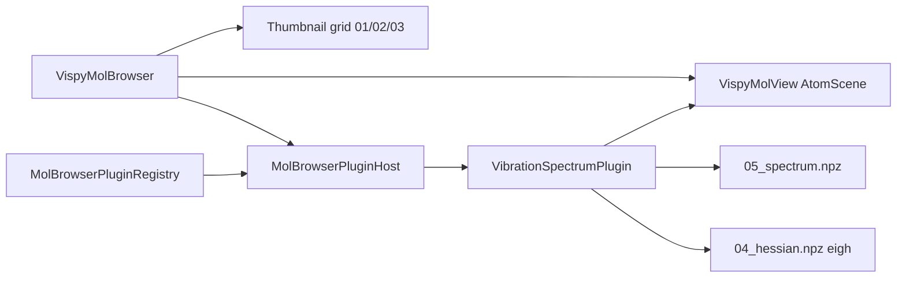

# Python VispyMolBrowser — plugin system & vibration spectrum panel

## Summary

PyQt5 + Vispy **molecular file browser** (`VispyMolBrowser`) with an extensible **plugin host** on the east side. Built-in **Vibration** plugin loads nanocrystal pipeline outputs beside the selected crystal (`05_spectrum.npz` histogram, `04_hessian.npz` for eigenvectors) and couples them to the 3D structure: zoomable spectrum plot, click-to-pick mode, displacement arrows, optional sinusoidal animation.

**Design intent:** analysis stages (`04_*`, `05_*`) stay **hidden from the thumbnail grid** (same rule as C++ `filterNonViewerNpzFiles`) but become available through plugins that resolve companion files in the crystal bundle directory.



**C++ parity:** C++ SDL browser still has no spectrum/Hessian panel — Python leads on vibration visualization. See [`CPP_MolecularBrowser_NPZ.md`](CPP_MolecularBrowser_NPZ.md).

---

## Tutorial

### Launch on a full pipeline crystal

```bash
cd /path/to/FireCore

# Default small fixtures
./tests/tSiNCs/run_vispy_mol_browser.sh

# Si ~1 nm passivation gallery (has 01→05 per subfolder)
./tests/tSiNCs/run_vispy_mol_browser.sh tests/tSiNCs/fixtures/si_1nm_passivation/02_sphere_13A_H_standard
```

### Workflow

1. **Browse** — grid lists `01_*`, `02_*`, `03_*` NPZ only; subfolder tiles navigate the gallery.
2. **Select** `02_relaxed.npz` (or `01_crystal.npz`) — 3D view loads geometry; companion `03_topology.npz` auto-loads for bonds/AABB.
3. **Vibration tab** (right) appears when `04_hessian.npz` and/or `05_spectrum.npz` exist in the same directory.
4. **Spectrum plot** — matplotlib toolbar: pan/zoom; click a peak to select nearest vibrational mode.
5. **3D overlay** — **Arrows** (red force lines), **Animate** (sinusoidal motion), **Amp** slider.

### Tests

```bash
PYTHONPATH=. pytest tests/tSiNCs/test_mol_browser_plugins.py \
  tests/tSiNCs/test_vispy_mol_browser_smoke.py \
  tests/tSiNCs/test_crystal_npz_load.py -q
```

---

## Plugin architecture

| Module | Role |
|--------|------|
| [`pyBall/GUI/mol_browser_plugins/base.py`](../../../pyBall/GUI/mol_browser_plugins/base.py) | `MolBrowserPlugin` ABC, `MolBrowserContext` |
| [`pyBall/GUI/mol_browser_plugins/registry.py`](../../../pyBall/GUI/mol_browser_plugins/registry.py) | `MolBrowserPluginRegistry`, `MolBrowserPluginHost` (tab strip) |
| [`pyBall/GUI/mol_browser_plugins/vibration_spectrum.py`](../../../pyBall/GUI/mol_browser_plugins/vibration_spectrum.py) | First plugin: FTIR spectrum + mode visualization |
| [`pyBall/GUI/mol_browser_plugins/__init__.py`](../../../pyBall/GUI/mol_browser_plugins/__init__.py) | `default_plugin_registry()` — register built-ins here |
| [`pyBall/GUI/VispyMolBrowser.py`](../../../pyBall/GUI/VispyMolBrowser.py) | Host window: grid + viewer + plugin panel |

### Lifecycle hooks

| Hook | When | Typical use |
|------|------|-------------|
| `is_relevant(ctx)` | Tab visibility | Directory has pipeline analysis NPZ |
| `create_panel(parent)` | First activation | Build QWidget (once) |
| `on_directory_changed(ctx)` | `load_directory` | Reset state |
| `on_molecule_selected(ctx)` | Thumbnail click | Load companion files for selection |
| `on_deactivate()` | Tab hidden | Clear viewer overlays |
| `filter_directory_entries(entries, ctx)` | Before grid build | Optional extra listing rules (chainable) |

### `MolBrowserContext`

| Field | Content |
|-------|---------|
| `directory` | Current browse path |
| `selected_path` | Active molecule file or npy-dir sentinel |
| `molecule` | `MoleculeData` after load (may be `None` on directory-only notify) |
| `viewer` | `VispyMolView` — plugins drive 3D overlays via `set_vibration_mode` / `clear_vibration_mode` |
| `pipeline_stages()` | `find_nanocrystal_pipeline_stages(dir)` → dict with `crystal`, `relaxed`, `topology`, `hessian`, `spectrum` keys |

### Add a new plugin

```python
# pyBall/GUI/mol_browser_plugins/my_plugin.py
from pyBall.GUI.mol_browser_plugins.base import MolBrowserPlugin, MolBrowserContext

class MyPlugin(MolBrowserPlugin):
    plugin_id = 'my_feature'
    title = 'My Feature'
    priority = 5

    def is_relevant(self, ctx: MolBrowserContext) -> bool:
        return bool(ctx.pipeline_stages().get('spectrum'))

    def create_panel(self, parent):
        ...

# pyBall/GUI/mol_browser_plugins/__init__.py
def default_plugin_registry():
    reg = MolBrowserPluginRegistry()
    reg.register(VibrationSpectrumPlugin())
    reg.register(MyPlugin())  # add here
    return reg
```

Higher `priority` sorts first when multiple plugins match.

---

## Vibration spectrum plugin

### Data sources

| File | Used for |
|------|----------|
| `05_spectrum.npz` | `omega_centers`, `hist`, `omegas_modes`, probe weights |
| `04_hessian.npz` | On-demand `solve_normal_modes_from_hessian_npz` → Cartesian eigenvectors |

**v1.2 caveat:** eigenvectors are **not** persisted in `05_spectrum.npz`; the plugin re-diagonalizes `K_projected` + `M` from `04_hessian.npz` (same math as `nanocrystal_pipeline spectrum`). Future schema may add `eigenvectors` to skip this step.

### Plot modes

| UI label | Data |
|----------|------|
| Histogram | `omega_centers` + `hist` from `05_spectrum.npz` |
| Mode sticks (vib) | Vertical lines at physical `omegas_modes_vib` (cm⁻¹) |
| Probe \|e·u\|² (x/y/z) | Stick heights from `probe_weight_*` on vib modes |

### Mode picking

- **Click** on plot → nearest mode in `omegas_cm_vib`
- **◀ / ▶** or spinbox → step through vib modes
- Selected mode: dashed red vertical line on plot

### 3D visualization (`VispyMolView`)

| Control | Effect |
|---------|--------|
| Arrows | `AtomScene` force lines along normalized displacement |
| Animate | `QTimer` sinusoid: `pos + amp·sin(φ)·û` |
| Amp | Scale slider (0.01–1.0 Å effective) |

Displacement unit vector: column of mass-unweighted Cartesian mode from `modes_cart`, normalized per atom block.

---

## Shared library API

### `pyBall/io/crystal_npz.py`

| Function | Purpose |
|----------|---------|
| `is_viewer_listable_basename(name)` | Hide `04_*`, `05_*`, `*hessian*`, `*spectrum*` from grid |
| `find_nanocrystal_pipeline_stages(dir)` | Resolve canonical `01`–`05` paths if present |
| `pipeline_dir_for_molecule_path(path)` | Bundle directory for companion lookup |

### `pyBall/nanocrystal_pipeline.py`

| Function | Purpose |
|----------|---------|
| `load_spectrum_npz(path)` | Load `05_spectrum.npz` plotting arrays |
| `solve_normal_modes_from_hessian_npz(path)` | `eigh` → `omegas_modes`, `omegas_cm`, `modes_cart`, `vib_mask` |
| `omega_internal_to_cm1` | Internal ω → cm⁻¹ (shared with pipeline) |

---

## Browser UI reference (core, non-plugin)

### Navigation

| Control | Action |
|---------|--------|
| `[..]` | Parent directory |
| Open… / path bar | Choose or type directory |
| Folder tiles | Enter subfolder |
| Thumbnail click | Load molecule + notify plugins |

### 3D viewer toggles

| Toggle | Effect |
|--------|--------|
| Bonds | Covalent sticks (`bonds_ij` or topology `neigh_idx`) |
| AABB | Surface group wireframes from `03_topology.npz` |
| Radii | VdW spheres from topology `radius` |
| Labels | Atom index labels |
| Bond k | Stiffness color map from `bond_k` |

**Camera:** preserved when switching thumbnails in the same directory; resets on directory change.

**Thumbnails:** CPU `QPainter` flat top-down render (no second GL context); disk cache `.vispy_mol_browser_cache_v2/`.

---

## Parity & tests

| Check | Location |
|-------|----------|
| Viewer NPZ filter | `test_mol_browser_plugins.py::test_scan_hides_analysis_npz` |
| Normal modes from Hessian | `test_solve_normal_modes_from_hessian_npz` (passivation fixture) |
| Plugin relevance | `test_vibration_plugin_relevant` |
| NPZ load timing | `test_crystal_npz_load.py` |
| Smoke import | `test_vispy_mol_browser_smoke.py` |

---

## Pitfalls

1. **No `04_hessian.npz`:** spectrum plot works; mode arrows/animation disabled (no eigenvectors).
2. **Large crystals:** `solve_normal_modes_from_hessian_npz` is dense O((3N)³) — same cost as pipeline `spectrum` stage; expect delay on first mode pick for N ≫ 500.
3. **Offscreen tests:** do not instantiate `VispyMolView` in pytest without a display — test plugin logic with `viewer=None` in context.
4. **Topology immutability:** always visualize modes on **relaxed** geometry (`02_relaxed.npz` pos); Hessian `pos` in `04` should match.
5. **Unicode NPZ keys:** ignored in C++; Python `np.load` handles `grid_meta`, `units` in spectrum files.

---

## Cross-links

- [`Nanocrystal_NPZ_Pipeline.guide.md`](Nanocrystal_NPZ_Pipeline.guide.md) — stage contracts  
- [`NPZ_Crystal_Schema.md`](NPZ_Crystal_Schema.md) — key tables §3–4  
- [`CPP_MolecularBrowser_NPZ.md`](CPP_MolecularBrowser_NPZ.md) — C++ viewer (no plugins yet)  
- [`../../topical_audit/Nanocrystal_Vibrations.md`](../../topical_audit/Nanocrystal_Vibrations.md) — code inventory  
- [`../../../tests/tSiNCs/README.md`](../../../tests/tSiNCs/README.md) — launch scripts  
- [`../../../pyBall/GUI/mol_browser_plugins/README.md`](../../../pyBall/GUI/mol_browser_plugins/README.md) — module index  
