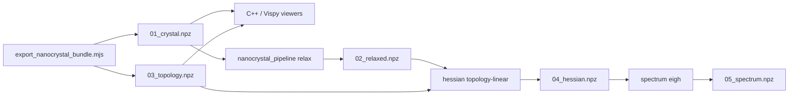

# FTIR Nanocrystals — Topic Documentation

Design notes, guides, and progress logs for Si / diamond nanocrystal generation, MMFF/UFF vibrations, FTIR, phonons, and related XRD.

## Documentation map

| Doc | Role |
|-----|------|
| [`tests/tSiNCs/README.md`](../../../tests/tSiNCs/README.md) | **Working hub** — commands, fixtures, viewers |
| [`Nanocrystal_NPZ_Pipeline.guide.md`](Nanocrystal_NPZ_Pipeline.guide.md) | **NPZ workflow** — stages 01→05, consumers |
| [`NPZ_Crystal_Schema.md`](NPZ_Crystal_Schema.md) | **Schema contract** — per-key dtype/shape tables |
| [`doc/topical_audit/Nanocrystal_Vibrations.md`](../../topical_audit/Nanocrystal_Vibrations.md) | **Audit** — code inventory, APIs, test matrix |
| [`tests/tSiNCs/ToDo_Nanocrystal.md`](../../../tests/tSiNCs/ToDo_Nanocrystal.md) | Open items and open questions |

When filenames disagree, prefer **schema + pipeline guide** and on-disk paths.

---

## Integrated system (summary)

| Layer | Key modules |
|-------|-------------|
| **Generate + export** | `Nanocrystals.js`, `NanocrystalExport.js`, `export_nanocrystal_bundle.mjs` |
| **View** | `MolecularBrowser.cpp` + `cpp/common/io/`; `VispyMolBrowser.py` + plugins |
| **Relax / spectrum** | `nanocrystal_pipeline.py`, `pyBall/io/crystal_npz.py`, `FTIR.py` |
| **Fixtures** | `tests/tSiNCs/fixtures/si_1nm_passivation/` (full pipeline), `fixtures/npz_viewer/` (smoke) |

Viewer guides: [`CPP_MolecularBrowser_NPZ.md`](CPP_MolecularBrowser_NPZ.md) · [`Python_Vispy_MolBrowser_Plugins.md`](Python_Vispy_MolBrowser_Plugins.md)

---

## Suggested reading order

1. [`tests/tSiNCs/README.md`](../../../tests/tSiNCs/README.md)  
2. [`Nanocrystal_NPZ_Pipeline.guide.md`](Nanocrystal_NPZ_Pipeline.guide.md)  
3. [`NPZ_Crystal_Schema.md`](NPZ_Crystal_Schema.md)  
4. [`gen_nanocrystals.chat.md`](gen_nanocrystals.chat.md) — generation and defects  
5. [`CPP_MolecularBrowser_NPZ.md`](CPP_MolecularBrowser_NPZ.md) or [`Python_Vispy_MolBrowser_Plugins.md`](Python_Vispy_MolBrowser_Plugins.md) — viewers  
6. [`Nanocrystal_pipeline.progress.md`](Nanocrystal_pipeline.progress.md) — ensemble history  
7. [`../../topical_audit/Nanocrystal_Vibrations.md`](../../topical_audit/Nanocrystal_Vibrations.md) — full inventory  

---

## Guides (`.guide.md`)

| File | Content |
|------|---------|
| [`Nanocrystal_NPZ_Pipeline.guide.md`](Nanocrystal_NPZ_Pipeline.guide.md) | NPZ stage contract, batch tutorial |
| [`NPZ_Crystal_Schema.md`](NPZ_Crystal_Schema.md) | Authoritative NPZ key tables (v1.2) |
| [`CPP_MolecularBrowser_NPZ.md`](CPP_MolecularBrowser_NPZ.md) | C++ SDL browser: NPZ, bond color, AABB |
| [`Python_Vispy_MolBrowser_Plugins.md`](Python_Vispy_MolBrowser_Plugins.md) | Vispy browser + vibration plugin |
| [`Phonon_testing.guide.md`](Phonon_testing.guide.md) | Phonon workflow; PBC/ASR pitfalls |
| [`Sparse_Hessian_Vibration_Spectra.guide.md`](Sparse_Hessian_Vibration_Spectra.guide.md) | Sparse Hessian + spectrum methods |

---

## Reference chats (`.chat.md`)

| File | Content |
|------|---------|
| [`gen_nanocrystals.chat.md`](gen_nanocrystals.chat.md) | Generation CLI, plane cuts, capping, bridges |
| [`Hessian_Kspace.chat.md`](Hessian_Kspace.chat.md) | Bloch / k-space Hessian theory |
| [`Hessian_fitting.chat.md`](Hessian_fitting.chat.md) | Bond/angle stiffness fitting |
| [`XrayDiffraction.chat.md`](XrayDiffraction.chat.md) | XRD design discussion |

---

## Progress logs (`.progress.md`)

| File | Content |
|------|---------|
| [`Nanocrystal_pipeline.progress.md`](Nanocrystal_pipeline.progress.md) | Ensemble pipeline milestones |
| [`Nanocrystal_generation.progress.md`](Nanocrystal_generation.progress.md) | Generation G0–G5 |
| [`Linearized_topology.progress.md`](Linearized_topology.progress.md) | MMFFL K₁₂/K₁₃/K₁₄ |
| [`Nanocrystal_vibration_sparse.progress.md`](Nanocrystal_vibration_sparse.progress.md) | Sparse vibration staging |
| [`Sparse_vibration_solver.progress.md`](Sparse_vibration_solver.progress.md) | GPU/iterative solvers (de-prioritized) |
| [`XRD_progress.md`](XRD_progress.md) | XRD + vibrations |
| [`Debug_ASan_double_free_and_eval_atom.progress.md`](Debug_ASan_double_free_and_eval_atom.progress.md) | MMFF ASan debugging |

---

## Filename convention

| Suffix | Meaning |
|--------|---------|
| `.guide.md` | Curated how-to / tutorial |
| `.chat.md` | Design discussion, CLI reference |
| `.progress.md` | Milestones, session notes |

---

## Cross-links

- [`doc/topical_audit/topical_audit.md`](../../topical_audit/topical_audit.md)  
- [`doc/topical_audit/file_descriptions.md`](../../topical_audit/file_descriptions.md)  
- [`tests/tMMFF/AGENTS.md`](../../../tests/tMMFF/AGENTS.md)  
- [`CODEMAP.md`](../../../CODEMAP.md)  
