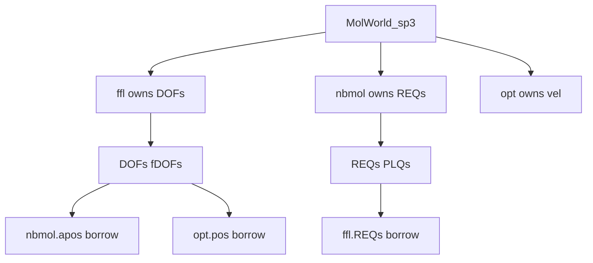

# C++ memory ownership, allocation, and debugging

General guide for FireCore C++ heap arrays: how ownership works, how to debug crashes (segfault, double-free, heap corruption, use-after-free), and how MMFF applies the pattern.

**Short agent skill:** `.cursor/skills/cpp-memory-ownership/SKILL.md`

---

## Philosophy: explicit ownership, not RAII

FireCore molecular code uses **manual heap arrays** (`T*`) and explicit lifecycle methods — **not** strict C++ RAII (Resource Acquisition Is Initialization).

| RAII style (we generally avoid) | FireCore style |
|-----------------------------------|----------------|
| `std::vector`, smart pointers own memory | Raw `T*` + `_alloc` / `_realloc` / `_dealloc` |
| Destructor always frees members | `dealloc()` called explicitly from orchestrator (`clearFFs`, `MolWorld::clear`) |
| Single object owns its buffers | Multiple objects may **alias** the same buffer; `bOwn*` flags record who may free |

**Why:** performance (flat arrays, pointer views into `DOFs`), Python ctypes aliasing, and long-lived singletons (`MolWorld_sp3 W` in `libMMFF_lib.so`).

**Implications:**

- Do **not** assume `~ClassName()` is the only teardown path — check whether the class calls `dealloc()` from its destructor (e.g. `Atoms`) vs relies on `MolWorld::clearFFs()`.
- **Never** `_dealloc` a pointer unless this object's `bOwn*` flag says it owns that buffer.
- `_dealloc(x)` nulls only the **reference passed in** — other aliases (`nbmol.apos` vs `ffl.apos`) stay non-null until separately cleared.
- Interior pointers (`pipos` inside `DOFs`, UFF `fbon` inside `fint`) are **views**, not separate allocations.

---

## Allocation toolkit (`cpp/common/macroUtils.h`)

All hot-path allocation goes through these macros/templates:

| Macro | Behavior |
|-------|----------|
| `_alloc(arr,n)` | `arr = new T[n]` |
| `_realloc(arr,n)` | `delete[] arr` if non-null, then `new T[n]` |
| `_realloc0(arr,n,v0)` | `_realloc` + fill with `v0` |
| `_allocIfNull(arr,n)` | Allocate only if `arr==0`; returns whether it allocated |
| `_dealloc(arr)` | `delete[] arr` if non-null; sets **that** reference to `0` |
| `_bindOrRealloc(n, from, arr)` | If `from!=0`: `arr=from`, return `false` (borrow). Else `_realloc(arr,n)`, return `true` (own) |

```cpp
// Borrow vs own — store the bool in bOwn* at bind time
bOwnREQs = _bindOrRealloc(natoms, REQs_, REQs);
```

**`Buf<T>` / `Arr<T>`** in the same header are small RAII helpers (`own` flag + destructor). Most force-field code uses raw pointers + `bOwn*` instead.

**Never** use raw `delete` / `delete[]` on buffers managed by these macros.

---

## DEBUG_ALLOCATOR (`cpp/common/debugAllocator.h`)

Optional **allocation ledger** wired when `DEBUG_ALLOCATOR` is defined (uncomment in `macroUtils.h` line 8, or `-DDEBUG_ALLOCATOR` at compile time).

### What it does

- Every `_alloc` / `_realloc` / … records `(pointer, n, file:line)` in a global `DebugAllocator`.
- Every `_dealloc` removes the pointer from the ledger.
- **Unknown pointer on dealloc** → prints error + `print_allocated()` + `exit` (catches double-free and stray `delete`).
- `debugAllocator_init()` must be called once at program start (GUI apps do this; **MMFF_lib does not** — add a call in `MMFF_lib.cpp` `main`/init if you enable DEBUG_ALLOCATOR there).

### API

```cpp
debugAllocator_init();           // once at startup
// ... run code using _alloc/_dealloc ...
debugAllocator_print();          // dump still-live allocations (leaks)
```

### Limitations (read before relying on it)

1. With `DEBUG_ALLOCATOR`, `_dealloc` goes through `debug_dealloc()` which **tracks** removal but the macro path does **not** mirror full `delete[]` behavior of the non-debug `__dealloc` — treat it as an **audit / invalid-free detector**, not a leak-free production allocator.
2. Does **not** catch use-after-free or buffer overruns — use **ASAN** for those.
3. Aliased pointers: only the **owner** should call `_dealloc`; a borrower's `_dealloc` would look like "pointer not found" or corrupt the ledger.

### When to use

| Goal | Tool |
|------|------|
| "Who allocated this?" / invalid free site | `DEBUG_ALLOCATOR` + rebuild |
| Double-free, UAF, overflow, ASAN stack trace | **AddressSanitizer** build |
| Leak at process exit | ASAN leak detection or `debugAllocator_print()` at shutdown |

---

## AddressSanitizer (primary crash debugger)

See `.cursor/skills/firecore-cpp-build/SKILL.md` for build/run details.

```bash
cd cpp && ln -sfn Build-asan Build
cd Build && cmake --build . --target MMFF_lib
cd tests/tMMFF && bash run_asan_minimal.sh asan
```

Typical ASAN messages:

| Message | Likely cause |
|---------|----------------|
| `attempting double-free` | Two `dealloc()` paths freed same buffer (missing `bOwn*` guard) |
| `heap-use-after-free` | Alias used after owner freed; or Python view after `MMFF.clear()` |
| `heap-buffer-overflow` | OOB index (e.g. bad `ipbc`, `neighCell`) |
| `SEGV` without ASAN | Null deref, bad cast, or opt build — rebuild with ASAN |

**Python ctypes:** `getBuffs()` returns **non-owning** NumPy views. GC does not free C++. After `MMFF.clear()`, any old view is UAF.

**Recycle contract:** `init` → work → `clear()` / `shutdown()` → `init` again; call `getBuffs()` after each `init`.

---

## Diagnosing ownership bugs

### Symptom → checklist

1. **Crash in `dealloc` / `~MolWorld` / `.so` unload**
   - Draw the alias graph: who owns `DOFs`, `apos`, `REQs`?
   - Check `bOwn*` flags at bind site (`initNBmol`, `bindOrRealloc`, `setOptimizer`).
   - Verify `clearFFs()` order: owner before borrowers.

2. **Crash on second `init()` without `clear()`**
   - Stale pointers in Python `buffers` map or stale `bBondInitialized`.
   - Fix: explicit `MMFF.clear()` between inits.

3. **Silent wrong physics / NaNs**
   - Often not memory — but stale aliased force buffer zeroed by wrong object can look like memory corruption.

4. **Interior pointer double-free**
   - UFF: only `_dealloc(fint)` — `fbon`/`fang`/`fdih`/`finv` point inside `fint`.
   - `MMFFsp3_loc`: only `_dealloc(DOFs)`/`fDOFs` — `apos`/`pipos` are views.

### Debugging workflow

```
1. Reproduce with Build-asan + test_asan_minimal.py or minimal XYZ
2. If crash at dealloc: identify pointer in ASAN stack; grep who calls _dealloc on it
3. Trace bind chain: _bindOrRealloc / bindShifts / bindArrays / pointer assignment
4. Optional: enable DEBUG_ALLOCATOR for alloc site of offending pointer
5. Fix: set bOwn* at bind; guard dealloc; fix clearFFs order — do not null-and-hope
6. Validate: init → clear → init → clear (ASAN)
```

---

## Ownership flags (class reference)

### `Atoms` — `bOwnArrays` → `apos`, `atypes`, `charge`

### `ForceField` — `bOwnFapos`, `bOwnVapos` → `fapos`, `vapos`

### `NBFF` — `bOwnREQs`, `bOwnPLQs`, `bOwnPLQd`, `bOwnNeighs`, `bOwnNeighCell`, `bOwnShifts` (+ inherited)

Always owned (no flag): `excl`, `BBs`, `pointBBs`.

### `DynamicOpt` — `bOwnPos`, `bOwnVel`, `bOwnForce`, `bOwnInvMasses`

Always owned: `avs`, `avs2`.

Set flags in `bindOrRealloc`, `bindArrays`, `bindOrAlloc`, or manual assignment (`ff->REQs = nbmol.REQs; ff->bOwnREQs = false`).

---

## MMFF case study (`MolWorld_sp3`)

### Objects

| Member | Role |
|--------|------|
| `ffl` | Primary bonded FF; owns `DOFs`/`fDOFs` |
| `nbmol` | NB layer; owns `REQs`/`PLQs`; borrows `apos`/`fapos` from `ffl` in normal path |
| `opt` | Optimizer; borrows `pos`/`force` from `ffl` |
| `ff` | Legacy duplicate topology |
| `ffu` | UFF path |
| `W.pbc_shifts` | Owned by MolWorld; `ffl.shifts` borrows |

### `initNBmol` wiring

```cpp
nbmol.bindOrRealloc(ff->natoms, ff->apos, ff->fapos, 0, ff->atypes);
builder.export_REQs(nbmol.REQs);
ff->REQs = nbmol.REQs;  ff->bOwnREQs = false;
// same for PLQs, PLQd
```

### Ownership table (after `initNBmol`)

| Buffer | Owner | Borrowers |
|--------|-------|-----------|
| `ffl.DOFs`, `ffl.fDOFs` | `ffl` | `ffl.apos/fapos/pipos`, `opt.pos/force`, `nbmol.apos/fapos` |
| `nbmol.REQs`, `PLQs`, `PLQd` | `nbmol` | `ffl.REQs`, `ffl.PLQs`, `ffl.PLQd` |
| `W.pbc_shifts` | `MolWorld` | `ffl.shifts` |
| `opt.vel` | `opt` | `ffl.vapos` |

### `clearFFs()` order

```cpp
ffl.dealloc();   // frees DOFs first (owners of aliased coords)
ffu.dealloc();
ff.dealloc();
nbmol.dealloc(); // skips borrowed apos/fapos
opt.dealloc();   // skips borrowed pos/force
_dealloc(pbc_shifts);
```

Entry points: `MolWorld::clear()` / `MMFF.clear()` / `MMFF.shutdown()`; `~MolWorld_sp3()` also calls `clearFFs()`.

### Object graph



---

## Rules for new arrays

1. Decide **one owner** before first `_realloc`.
2. If bind-time own-or-borrow: `_bindOrRealloc` + store `bOwn*`.
3. Free only in owner's `dealloc()` or `clearFFs()`.
4. Never free interior pointers.
5. After changes: ASAN + `init → clear → init` test (`tests/tMMFF/test_asan_minimal.py`).

---

## Historical MMFF bugs (2026-06)

| Symptom | Cause |
|---------|-------|
| Double-free on `nbmol.dealloc` | `nbmol.apos` aliased `ffl.DOFs`; both freed |
| Double-free on `opt.dealloc` | `opt.pos` aliased `ffl.DOFs` |
| UFF invalid free | Freed `fang`/`fdih` inside `fint` block |

Details: [Debug_ASan_double_free_and_eval_atom.md](../../Topics/FTIR_Nanocrystals/Debug_ASan_double_free_and_eval_atom.md)

---

## Key files

| File | Role |
|------|------|
| `cpp/common/macroUtils.h` | Alloc macros, `_bindOrRealloc` |
| `cpp/common/debugAllocator.h` | DEBUG_ALLOCATOR ledger |
| `cpp/common/molecular/Atoms.h` | `bOwnArrays` |
| `cpp/common/molecular/NBFF.h` | `bindOrRealloc`, `dealloc` |
| `cpp/common/molecular/MMFFsp3_loc.h` | `DOFs` owner |
| `cpp/common/molecular/MolWorld_sp3.h` | `initNBmol`, `clearFFs` |
| `cpp/common/math/DynamicOpt.h` | Optimizer borrow flags |
| `pyBall/MMFF.py` | `clear()`, `getBuffs()` |
| `.cursor/skills/cpp-memory-ownership/SKILL.md` | Agent quick reference |
| `.cursor/skills/firecore-cpp-build/SKILL.md` | ASAN build/run |
