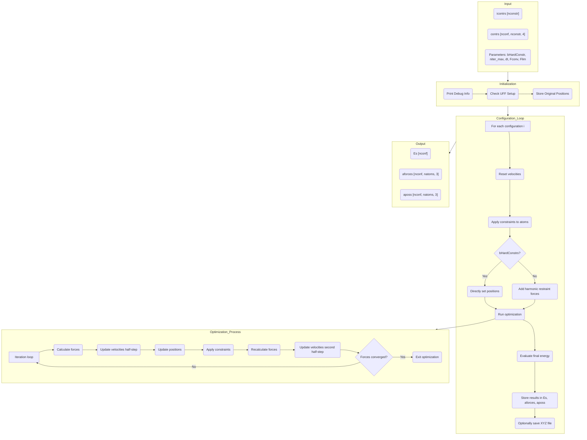

# `scan_constr()` Function Documentation

## Overview

The `scan_constr()` function (exposed as `lib.scan_constr` in Python) performs a constrained molecular scan using the UFF force field. It allows specific atoms to be constrained to fixed positions during geometry optimization, enabling the exploration of potential energy surfaces with partial structural constraints. This is particularly useful for studying molecular conformations, reaction paths, or adsorption geometries where certain atoms need to maintain specific positions.

## Context

`scan_constr` is typically called after system initialization:

1. **Parameter Loading:** Force field parameters are loaded.
2. **Molecule Loading:** The molecule's geometry and parameters are loaded.
3. **Force Field Setup:** UFF types are assigned to molecule atoms and internal data structures are built.
4. **Constraint Setup:** A list of atom indices to constrain (`icontrs`) and their target positions/constraints (`contrs`) is prepared.
5. **`scan_constr` Call:** The function is invoked with the constraints and output buffers.

## Core Functionality (`scan_constr` / `lib.scan_constr`)

1. **Input Parameters:**
   * `nconf`: Number of configurations to scan
   * `nconstr`: Number of atoms to constrain
   * `icontrs`: Array of atom indices to constrain
   * `contrs_`: Array of constraint parameters (Quat4d format)
   * `Es`: Output array for energies
   * `aforces`: Output array for atomic forces
   * `aposs`: Output array for atomic positions
   * `bHardConstr_`: Flag for hard constraints (fixed positions) vs. soft constraints (harmonic restraints)
   * `omp`: Flag for OpenMP parallelization
   * `niter_max`: Maximum number of optimization iterations
   * `dt`: Time step for dynamics
   * `Fconv`: Force convergence criterion
   * `Flim`: Force limit for stability

2. **Initialization:**
   * Prints debug information about the function call
   * Checks and prints UFF force field sizes and pointers
   * Stores original positions of all atoms

3. **Configuration Loop:**
   * Iterates through each configuration (`i`) from 0 to `nconf-1`
   * For each configuration:
     * Resets atomic velocities to zero
     * Applies constraints to specified atoms:
       * Each constraint is a Quat4d where:
         * `.x`, `.y`, `.z` components specify the target position
         * `.w` component specifies the constraint strength (stiffness)
     * If `bHardConstrs` is true and constraint strength > 0:
       * Directly sets atom position to constraint position
       * Sets velocity to zero
     * Otherwise, applies a harmonic restraint toward the target position

4. **Optimization:**
   * Calls `run_no_omp()` to perform geometry optimization with constraints
   * Optimization runs for up to `niter_max` iterations or until forces converge below `Fconv`
   * Uses velocity Verlet integration with time step `dt`
   * Applies force limiting (`Flim`) for stability

5. **Evaluation and Output:**
   * Calls `eval_no_omp()` to calculate final energy after optimization
   * Stores results in output arrays:
     * `Es[i]`: Final energy
     * `aforces + i*ffu.natoms`: Final atomic forces
     * `aposs + i*ffu.natoms`: Final atomic positions
   * Optionally saves XYZ trajectory file for visualization

## Implementation Details

1. **Constraint Handling:**
   * Constraints are applied through the `ffu.constr` array (Quat4d format)
   * For each constrained atom `ia`, `ffu.constr[ia]` stores:
     * `.x`, `.y`, `.z`: Target position coordinates
     * `.w`: Constraint strength (stiffness coefficient)
   * During force evaluation, additional forces are added:
     * `F_constraint = k * (target_pos - current_pos)`
     * Where `k` is the stiffness coefficient (`.w` component)
   * For hard constraints (`bHardConstrs` true), positions are directly set

2. **Force Field Specifics:**
   * Uses UFF force field (`ffu`) instead of MMFF
   * All UFF terms are evaluated: bonds, angles, dihedrals, inversions, and non-bonded interactions
   * Forces from all terms are accumulated in `ffu.fapos`

3. **Optimization Algorithm:**
   * Uses velocity Verlet integration:
     * `v(t+dt/2) = v(t) + a(t)*dt/2`
     * `x(t+dt) = x(t) + v(t+dt/2)*dt`
     * Recalculate forces/accelerations
     * `v(t+dt) = v(t+dt/2) + a(t+dt)*dt/2`
   * Includes damping for stability
   * Monitors force convergence: stops when max force < `Fconv`

## Key Data Structures / Buffers

* **`ffu` (UFF object):** Holds the UFF state for the molecule.
  * `ffu.apos`: `Vec3d*` [natoms] - Current atomic positions
  * `ffu.vapos`: `Vec3d*` [natoms] - Atomic velocities
  * `ffu.fapos`: `Vec3d*` [natoms] - Accumulated atomic forces
  * `ffu.constr`: `Quat4d*` [natoms] - Constraint parameters
  * `ffu.atypes`: Atom types for UFF parameterization
  * Various UFF parameter arrays for bonds, angles, etc.

* **Input Arrays:**
  * `icontrs`: `int*` [nconstr] - Indices of atoms to constrain
  * `contrs_`: `Quat4d*` [nconf*nconstr] - Constraint parameters for each configuration
    * Format: `contrs_[i*nconstr+ic]` for configuration `i` and constraint `ic`
    * Each constraint is a Quat4d with components:
      * `.x`, `.y`, `.z`: Target position
      * `.w`: Constraint strength

* **Output Arrays:**
  * `Es`: `double*` [nconf] - Final energy for each configuration
  * `aforces`: `Vec3d*` [nconf*natoms] - Final atomic forces
  * `aposs`: `Vec3d*` [nconf*natoms] - Final atomic positions

## Python Interface

In Python, the function is exposed through the `scan_constr` method:

```python
def scan_constr(icontrs, contrs, Es=None, aforces=None, aposs=None, bHardConstr=False, 
                bF=False, bP=False, omp=False, niter_max=10000, dt=0.05, Fconv=1e-5, Flim=100.0):
    nconf = len(contrs)
    ncontr = len(icontrs)
    if Es is None: Es = np.zeros(nconf)
    if (aforces is None) and bF: aforces = np.zeros((nconf, natoms, 3))
    if (aposs is None) and bP: aposs = np.zeros((nconf, natoms, 3))
    
    lib.scan_constr(nconf, ncontr, _np_as(icontrs, c_int_p), _np_as(contrs, c_double_p),
                   _np_as(Es, c_double_p), _np_as(aforces, c_double_p), _np_as(aposs, c_double_p),
                   bHardConstr, omp, niter_max, dt, Fconv, Flim)
    return Es, aforces, aposs
```

Where:
* `icontrs`: NumPy array of atom indices to constrain
* `contrs`: NumPy array of shape [nconf, nconstr, 4] containing constraint parameters
* `bF`, `bP`: Flags to request force and position output
* Other parameters match the C++ function

## Data Flow Diagram



## Flags/Switches Influencing scan_constr
* `bHardConstrs`: Controls whether constraints are applied as hard constraints (direct position setting) or soft constraints (harmonic restraints)
* `bUFF`: Must be true to use UFF force field (this function specifically uses UFF)
* `bBonds`, `bAngles`, etc.: Control which energy terms are included in the UFF calculation
* `bPBC`: Enables Periodic Boundary Conditions

## Usage Example

```python
# Define atoms to constrain (atom indices)
iconstr = np.array([29], np.int32)

# Define constraint positions for each configuration
nscan = 10
contrs = np.zeros((nscan, len(iconstr), 4), np.float64)

# Set constraint positions (x,y,z) and stiffness (w)
for i in range(nscan):
    contrs[i, 0, 0] = i * 0.1  # x position varies
    contrs[i, 0, 1] = 0.0      # y position fixed
    contrs[i, 0, 2] = 0.0      # z position fixed
    contrs[i, 0, 3] = 1.0      # stiffness

# Run constrained scan
Es, Fs, Ps = mmff.scan_constr(iconstr, contrs, bHardConstr=True, 
                             bF=True, bP=True, niter_max=1000, 
                             dt=0.05, Fconv=1e-5)

# Plot energy profile
plt.figure(figsize=(10, 6))
plt.plot(np.arange(nscan) * 0.1, Es, 'o-')
plt.xlabel('X position (Å)')
plt.ylabel('Energy (eV)')
plt.title('Constrained Scan Energy Profile')
plt.grid(True)
plt.show()
```

## Implementation Notes and Caveats

1. **UFF vs. MMFF:** This implementation specifically uses the UFF force field (`ffu`), not MMFF. The function name might be misleading as it doesn't include "uff" in its name.

2. **Memory Management:** The function assumes all arrays are pre-allocated with sufficient size. No dynamic memory allocation occurs within the function.

3. **Constraint Application:** For hard constraints, atom positions are directly set to the constraint positions. For soft constraints, additional forces are applied based on the distance from the target position.

4. **Optimization Stability:** The function includes several stability measures:
   * Force limiting (`Flim`) to prevent excessive forces
   * Velocity resetting at the beginning of each configuration
   * Damping during dynamics

5. **Performance Considerations:**
   * OpenMP parallelization is mentioned in the interface but not fully implemented
   * The function is computationally intensive, especially for large systems or many configurations
   * Most time is spent in the force evaluation and optimization loops

6. **Debugging:** The function includes debug prints that can be enabled to track the constraint application and optimization progress.