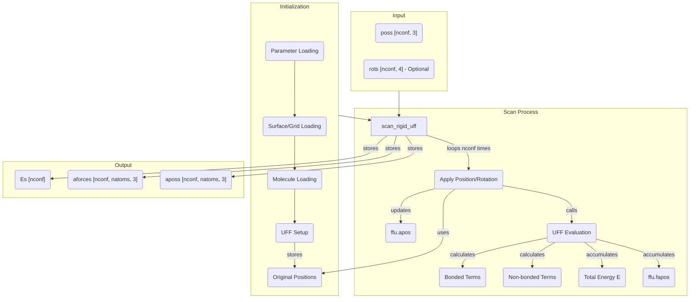

# `scan_rigid_uff()` Function Documentation (UFF Module)

## Overview

The `scan_rigid_uff()` function (exposed as `lib.scan_rigid_uff` in Python) performs a rigid scan of a molecule using the Universal Force Field (UFF) instead of MMFF. It iterates through predefined molecule positions and orientations, calculating interaction energies and forces for each configuration. This is useful for generating potential energy surfaces (PES) for adsorption, diffusion barriers, or approach curves using UFF parameters.

## Context

`scan_rigid_uff` is typically called after system initialization:

1. **Parameter Loading:** UFF parameters are loaded.
2. **Surface Loading:** If a surface is used, its geometry is loaded.
3. **Molecule Loading:** The probe molecule's geometry and parameters are loaded.
4. **Force Field Setup:** UFF types are assigned to molecule atoms and internal data structures are built.
5. **Scan Setup:** A list of positions (`poss`) and optionally rotations (`rots`) for the molecule is prepared.
6. **`scan_rigid_uff` Call:** The function is invoked with the configurations and output buffers.

## Core Functionality (`scan_rigid_uff` / `lib.scan_rigid_uff`)

1. **Input:** Takes an array of positions (`poss`), optional rotations (`rots`), and buffers for output energies (`Es`), forces (`aforces`), and final positions (`aposs`). A flag controls parallelization (`omp`).
2. **Original Position Storage:** Stores the original positions of all atoms in the molecule.
3. **Looping:** Iterates through each configuration (`i`) provided in `poss` and `rots`.
4. **Positioning:** For each configuration:
   * Sets the molecule's position and orientation according to `poss[i]` and `rots[i]`.
   * Applies the transformation to each atom in the molecule.
5. **Evaluation:** Calls UFF evaluation functions to calculate the total energy and forces for the current fixed configuration:
   * **Bonded Terms:** Calculates bonds, angles, dihedrals, and inversions if enabled.
   * **Non-bonded Terms:** Calculates van der Waals and electrostatic interactions.
6. **Output:** Stores the calculated total energy in `Es[i]`, the final atomic forces in `aforces[i]`, and the atomic positions in `aposs[i]`.

## Key Data Structures / Buffers

* **`ffu` (UFF object):** Holds the UFF state for the molecule.
  * `ffu.apos`: `Vec3d*` [natoms] - Current atomic positions of the molecule.
  * `ffu.fapos`: `Vec3d*` [natoms] - Accumulated atomic forces on the molecule.
  * `ffu.REQs`: Parameters for atoms including van der Waals radii, well depths, and charges.
* **Input/Output Arrays (Python side):**
  * `poss`: `double[:,3]` [nconf, 3] - Input molecule center positions for each scan point.
  * `rots`: `double[:,4]` [nconf, 4] - Input molecule orientations (quaternions) for each scan point (Optional).
  * `Es`: `double[:]` [nconf] - Output total energy for each configuration.
  * `aforces`: `double[:,:,3]` [nconf, natoms, 3] - Output atomic forces for each configuration.
  * `aposs`: `double[:,:,3]` [nconf, natoms, 3] - Output final atomic positions for each configuration.

## Data Flow Diagram (Simplified Mermaid Graph)

## Flags/Switches Influencing scan_rigid_uff
* `bBonds`: Controls whether bond terms are included in the energy calculation.
* `bAngles`: Controls whether angle terms are included in the energy calculation.
* `bDihedrals`: Controls whether dihedral terms are included in the energy calculation.
* `bInversions`: Controls whether inversion terms are included in the energy calculation.
* `bNonBonded`: Controls whether non-bonded terms are included in the energy calculation.
* `bPBC`: Enables Periodic Boundary Conditions for neighbor finding.
* `omp`: Enables OpenMP parallelization (currently not implemented).

## Differences from MMFF scan_rigid
1. Uses UFF parameters instead of MMFF parameters.
2. Different energy terms (UFF has specific formulations for bonds, angles, etc.).
3. Different parameterization approach (UFF is more general and covers the entire periodic table).
4. May not support GridFF interaction in the same way as MMFF.