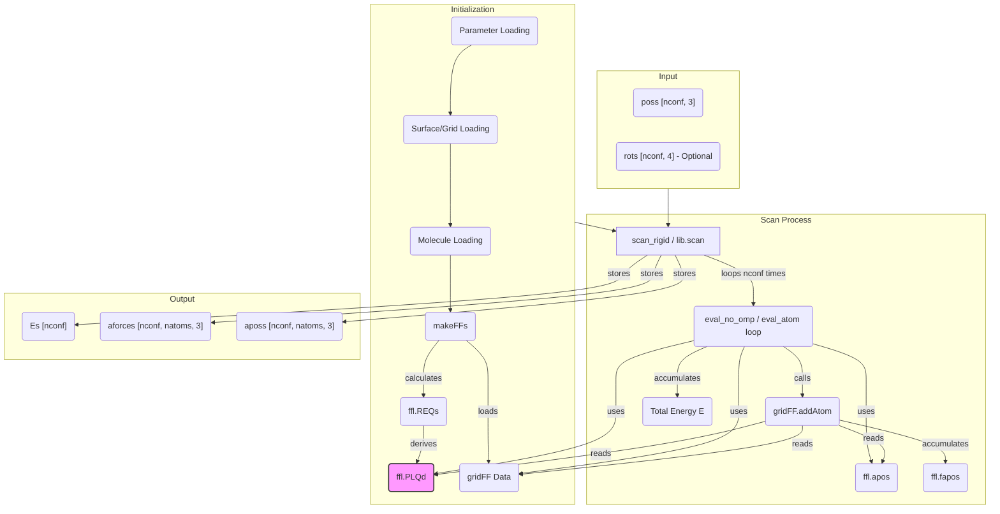

# `scan_rigid()` Function Documentation (MMFF Module)

## Overview

The `scan_rigid()` function (exposed as `lib.scan` in Python) is designed to perform a rigid scan of a molecule (probe) relative to a surface or environment. It iterates through a predefined set of molecule positions and orientations, calculating the interaction energy and forces for each configuration using the Molecular Mechanics Force Field (MMFF) and potentially a pre-calculated Grid Force Field (GridFF). This is typically used for generating potential energy surfaces (PES) for adsorption, diffusion barriers, or approach curves.

## Context

`scan_rigid` is usually called *after* the system has been initialized:

1.  **Parameter Loading:** MMFF parameters (atom types, bond types, etc.) are loaded (`initParams`).
2.  **Surface Loading:** If a surface is used, its geometry is loaded, and potentially a GridFF is generated or loaded from a file (`initGridFF`, often loading `.npy` files like `Bspline_PLQd.npy`).
3.  **Molecule Loading:** The probe molecule's geometry and initial parameters (like charges) are loaded (`loadGeom`, `buildMolecule_xyz`).
4.  **Force Field Setup (`makeFFs`):**
    *   MMFF types are assigned to molecule atoms.
    *   Internal MMFF data structures (`ffl`, `ff`) are built.
    *   Non-bonded parameters (`REQs`, `PLQs`, `PLQd`) are calculated for both the molecule's internal interactions (`ffl`) and its interaction with the environment/grid (`nbmol`). **Crucially, `ffl.PLQd` stores the Pauli, London, and Coulomb interaction parameters derived from the molecule's `REQs` (RvdW, Epsilon, Charge).**
5.  **Scan Setup:** A list of positions (`poss`) and optionally rotations (`rots`) for the molecule is prepared.
6.  **`scan_rigid` Call:** The function is invoked with the configurations and output buffers.

## Core Functionality (`scan_rigid` / `lib.scan`)

1.  **Input:** Takes an array of positions (`poss`), optional rotations (`rots`), and buffers for output energies (`Es`), forces (`aforces`), and final positions (`aposs`). Flags control parallelization (`omp`), relaxation (`bRelax`), and output details.
2.  **Looping:** Iterates through each configuration (`iconf`) provided in `poss` and `rots`.
3.  **Positioning:** For each configuration:
    *   Sets the molecule's position and orientation according to `poss[iconf]` and `rots[iconf]`.
    *   *(If `bRelax` is true, performs geometry optimization steps, which is **not** the typical use case for `scan_rigid`)*.
4.  **Evaluation (`eval_no_omp` / `eval_atom`):** Calls an evaluation function (like `eval_no_omp` or directly looping through `eval_atom`) to calculate the total energy and forces for the *current fixed configuration*.
    *   **Internal MMFF:** Calculates bonded terms (bonds, angles - `ffl.eval_atom`) and potentially intra-molecular non-bonded terms (if enabled).
    *   **Grid Interaction:** If `bGridFF` is enabled, it iterates through each atom (`ia`) of the molecule:
        *   Calls `gridFF.addAtom( ffl.apos[ia], ffl.PLQd[ia], ffl.fapos[ia] )`.
        *   This function interpolates the pre-calculated grid fields (`P_grid`, `L_grid`, `Q_grid`) at the atom's position `ffl.apos[ia]`.
        *   It calculates the interaction energy for that atom as approximately:
            `E_ia = P_grid * ffl.PLQd[ia].x + L_grid * ffl.PLQd[ia].y + Q_grid * ffl.PLQd[ia].z`
            (i.e., `E_ia = P_grid*P_mol + L_grid*L_mol + Q_grid*Q_mol`)
        *   Forces are calculated via the derivatives of this energy and accumulated in `ffl.fapos[ia]`.
5.  **Output:** Stores the calculated total energy `E` in `Es[iconf]`, the final atomic forces in `aforces[iconf]`, and the (potentially relaxed) atomic positions in `aposs[iconf]`.

## Key Data Structures / Buffers

*   **`ffl` (MMFFsp3_loc object):** Holds the MMFF state for the *molecule*.
    *   `ffl.apos`: `Vec3d*` [natoms] - Current atomic positions of the molecule.
    *   `ffl.fapos`: `Vec3d*` [natoms] - Accumulated atomic forces on the molecule.
    *   `ffl.pipos`: `Vec3d*` [nnode] - Pi-orbital vectors (if applicable).
    *   `ffl.fpipos`: `Vec3d*` [nnode] - Forces on pi-orbitals (if applicable).
    *   `ffl.REQs`: `Quat4d*` [natoms] - Basic atom parameters {RvdW, sqrt(Epsilon), Q, Hb?} read from input/defaults.
    *   `ffl.PLQd`: `Quat4d*` [natoms] - **Derived interaction parameters {Pauli, London, Coulomb, alpha\*RvdW?} calculated from `ffl.REQs`. Used for grid interaction.**
    *   `ffl.neighs`: `Quat4i*` [natoms] - Neighbor indices for bonded calculations.
    *   `ffl.bKs`, `ffl.bLs`, `ffl.apars`, etc.: Parameters for bonds, angles.
*   **`nbmol` (NBFF object):** Holds parameters specifically for molecule-environment non-bonded interactions.
    *   `nbmol.REQs`: `Quat4d*` [natoms] - Copied/derived from `ffl.REQs`.
    *   `nbmol.PLQd`: `Quat4d*` [natoms] - Derived interaction parameters, potentially different from `ffl.PLQd` if different mixing rules or parameters are used for molecule-surface vs intra-molecule interactions. *Seems intended for NB list interactions, not grid.*
*   **`gridFF` (GridFF object):** Manages the pre-calculated potential grid.
    *   Stores B-spline coefficients (loaded from `.npy`) representing the Pauli, London Dispersion, and Coulomb potential fields generated by the surface.
    *   `gridFF.addAtom()`: Function to evaluate interaction of a molecule atom with the grid.
    *   `gridFF.alphaMorse`: Parameter potentially used in the interaction formula (often related to the repulsive part).
*   **Input/Output Arrays (Python side):**
    *   `poss`: `double[:,3]` [nconf, 3] - Input molecule center positions for each scan point.
    *   `rots`: `double[:,4]` [nconf, 4] - Input molecule orientations (quaternions) for each scan point (Optional).
    *   `Es`: `double[:]` [nconf] - Output total energy for each configuration.
    *   `aforces`: `double[:,:,3]` [nconf, natoms, 3] - Output atomic forces for each configuration.
    *   `aposs`: `double[:,:,3]` [nconf, natoms, 3] - Output final atomic positions for each configuration.

## Data Flow Diagram (Simplified Mermaid Graph)

### Flags/Switches Influencing scan_rigid
*  `bMMFF (Global/Setup)`: Must be true to use MMFF bonded terms.
*  `bGridFF (Runtime)`: Must be true to enable interaction with the GridFF. Controlled via setSwitches2.
*  `bPBC (Runtime)`: Enables Periodic Boundary Conditions for neighbor finding and potentially grid evaluation. Controlled via setSwitches2.
*  `bRelax (Input flag)`: If true, performs relaxation within the scan loop (uncommon for rigid scans).
*  `omp (Input flag)`: Enables OpenMP parallelization over configurations.
