**Results for run_test_GridFF.py**
- Iput 
    - NaCl_1x1_L3

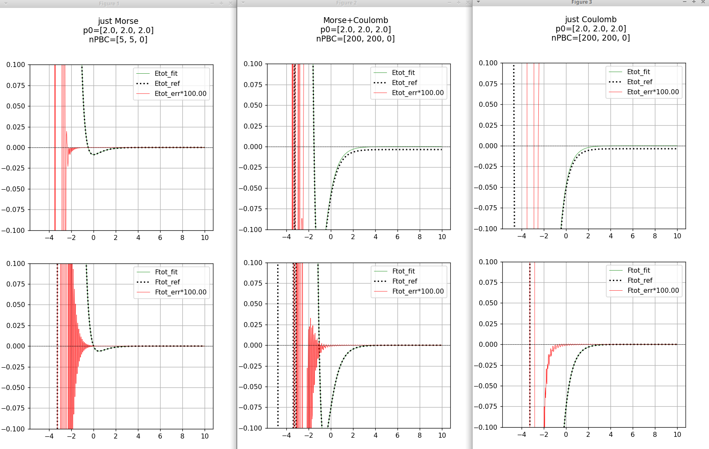

real    0m21.079s
user    0m25.008s
sys     0m0.268s

**Fine tune results**

nPBC 400
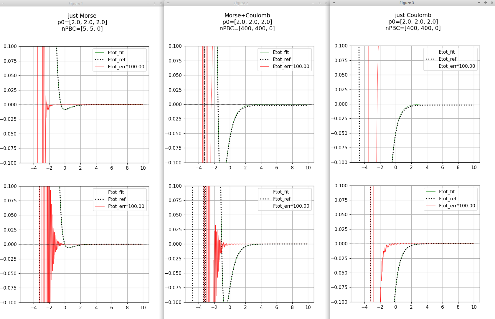

real    1m47.071s
user    1m14.606s
sys     0m0.586s

nPBC 600
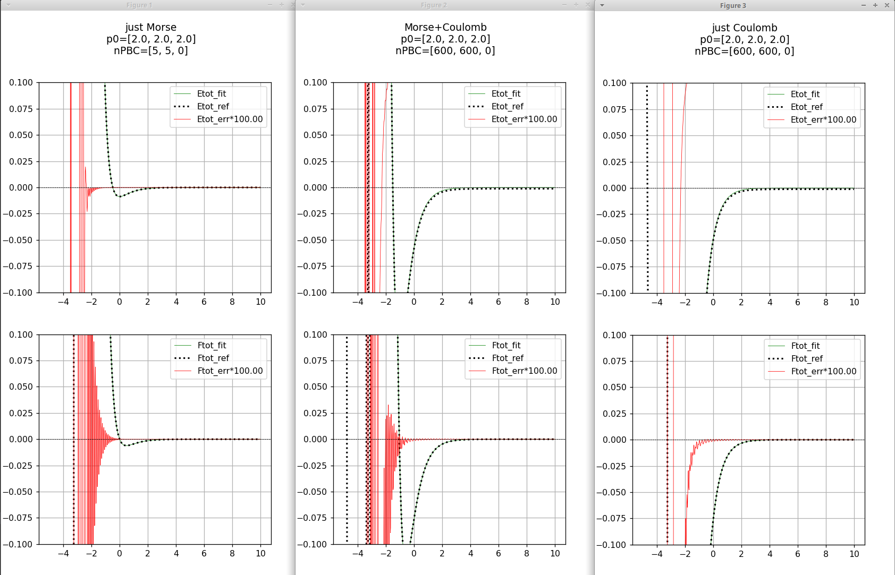

real    1m59.666s
user    2m37.663s
sys     0m0.396s

nPBC 1000
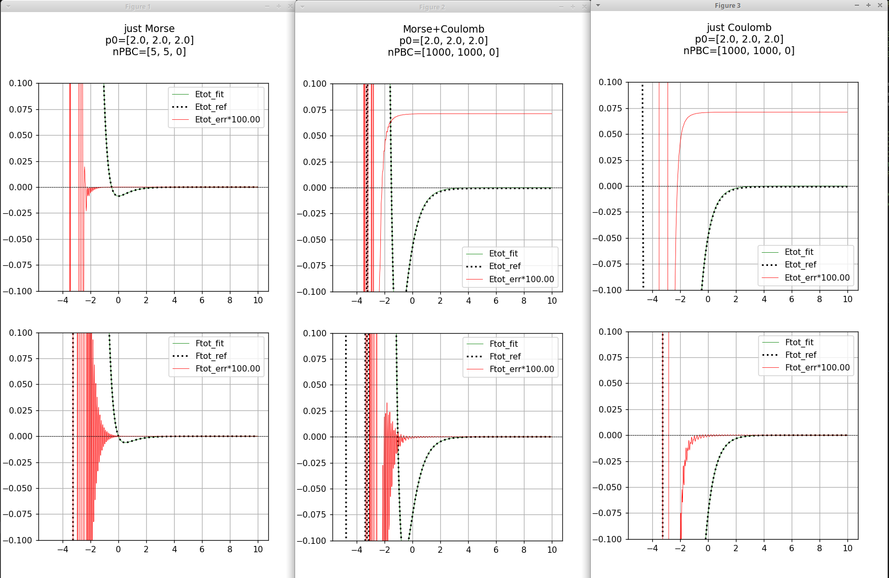

real    1m55.621s
user    7m5.371s
sys     0m0.495s

nPBC 2000
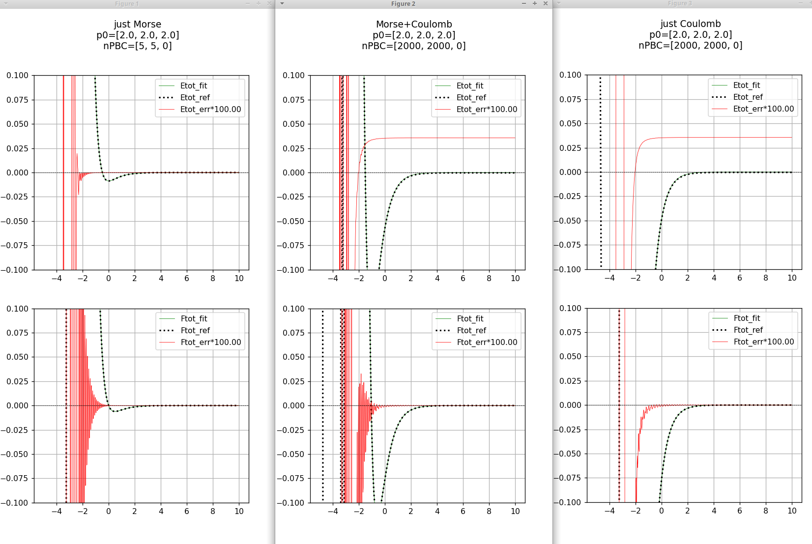

real    6m3.831s
user    28m31.898s
sys     0m1.280s

<!-- nPBC 3000
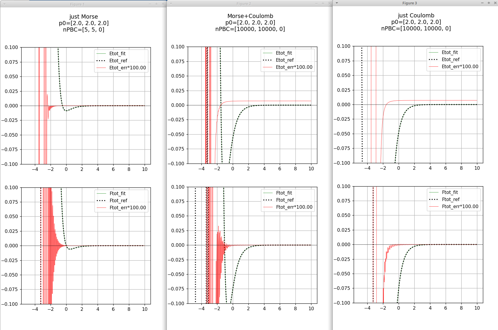

real    7m10.628s
user    65m42.965s
sys     0m1.120s -->

nPBC 10000

real    65m53.778s
user    743m22.472s
sys     0m15.570s

**Results for run_test_Multipole.py** 
Segmentation fault (core dumped)

**Results for run_test_GridFF_ocl.py**
    Traceback (most recent call last):
  File "/home/indranil/git/FireCore/tests/tMMFF/run_test_GridFF_ocl.py", line 44, in <module>
    gff.test_gridFF_vs_ocl( mode=6, title="Bspline_o3 \n(z-cut)" , p0=[0.0,0.0,2.0],  Q=0.4, E0=0, bRefine=False, nPBC=[400,400,0], Emax=Emax, Fmax=Fmax )
  File "/home/indranil/git/FireCore/tests/tMMFF/../../pyBall/tests/ocl_GridFF.py", line 43, in test_gridFF_vs_ocl
    VPLQ = ut.load_potential_comb( path )  #;print( "VPLQ.shape=", VPLQ.shape )
  File "/home/indranil/git/FireCore/tests/tMMFF/../../pyBall/tests/utils.py", line 57, in load_potential_comb
    VPaul = np.load( os.path.join( path, "debug_BsplinePaul_pbc.npy" ) )
  File "/usr/lib/python3/dist-packages/numpy/lib/npyio.py", line 417, in load
    fid = stack.enter_context(open(os_fspath(file), "rb"))

    FileNotFoundError: [Errno 2] No such file or directory: 'data/xyz/NaCl_1x1_L2/debug_BsplinePaul_pbc.npy'

**Results for run_test_GridFF_ocl_new.py**
Traceback (most recent call last):
  File "/home/indranil/git/FireCore/tests/tMMFF/run_test_GridFF_ocl_new.py", line 43, in <module>
    gff.test_gridFF_ocl( fname="data/xyz/"+name+".xyz", save_name="double3", job="PLQ" )
  File "/home/indranil/git/FireCore/tests/tMMFF/../../pyBall/tests/ocl_GridFF_new.py", line 316, in test_gridFF_ocl
    Vcoul = clgff.makeCoulombEwald_slab( xyzq, niter=2, bSaveQgrid=True, bCheckVin=True, bCheckPoisson=True )
  File "/home/indranil/git/FireCore/tests/tMMFF/../../pyBall/OCL/GridFF.py", line 839, in makeCoulombEwald_slab
    clu.try_load_clFFT()
  File "/home/indranil/git/FireCore/tests/tMMFF/../../pyBall/OCL/clUtils.py", line 39, in try_load_clFFT
    from gpyfft.fft import FFT as FFT_
ModuleNotFoundError: No module named 'gpyfft'

**Results for run_test_ewald.py**

# Figure 1
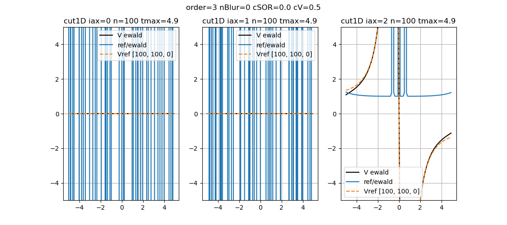

# Figure 2
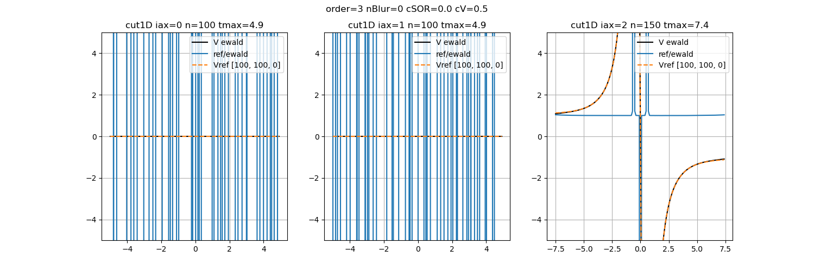

# Figure 3
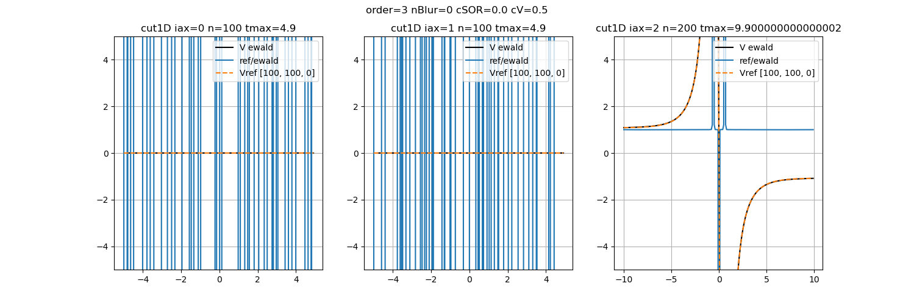

# Figure 4

# Figure 5
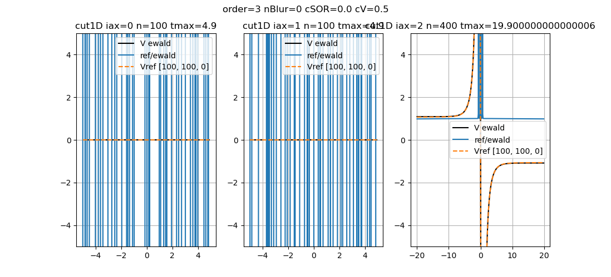

**Fine Tune results**

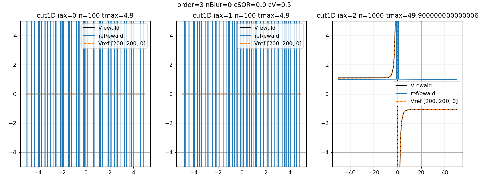

Now the the cut position of the 3D potential for both the calculated Ewald and reference potential are syced through by passing the  ps0 to the 1Dcut plot in the Ewald.py to the utils.py and iterated for 3 axixs and the results are shown in the figure below.
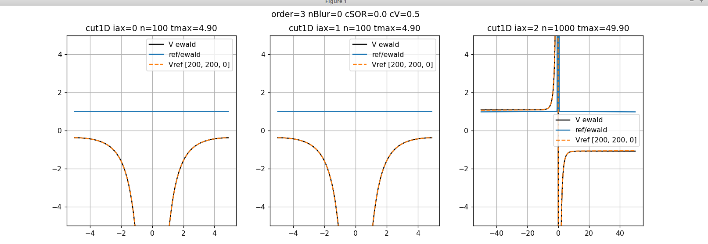

**Results for run_surf_lattice.py**  

DEBUG 1
 walk2D nu 12 nv 0 Rmax 20 dmax 0.05 
 walk2D lat0 [(4,0)  (0,4)] 
 walk2D lat1 [(16,0)  (0,5)] 
WARRNING LatticeMatch2D::matchAngles() no matches found (match_size(12,0)) 
DEBUG 2
Traceback (most recent call last):
  File "/home/indranil/git/FireCore/tests/tMMFF/run_surf_lattice.py", line 27, in <module>
    lat.plotSuperLattices( lat1, inds, plt, n=2 )
  File "/home/indranil/git/FireCore/tests/tMMFF/../../pyBall/Lattice2D.py", line 107, in plotSuperLattices
    u=lat[0,:]*inds[i,0] + lat[1,:]*inds[i,1] 
IndexError: index 0 is out of bounds for axis 0 with size 0

**Results for run_sample.py**

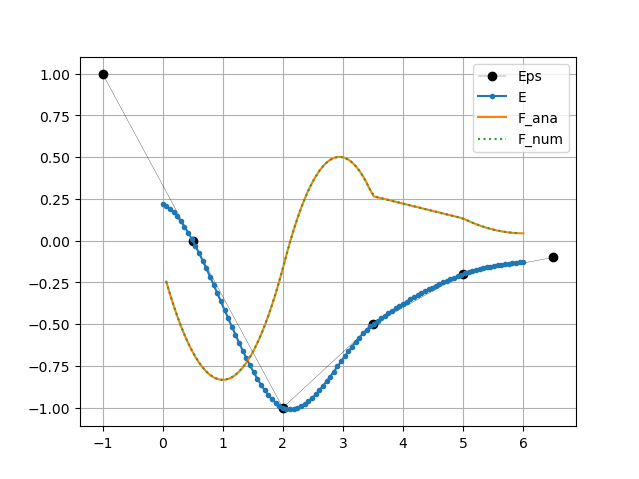

**Results for run_sample_tricubic.py**

Bspline::fit3D_omp() RMS=0.00e+00 |F|=0.00e+00 niter(   0) nxyz=(  320000) time 0.0383371[GTicks] inf[tick/(nxyz*iter)] 
Traceback (most recent call last):
  File "/home/indranil/git/FireCore/tests/tMMFF/run_sample_tricubic.py", line 171, in <module>
    fitBin( fname="../tMolGUIapp/FFelec.bin",  foutname="../tMolGUIapp/G_elec.bin", ns=ns, cell=cell, bXSF=True, dt=0.1 )
  File "/home/indranil/git/FireCore/tests/tMMFF/run_sample_tricubic.py", line 147, in fitBin
    Gs, Ws = mmff.fit3D_Bspline( Eg, Ftol=Ftol, nmaxiter=nmaxiter, dt=dt )
ValueError: too many values to unpack (expected 2)

**Results for run_sample_surf.py**

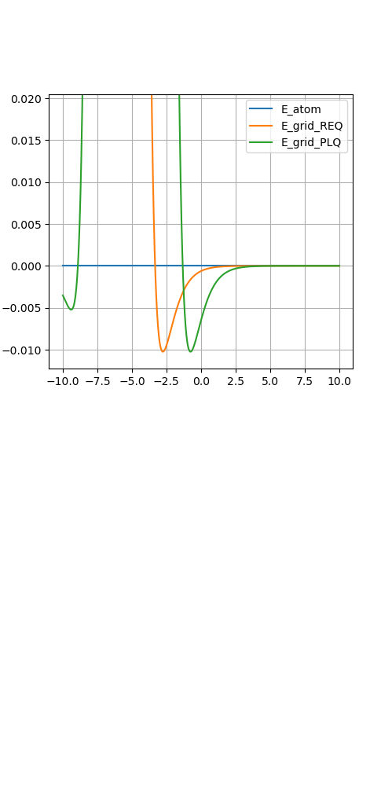

However the others commented subplots are not working getting some core dump error.

Refine Result to merge the gape between the two surface.

**Results for run_sample_nonbond.py**

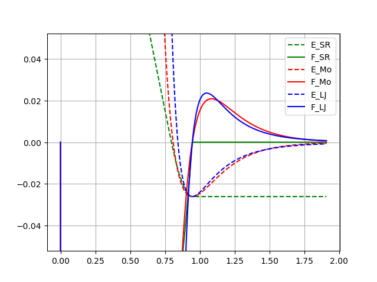

**Results for run_sample_Hermite.py**

MMFFparams::loadDihedralTypes(fname=data/DihedralTypes.dat)
test_gridFF() START
MMFF_lib::makeGridFF() bAutoNPBC=1 bCheckEval=0 bUseEwald=1 bFit=1 bRefine=1 
cannot find data/NaCl_1x1_L2.xyz
ERROR in MMFF_lib::makeGridFF() file(data/NaCl_1x1_L2.xyz) not found in path(/home/indranil/git/FireCore/tests/tMMFF)=> Exit()

We need to modify the MMFF_lib call process of xzy file direcotry.

**Results for run_sample_func.py**

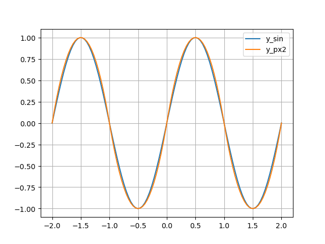

**Results for run_sample_Bsplines.py**

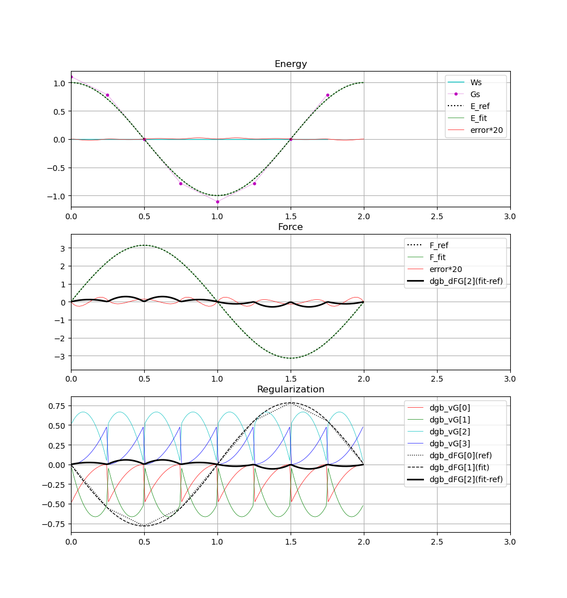

**Results for run_sample_Bsplines_ocl.py**

Traceback (most recent call last):
  File "/home/indranil/git/FireCore/tests/tMMFF/run_sample_Bsplines_ocl.py", line 33, in <module>
    test_fit_Bspline(  )
  File "/home/indranil/git/FireCore/tests/tMMFF/run_sample_Bsplines_ocl.py", line 15, in test_fit_Bspline
    Gs,conv = clgff.fit3D( E_ref=E_ref, nmaxiter=3000, dt=0.3, Ftol=1e-8, cdamp=0.95, bAlloc=True, nPerStep=10, bConvTrj=True )
TypeError: GridFF_cl.fit3D() got an unexpected keyword argument 'E_ref'

**Results for run_propandilo.py**

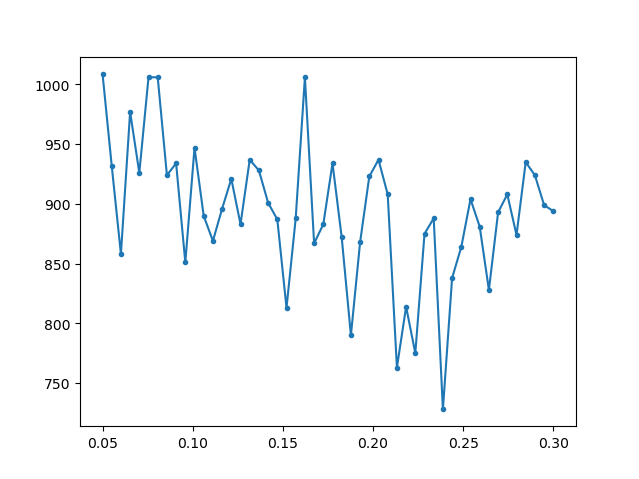

**Results for run_opt_poly.py**

Traceback (most recent call last):
  File "/home/indranil/git/FireCore/tests/tMMFF/run_opt_poly.py", line 46, in <module>
    names = [ name for name in os.listdir("out") ]
FileNotFoundError: [Errno 2] No such file or directory: 'out'

**Results for run_Hbonds.py**

Hard path is given

OSError: /home/prokop/Desktop/CARBSIS/PEOPLE/Mithun/HBond_Fit_Radial_Scans/energy_angle_0/ref-HF_HF-000.dat not found.
free(): double free detected in tcache 2
Aborted (core dumped)

**Results for run_gui.py**

The pyreden is not visible or we need to do something elese 

this is workign fine /home/indranil/git/FireCore/tests/tMolGUIapp/run.sh

**Results for run_collison_damp.py**

for the input of hydropentacene_cross.xyz

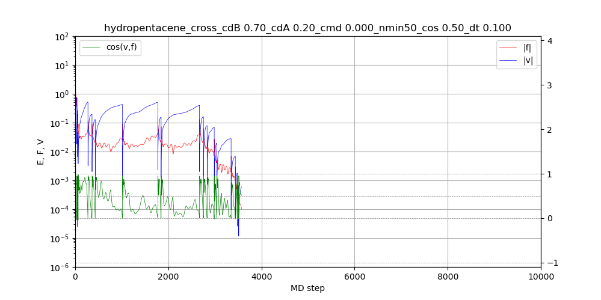

**Results for run_collison_damp_scan.py**

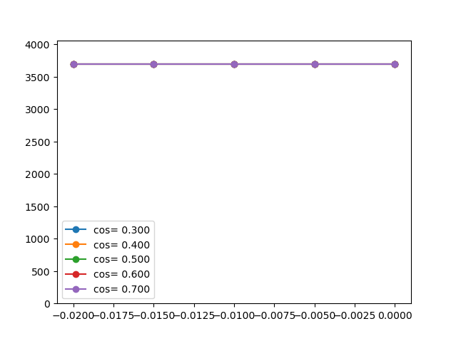

**Results for all the run_*_poly_*.py**

Absolute path is given 

