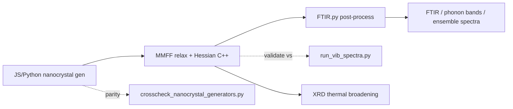

# Si / Diamond Nanocrystal Vibrations & FTIR

## Documentation triad

| Location | Role |
|----------|------|
| **This file** (`tests/tSiNCs/`) | **Working hub** — quick start, scripts, fixtures, viewers |
| [`doc/topical_audit/SiNCs.md`](../../doc/topical_audit/SiNCs.md) | **Project briefing** — FTIR + XRD + FFfit (ChatGPT-ready) |
| [`doc/Topics/FTIR_Nanocrystals/README.md`](../../doc/Topics/FTIR_Nanocrystals/README.md) | Topic docs index (guides, chats, progress logs) |
| [`doc/topical_audit/Nanocrystal_Vibrations.md`](../../doc/topical_audit/Nanocrystal_Vibrations.md) | Vibration API inventory |

Keep these in sync when adding files or changing the canonical workflow.

**Open work:** [`ToDo_Nanocrystal.md`](ToDo_Nanocrystal.md)

**Goal:** compute and validate FTIR / phonon spectra for capped Si and diamond nanocrystals, using QM references (adamantane, sila-adamantane) to anchor classical force-field results.

---

## Pipeline overview



**Materials:** Si (sphalerite), C (diamond), H capping, optional `-CH₂-` bridge collapse/insert.

**Canonical spectrum method (production):** dense `eigh` + mode histogram via [`pyBall/nanocrystal_pipeline.py`](../../pyBall/nanocrystal_pipeline.py). See [`doc/Topics/FTIR_Nanocrystals/Nanocrystal_pipeline.progress.md`](../../doc/Topics/FTIR_Nanocrystals/Nanocrystal_pipeline.progress.md).

**Alternate method (large systems / linear response):** Green's-function probing in [`pyBall/FTIR.py`](../../pyBall/FTIR.py) — used by `tests/tMMFF/test_vibration_spectra.py`.

---

## This folder

| Path | Role |
|------|------|
| [`run_vib_spectra.py`](run_vib_spectra.py) | Multi-method QM vibrational spectra (DFTB+, CP2K, GPAW, Psi4, PySCF) |
| [`vib_utils.py`](vib_utils.py) | ASE dispatch, geometry/frequency caching, IR export |
| [`plot_vib_spectra.py`](plot_vib_spectra.py) | Overlay cached spectra from multiple methods |
| [`crosscheck_nanocrystal_generators.py`](crosscheck_nanocrystal_generators.py) | JS vs Python nanocrystal generator parity (sphere cuts) |
| [`VibSpectra_ASE.chat.md`](VibSpectra_ASE.chat.md) | QM backend survey and design notes |
| [`GPU_Acceletated_QM_packages.chat.md`](GPU_Acceletated_QM_packages.chat.md) | GPU QM package notes |
| [`orca/`](orca/) | ORCA MPI install/run notes and example input |
| [`pyscf/`](pyscf/) | PySCF adamantane/GPU smoke tests |
| [`hessian_calc/`](hessian_calc/) | DFTB+ Hessian run artifacts (adamantane reference) |
| [`orbital_calc/`](orbital_calc/) | DFTB+ waveplot / orbital cube files |
| [`sila_adamantane_dftb_vib/`](sila_adamantane_dftb_vib/) | Deprecated DFTB cache (see its README) |
| `crosscheck/` | Output from generator cross-check (created on run) |
| `fixtures/npz_viewer/` | Small committed NPZ fixtures for viewers A/B |
| `fixtures/si_1nm_passivation/` | Nine Si ~1 nm crystals with **full 01→05 NPZ pipeline** (relax + Hessian + spectrum). See [`fixtures/si_1nm_passivation/README.md`](fixtures/si_1nm_passivation/README.md). |
| `test_cpp_npz_load.sh` | Headless C++ NPZ verify; `--gui` opens MolecularBrowser |
| `run_cpp_mol_browser.sh` | C++ SDL molecular browser launcher |
| `run_vispy_mol_browser.sh` | Python Vispy molecular browser launcher (plugin host + vibration panel) |
| `test_mol_browser_plugins.py` | Plugin registry, NPZ grid filter, vibration panel tests |
| `plot_pyscf_vib_results.py` | Plot PySCF vibration results (Hessian in atomic blocks + spectra + size series) |
| `run_small_np_pyscf_vib.py` | PySCF workflow: relax → Hessian → harmonic analysis → loose .npy output |
| `test_FFfit.py` | **QM-Hessian FF fitting CLI** — hybrid mode/local/Wilson-row-space fit, Si subtype hierarchy, and optional local stretch--stretch/stretch--bend terms; outputs tables and spectrum overlays. |
| `test_fffit_hybrid.py` | Regression tests for Wilson scaling/gauge invariance, hierarchy rows, cross sensitivities, bounded fitting, and torsion gradients. |
| `test_parity_py_cpp.py` | Python vs C++ FFfit sensitivity matrix parity tests |
| `test_parity_graph_cpp.py` | Graph algorithm + dihedral batch parity tests (14 tests): BFS distances, local Hessian mask, 1-4 neighbor finding, dihedral enumeration, Wilson matrix, dihedral Hessian FD, batch vs single dihedral sensitivity |
| `SiNCs_FFfit_summary.md` | Results report: typing strategies, fitted parameters, model comparisons for 6 Si nanocrystals |
| `FFfit_python_to_cpp_port.plan.md` | Porting plan for migrating FFfit Python hotspots to C++ |
| [`ToDo_Nanocrystal.md`](ToDo_Nanocrystal.md) | Open items and open questions |

---

### FFfit: PySCF Hessian to transferable valence model

The authoritative theory is [`doc/Topics/FFfit/HessianFitting_Theory.md`](../../doc/Topics/FFfit/HessianFitting_Theory.md). The Wilson least-norm diagonal is a diagnostic indicator, not a per-bond DFT stiffness; transferable parameters come from the regularized hybrid fit.

```bash
# Elemental versus hierarchical Si/SiH/SiH2/SiH3 typing; tables + six spectrum overlays
CPP_BUILD_PATH=$PWD/cpp/Build-opt/libs python3 tests/tSiNCs/test_FFfit.py \
  --cases all_Si --compare-typing --subtype-shrinkage 0.001 \
  --plot-dir tests/tSiNCs/OUT_FFfit_plots/typing_all_Si_hierarchical

# Add the optional local valence couplings (requires --equilibrium local, the default)
CPP_BUILD_PATH=$PWD/cpp/Build-opt/libs python3 tests/tSiNCs/test_FFfit.py \
  --cases all_Si --compare-typing --subtype-shrinkage 0.001 \
  --stretch-stretch --stretch-bend \
  --plot-dir tests/tSiNCs/OUT_FFfit_plots/typing_all_Si_cross_both

# Focused numerical/parity suite
CPP_BUILD_PATH=$PWD/cpp/Build-opt/libs python3 -m pytest -q \
  tests/tSiNCs/test_fffit_hybrid.py tests/tSiNCs/test_parity_graph_cpp.py
```

The cross terms are signed, zero-centered, and bounded; they are intentionally rejected for `--equilibrium type-average` because their prestress Hessian is not yet implemented.

---

## Quick start

All commands assume repo root `FireCore/` unless noted.

### QM reference spectra (this folder)

```bash
cd tests/tSiNCs

# Default methods per molecule (cached on disk after first run)
python3 run_vib_spectra.py adamantane
python3 run_vib_spectra.py sila_adamantane

# Pick backends explicitly
python3 run_vib_spectra.py adamantane --methods dftb_mio pyscf_hf

# Plot overlays from cache
python3 plot_vib_spectra.py adamantane
python3 plot_vib_spectra.py sila_adamantane --noshow
```

### NPZ vibration pipeline (relax → Hessian → spectrum)

Requires `01_crystal.npz` + `03_topology.npz` per crystal directory. Full contract: [`Nanocrystal_NPZ_Pipeline.guide.md`](../../doc/Topics/FTIR_Nanocrystals/Nanocrystal_NPZ_Pipeline.guide.md).

```bash
export LSAN_OPTIONS=detect_leaks=0
ASAN="$(g++ -print-file-name=libasan.so)" && [ -f "$ASAN" ] && export LD_PRELOAD="$ASAN"

DIR=tests/tSiNCs/fixtures/si_1nm_passivation/02_sphere_13A_H_standard

python3 -m pyBall.nanocrystal_pipeline relax \
  --init-npz "$DIR/01_crystal.npz" --out-npz "$DIR/02_relaxed.npz" --out-xyz "$DIR/relaxed.xyz"

python3 -m pyBall.nanocrystal_pipeline hessian \
  --relaxed-npz "$DIR/02_relaxed.npz" --topology-npz "$DIR/03_topology.npz" \
  --out-npz "$DIR/04_hessian.npz"

python3 -m pyBall.nanocrystal_pipeline spectrum \
  --hessian-npz "$DIR/04_hessian.npz" --out-npz "$DIR/05_spectrum.npz" \
  --out-plot "$DIR/spectrum.png"
```

Batch all nine gallery crystals: see [`fixtures/si_1nm_passivation/README.md`](fixtures/si_1nm_passivation/README.md).

### NPZ pipeline viewers (C++ / Python)

```bash
# C++ SDL browser — thumbnails + 3D VIEW ([c] bond color, [g] AABB)
./tests/tSiNCs/run_cpp_mol_browser.sh
./tests/tSiNCs/run_cpp_mol_browser.sh tests/tSiNCs/fixtures/si_1nm_passivation/09_sphere_13A_H_fuse

# Headless C++ NPZ parse
./tests/tSiNCs/test_cpp_npz_load.sh

# Python Vispy browser — thumbnails, 3D view, vibration spectrum plugin
./tests/tSiNCs/run_vispy_mol_browser.sh
./tests/tSiNCs/run_vispy_mol_browser.sh tests/tSiNCs/fixtures/si_1nm_passivation/02_sphere_13A_H_standard
```

Guides: C++ [`CPP_MolecularBrowser_NPZ.md`](../../doc/Topics/FTIR_Nanocrystals/CPP_MolecularBrowser_NPZ.md); Python plugins [`Python_Vispy_MolBrowser_Plugins.md`](../../doc/Topics/FTIR_Nanocrystals/Python_Vispy_MolBrowser_Plugins.md).

### PySCF vibration results (loose .npy format)

PySCF vibration data uses loose `.npy` files per case directory, not the NPZ pipeline stages. The `VibrationSpectrumPlugin` auto-detects this format (NPZ tried first, PySCF fallback).

**Format contract** (full details: [`doc/topical_audit/Vibration_Data_Formats.md`](../../doc/topical_audit/Vibration_Data_Formats.md)):

| File | Shape | Dtype | Units |
|------|-------|-------|-------|
| `frequencies_cm1.npy` | (3N,) | float64 or complex128 | cm⁻¹ |
| `modes.npy` | (n_vib, N, 3) | float64 | Å displacement |
| `hessian.npy` | (N, N, 3, 3) | float64 | Hartree/Bohr² |
| `masses.npy` | (N,) | int64 | amu |
| `relaxed.xyz` | — | XYZ | Å |

```bash
# Plot all cases (Hessian in atomic 3×3 blocks + spectra)
python3 tests/tSiNCs/plot_pyscf_vib_results.py /path/to/results --noshow

# Launch Vispy browser on PySCF results (auto-detects .npy format)
python3 -m pyBall.GUI.VispyMolBrowser --dir /path/to/results
```

**DFTB+ prerequisite:** set Slater–Koster paths before running DFTB methods. `vib_utils.py` currently hardcodes `/home/prokop/SIMULATIONS/dftbplus/slakos/...` — override via env or edit `SK_PATHS` until parameterized (backlog item).

### Generator parity (this folder)

```bash
cd tests/tSiNCs
python3 crosscheck_nanocrystal_generators.py
# writes reports under tests/tSiNCs/crosscheck/
```

Requires Node.js for the JS generator path.

### Classical MMFF / phonon smoke tests (sibling folder)

```bash
cd tests/tMMFF
bash run.sh test_diamond_gamma.py
bash run.sh test_vibration_spectra.py
bash run.sh test_diamond_phonon_bands.py --unit THz --super-n 3
python3 test_nanocrystal_sparse_hessian.py --spectrum --plot
```

### Ensemble pipeline (library + scripts)

```bash
python3 pyBall/nanocrystal_pipeline.py --help
# orchestration also planned via scripts/nanocrystals.mjs (not yet in repo)
```

---

## Related code (outside this folder)

### Generation

| File | Role |
|------|------|
| [`web/molgui_webgpu/Nanocrystals.js`](../../web/molgui_webgpu/Nanocrystals.js) | Full generator: CIF → supercell → Miller/sphere cuts → H-cap → bridges |
| [`pyBall/nanocrystal_gen.py`](../../pyBall/nanocrystal_gen.py) | Python sphere-cut builder (parity target for JS) |
| [`scripts/gen_nanocrystals.mjs`](../../scripts/gen_nanocrystals.mjs) | CLI wrapper (deprecated; points to missing `nanocrystals.mjs`) |

JS is the feature-complete path (plane cuts, defects, bridges). Python does spherical cuts natively and delegates Miller planes to Node.

### Vibration / FTIR core

| File | Role |
|------|------|
| [`pyBall/FTIR.py`](../../pyBall/FTIR.py) | Green's probing, rigid-mode projection, mass matrix, Hessian fitting, sparse solvers, `vibration_spectrum_from_modes` |
| [`pyBall/FFfit.py`](../../pyBall/FFfit.py) | C++ ctypes wrapper for `libFFfit_lib.so` — Wilson B matrix, internal Hessian projection, sensitivity matrices |
| [`pyBall/FFfit_utils.py`](../../pyBall/FFfit_utils.py) | **FFfit utility functions** — type system, topology, dihedral physics, parameter mapping, sensitivity matrices, fitting routines, frequency analysis, C++ bridge, legacy mode-basis fitting (migrated from `test_FFfit.py`) |
| [`pyBall/FFfit_plots.py`](../../pyBall/FFfit_plots.py) | **FFfit plotting/visualization** — spectrum plotting, equilibrium distributions, DFT stiffness distributions, interactive p5.js stiffness HTML maps (migrated from `test_FFfit.py`) |
| [`pyBall/MMFF.py`](../../pyBall/MMFF.py) | ctypes: `getHessian3Nx3N`, `getHessianSparseBlocks`, `getPhononPhiBlocks` |
| [`pyBall/nanocrystal_pipeline.py`](../../pyBall/nanocrystal_pipeline.py) | NPZ stages: relax → topology-linear Hessian → `eigh` spectrum → accumulate |
| [`pyBall/OCL/VibSolver.py`](../../pyBall/OCL/VibSolver.py) | GPU Jacobi frequency-domain solver (experimental, deferred) |
| [`cpp/libs/Molecular/MMFF_lib.cpp`](../../cpp/libs/Molecular/MMFF_lib.cpp) | Central FD Hessian, sparse blocks, phonon Φ blocks |
| [`cpp/common_resources/crystals/`](../../cpp/common_resources/crystals/) | `Si_primitive`, `diamond_primitive`, CIF/XYZ inputs |

### Classical tests

| Folder | Key scripts |
|--------|-------------|
| [`tests/tMMFF/`](../tMMFF/) | `test_vibration_spectra.py`, `test_diamond_phonon_bands.py`, `test_nanocrystal_sparse_hessian.py`, solver ladder |
| [`tests/tXRD/`](../tXRD/) | `test_debye_histogram.py`, `test_large_crystal.py` — thermal broadening from vibration Hessian |

---

## Documentation map

Full topic index: [`doc/Topics/FTIR_Nanocrystals/README.md`](../../doc/Topics/FTIR_Nanocrystals/README.md).  
Code inventory: [`doc/topical_audit/Nanocrystal_Vibrations.md`](../../doc/topical_audit/Nanocrystal_Vibrations.md).

### Read first (outside this folder)

| Doc | Content |
|-----|---------|
| [`Nanocrystal_pipeline.progress.md`](../../doc/Topics/FTIR_Nanocrystals/Nanocrystal_pipeline.progress.md) | **Current direction:** ensemble pipeline, NPZ cache |
| [`gen_nanocrystals.chat.md`](../../doc/Topics/FTIR_Nanocrystals/gen_nanocrystals.chat.md) | Generation CLI, plane cuts, capping, bridges |
| [`Phonon_testing.guide.md`](../../doc/Topics/FTIR_Nanocrystals/Phonon_testing.guide.md) | Diamond phonon validation, PBC/ASR pitfalls |
| [`Sparse_Hessian_Vibration_Spectra.guide.md`](../../doc/Topics/FTIR_Nanocrystals/Sparse_Hessian_Vibration_Spectra.guide.md) | Sparse Hessian blocks, spectrum methods |

### QM notes (in this folder)

| Doc | Content |
|-----|---------|
| [`VibSpectra_ASE.chat.md`](VibSpectra_ASE.chat.md) | ASE multi-backend workflow |
| [`orca/orca.guide.md`](orca/orca.guide.md) | ORCA MPI setup |
| [`pyscf/pyscf_GPU.chat.md`](pyscf/pyscf_GPU.chat.md) | PySCF GPU notes |

---

## Suggested reading order

1. This README  
2. [`doc/Topics/FTIR_Nanocrystals/README.md`](../../doc/Topics/FTIR_Nanocrystals/README.md) — topic doc index  
3. [`doc/topical_audit/Nanocrystal_Vibrations.md`](../../doc/topical_audit/Nanocrystal_Vibrations.md) — full code inventory  
4. [`Nanocrystal_pipeline.progress.md`](../../doc/Topics/FTIR_Nanocrystals/Nanocrystal_pipeline.progress.md) — production direction  
5. [`pyBall/FTIR.py`](../../pyBall/FTIR.py) + [`tests/tMMFF/test_vibration_spectra.py`](../tMMFF/test_vibration_spectra.py) — classical end-to-end  
6. [`VibSpectra_ASE.chat.md`](VibSpectra_ASE.chat.md) + `run_vib_spectra.py` — QM references  

---

## Status

| Area | State | Notes |
|------|-------|-------|
| QM reference (adamantane / sila-adamantane) | **Working** | `run_vib_spectra.py`, disk cache, overlay plots |
| Generator parity (sphere) | **Working** | `crosscheck_nanocrystal_generators.py` |
| Classical MMFF vibrations | **Working** | `tests/tMMFF/` ladder |
| Ensemble / NPZ pipeline | **Working** | `nanocrystal_pipeline.py`; `fixtures/si_1nm_passivation/` (01→05) |
| NPZ viewers (C++ / Vispy) | **Working** | `run_cpp_mol_browser.sh`, `run_vispy_mol_browser.sh` |
| PySCF .npy viewer support | **Working** | `VibrationSpectrumPlugin` auto-detects `.npy` format; `plot_pyscf_vib_results.py` |
| Nanocrystal → QM | **Not started** | QM refs are molecular cages only so far |
| SiO₂ / silica | **Out of scope** | No implementation |

**Strengths:** clean JS → C++ → Python split; solid validation ladder; two spectrum methods (`eigh` histogram vs Green's probing); honest physics limitations documented.

**Known physics gaps:**

- Surface H not relaxed before vibration  
- PBC optical modes need care (`--asr`; cluster mode preferred for Γ optical)  
- Hessian FD is O(6N) force evals — bottleneck for large NCs  
- No GPU Hessian yet  

---

## Open items

See [`ToDo_Nanocrystal.md`](ToDo_Nanocrystal.md) for viewers, pipeline parity, validation, and open physics questions.

---

## Cross-links

- [`doc/Topics/FTIR_Nanocrystals/README.md`](../../doc/Topics/FTIR_Nanocrystals/README.md) — topic documentation index  
- [`doc/topical_audit/Nanocrystal_Vibrations.md`](../../doc/topical_audit/Nanocrystal_Vibrations.md) — topical audit  
- [`doc/topical_audit/Vibration_Data_Formats.md`](../../doc/topical_audit/Vibration_Data_Formats.md) — vibration data format contracts (NPZ vs PySCF .npy)  
- [`doc/topical_audit/topical_audit.md`](../../doc/topical_audit/topical_audit.md) — global topic index  
- [`CODEMAP.md`](../../CODEMAP.md) — repo structure  
- [`tests/tMMFF/AGENTS.md`](../tMMFF/AGENTS.md) — phonon validation ownership  
